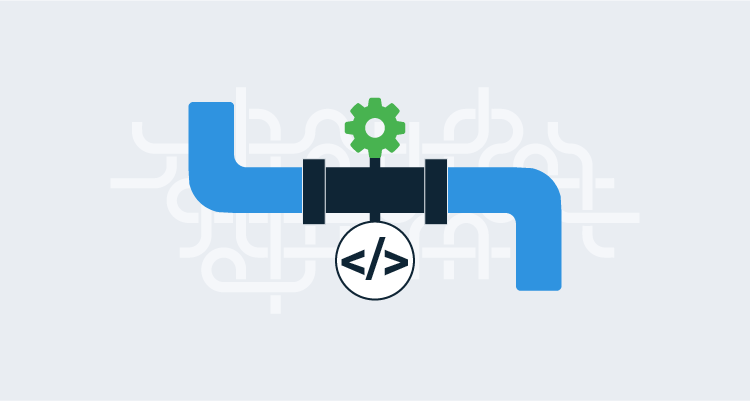

# CD Pipeline Concepts

### **Introduction**

Continuous Deployment (CD) pipelines are essential for automating the deployment of software in a DevOps environment. Azure DevOps enables you to create these pipelines using Pipeline as Code (PaC), allowing for version control, consistency, and scalability. This page will guide you through setting up and organizing CD pipelines, configuring triggers and conditions, and ensuring that your deployments are efficient and reliable.

***

### **Setting Up CD Pipelines Using Pipeline as Code (PaC)**

Pipeline as Code (PaC) allows you to define your CD pipeline within YAML files, which are stored in your version control system. This approach ensures that your deployment process is transparent, repeatable, and easy to manage.

**Organizing CD Pipelines**

When creating CD pipelines, you have several options for organizing your YAML files:

* **Single File for CI/CD:** Combine both CI and CD pipelines into one YAML file. This approach can simplify the setup but might become complex as the project grows.
* **Separate Files for CI and CD:** Maintain separate YAML files for CI and CD pipelines. This organization provides clarity and separation of concerns, making it easier to manage and maintain.
* **Modular Files:** Break down your CD pipeline into multiple files, each handling different stages or components of the deployment. You can reference these modular files within a master YAML file, promoting reusability and scalability.

#### **Example of Modular CD Pipeline Organization:**

```yaml
# Main pipeline file
stages:
- template: deploy-staging.yml  # Reference a template for the staging deployment
- template: deploy-production.yml  # Reference a template for the production deployment
```

<figure><figcaption><p>Pipeline as Code</p></figcaption></figure>


**Tip:** Modularizing your pipelines can help manage complex projects by keeping each YAML file focused on specific tasks.


***

### **Configuring Triggers for Automatic Deployment**

Triggers in a CD pipeline determine when the deployment process should begin. By setting up appropriate triggers, you can automate deployment to different environments based on the status of your CI pipeline.

#### **Integrating CI/CD Pipelines**

In a DevOps setup, a CD pipeline is often triggered automatically upon the successful completion of a CI pipeline. This ensures that only tested and validated code is deployed to production.

* **Example of a Simple Trigger Configuration:**

```yaml
trigger:
  branches:
    include:
      - main
```

* **Example of a Trigger after CI Completion:**

You can configure your CD pipeline to start automatically after the CI pipeline completes successfully:

```yaml
resources:
  pipelines:
    - pipeline: CI_Build  # Name of the CI pipeline
      source: CI-Pipeline  # Reference to the CI pipeline
      trigger:
        branches:
          include:
            - main
```

This configuration ensures that the CD pipeline is triggered only after the CI pipeline has finished successfully.


**Tip:** Integrating triggers ensures seamless transitions from CI to CD, reducing manual interventions and errors.


***

### **Using Conditions in CD Pipelines**

Conditions in Azure DevOps pipelines add flexibility by allowing specific stages, jobs, or tasks to run only when certain criteria are met. This feature is crucial for managing complex deployment scenarios.

#### **Applying Conditions and Dependencies**

Conditions and the `dependsOn` property are used to control the flow of stages and jobs within your CD pipeline. By default, stages depend on each other in sequence, but you can customize this behavior.

* **Using `dependsOn: []` to Disconnect Stages:**

If you want to ensure that stages do not wait for each other and can run independently, you can use the `dependsOn: []` property:

```yaml
stages:
- stage: DeployToStaging
  dependsOn: []  # This stage does not depend on any other stage
  jobs:
  - job: DeployToStaging
    pool:
      vmImage: 'ubuntu-latest'  # Use the latest Ubuntu VM image
    steps:
    - script: echo "Deploying to Staging..."
      displayName: 'Deploy to Staging'

- stage: DeployToProduction
  dependsOn: []  # This stage does not depend on any other stage
  jobs:
  - job: DeployToProduction
    pool:
      vmImage: 'ubuntu-latest'  # Use the latest Ubuntu VM image
    steps:
    - script: echo "Deploying to Production..."
      displayName: 'Deploy to Production'
```

This configuration allows each stage to run independently without waiting for the completion of the other stages.

* **Example of Using Conditions:**

Conditions allow you to control when specific steps or jobs should run based on certain criteria:

```yaml
stages:
- stage: DeployToStaging
  jobs:
  - job: DeployToStaging
    pool:
      vmImage: 'ubuntu-latest'
    condition: and(succeeded(), eq(variables['Build.SourceBranch'], 'refs/heads/main'))
    steps:
    - script: echo "Deploying to Staging..."
      displayName: 'Deploy to Staging'

- stage: DeployToProduction
  jobs:
  - job: DeployToProduction
    pool:
      vmImage: 'ubuntu-latest'
    condition: and(succeeded(), eq(variables['Build.SourceBranch'], 'refs/heads/main'), eq(variables['Build.Reason'], 'Manual'))
    steps:
    - script: echo "Deploying to Production..."
      displayName: 'Deploy to Production'
```

In this example:

* The staging deployment runs only if the **previous stages or jobs in the current pipeline have succeeded** (as indicated by `succeeded()`) and the source branch is `main`.
* The production deployment runs only if the **previous stages or jobs in the current pipeline have succeeded** (as indicated by `succeeded()`), the branch is `main`, and the deployment was triggered manually (as indicated by `eq(variables['Build.Reason'], 'Manual')`).

Key Points:

* The `succeeded()` condition checks the success of previous stages or jobs within the same pipeline, **not the CI pipeline**.
* The `eq(variables['Build.SourceBranch'], 'refs/heads/main')` condition ensures the deployment only happens on the `main` branch.
* The `eq(variables['Build.Reason'], 'Manual')` condition ensures the production deployment only runs if the pipeline was triggered manually by a user.

**Additional Condition Examples:**

* **Condition Based on Branch Name:**

```yaml
condition: eq(variables['Build.SourceBranchName'], 'main')
```

This condition ensures that a job or step only runs when the build is triggered from the `main` branch.

* **Condition Based on Build Reason:**

```yaml
condition: eq(variables['Build.Reason'], 'PullRequest')
```

This condition runs the job or step only if the build was triggered by a pull request.

* **Condition Based on a Custom Variable:**

```yaml
condition: eq(variables['CustomVariable'], 'true')
```

This condition runs the job or step only if a custom variable is set to `true`.


**Note:** Conditions can be combined with logical operators like `and`, `or`, and `not` to create complex deployment scenarios.


***

### **Conclusion**

Using Pipeline as Code (PaC) in Azure DevOps allows for a highly automated, consistent, and scalable deployment process. By organizing your CD pipelines effectively, setting up appropriate triggers, and applying conditions, you can streamline your deployment workflows and minimize risks. This approach is key to achieving a seamless and reliable Continuous Deployment process within your DevOps lifecycle.
