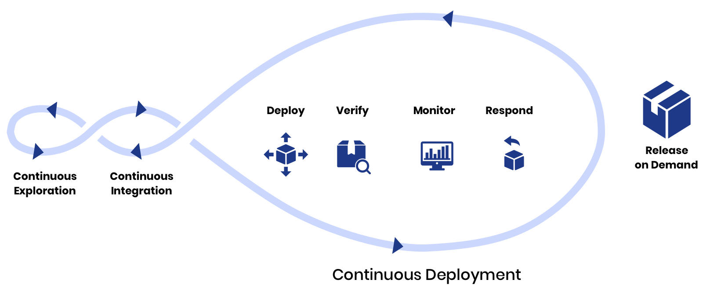
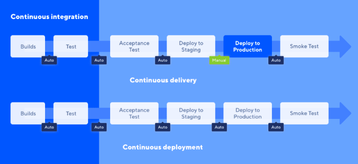
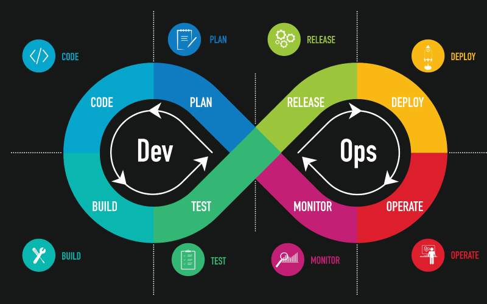

# Introduction to Continuous Deployment (CD)

### **Introduction**

Continuous Deployment (CD) is a critical practice in the DevOps lifecycle that automates the release of software updates to production environments. By removing manual intervention, CD ensures that every change that passes automated testing is automatically deployed to production. This practice not only accelerates the delivery of software but also enhances the reliability and consistency of deployments.

***

### **What is Continuous Deployment (CD)?**

Continuous Deployment is the process of automatically deploying every code change that passes the automated testing phase directly to production. Unlike Continuous Delivery, where manual approval might be required before deployment, Continuous Deployment is fully automated, making it the final step in the DevOps pipeline.

#### **Key Characteristics:**

* **Automation:** Eliminates manual deployment steps, ensuring faster and more consistent releases.
* **Frequent Updates:** Enables continuous delivery of new features, improvements, and fixes to users.
* **Reliability:** Minimizes human errors in the deployment process, leading to more stable production environments.

**Example:**\
Imagine a software application where developers push code changes multiple times a day. With Continuous Deployment, each of these changes is automatically tested and, if successful, deployed to the production environment without any manual intervention. This results in a seamless flow of updates, reducing time-to-market and improving the user experience.

<figure><figcaption>
Continuous Deployement
</figcaption></figure>

***

### **Continuous Deployment vs. Continuous Delivery**

While both Continuous Deployment and Continuous Delivery focus on automating the release process, they differ primarily in the level of automation and the need for manual approval.

#### **Continuous Delivery:**

* **Manual Approval:** After the automated tests pass, a manual approval step is often required before deploying to production.
* **Final Human Check:** Ensures that an individual reviews the changes before they are released, adding a layer of control.

#### **Continuous Deployment:**

* **Full Automation:** Once the automated tests pass, the code is automatically deployed to production without any manual intervention.
* **No Human Intervention:** Streamlines the process, allowing for faster and more frequent releases.

<figure><figcaption>
<strong>Continuous Deployment vs. Continuous Delivery</strong>
</figcaption></figure>

#### **Comparison Table:**

| **Aspect**              | **Continuous Delivery**    | **Continuous Deployment**   |
| ----------------------- | -------------------------- | --------------------------- |
| **Deployment Trigger**  | Manual Approval            | Automated                   |
| **Release Frequency**   | Scheduled/Controlled       | Continuous                  |
| **Risk of Human Error** | Reduced with manual checks | Minimized due to automation |
| **Time-to-Market**      | Moderate                   | Fast                        |

***

### **The Role of Continuous Deployment in the DevOps Lifecycle**

Continuous Deployment is a fundamental component of the DevOps lifecycle, which emphasizes the integration of development and operations to improve collaboration and productivity.

<figure><figcaption>
DevOps Process
</figcaption></figure>

#### **Key Roles of CD in DevOps:**

1. **Accelerated Feedback Loop:** By deploying changes directly to production, feedback from real users can be gathered immediately, allowing developers to quickly address issues or iterate on features.
2. **Improved Collaboration:** Automating deployments fosters a culture of collaboration between development and operations teams, as they work together to ensure that the pipeline is reliable and efficient.
3. **Reduced Time-to-Market:** With every successful build being deployed automatically, the time from code commit to production is significantly reduced.
4. **Enhanced Stability:** Continuous Deployment ensures that only code that has passed rigorous automated testing is released, leading to more stable and reliable software in production.

***

### **Benefits of Automating Deployments**

Automating the deployment process offers numerous advantages that can significantly enhance the efficiency and reliability of software delivery.

<figure><figcaption>
Automated Deployments
</figcaption></figure>

**1. Speed and Efficiency:**

* Automation reduces the time required to deploy changes, enabling faster releases and reducing delays caused by manual processes.

**2. Consistency:**

* Automated deployments ensure that the same process is followed every time, reducing the likelihood of errors and discrepancies between environments.

**3. Reliability:**

* By automating deployments, you can eliminate common human errors, such as misconfigurations, and ensure that only thoroughly tested code reaches production.

**4. Scalability:**

* Automated deployments can easily scale to accommodate more frequent releases as the development team grows or the application becomes more complex.

**5. Improved Developer Productivity:**

* With a reliable automated deployment process in place, developers can focus more on writing code rather than managing releases, leading to increased productivity.

> "Automating deployments ensures a faster, more reliable delivery process, allowing development teams to focus on innovation rather than manual tasks."

**Example:**\
Consider a scenario where a development team releases updates to a web application daily. By automating the deployment process, the team can ensure that each update is delivered quickly and reliably, without the need for manual intervention. This not only improves the efficiency of the release process but also ensures that users receive new features and fixes as soon as they are available.

***

### **How CD Pipelines Fit into the Overall DevOps Process**

Continuous Deployment pipelines are a critical component of the overall DevOps process. They ensure that the flow of code from development to production is smooth, automated, and consistent.

#### **Key Integration Points:**

* **Integration with CI Pipelines:** CD pipelines are triggered by the successful completion of CI pipelines. This integration ensures that only tested and validated code is deployed to production.
* **Environment Management:** CD pipelines manage the deployment of code across various environments (e.g., staging, production), ensuring that each environment is consistently updated.
* **Monitoring and Feedback:** After deployment, monitoring tools are integrated into the CD pipeline to track the performance of the application in production, providing immediate feedback to the development team.

**Example:**\
In a typical DevOps setup, the CI pipeline handles the building and testing of the code, while the CD pipeline takes over to deploy the tested code to staging and production environments. By integrating these pipelines, the entire process from code commit to production deployment is automated, ensuring a seamless and efficient software delivery process.

***

### **Common Challenges and Best Practices in Continuous Deployment**

#### **Challenges in Continuous Deployment:**

1.  **Ensuring Consistent Environment Configurations:**

    * One of the major challenges in Continuous Deployment is maintaining consistent configurations across different environments (e.g., development, staging, production). Differences in configurations can lead to unexpected behavior in production deployments.

    **Example:** A configuration mismatch between staging and production could result in a feature working perfectly in staging but failing in production due to a missing environment variable.\

    
    Use Infrastructure as Code (IaC) to ensure environment consistency across all stages.
    

    \

2.  **Managing Rollbacks and Failures:**

    * Automated deployments increase the risk of deploying faulty code to production. Without proper rollback mechanisms, a failed deployment can lead to significant downtime or service degradation.

    **Example:** Deploying a new version of an application without a solid rollback strategy could leave users facing issues if the deployment introduces bugs that were not caught in testing.\

    
    Implement automated rollback mechanisms to minimize downtime in case of deployment failures.
    

    \

3.  **Security Considerations:**

    * Automating deployments can expose sensitive data if proper security measures are not in place. Securing credentials, API keys, and other sensitive information is critical.

    **Example:** Storing API keys in plain text within the deployment scripts can lead to security breaches if the pipeline is compromised.\

    
    Always encrypt sensitive data, such as API keys, and use secure storage solutions like Azure Key Vault.
    

#### **Best Practices for Continuous Deployment:**

1.  **Use Infrastructure as Code (IaC):**

    * Leverage Infrastructure as Code to define and manage environment configurations, ensuring consistency across all stages of deployment. Tools like Terraform, ARM templates, or Azure DevOps pipelines can automate environment provisioning.

    **Example:** Using ARM templates to define the infrastructure ensures that the same configuration is used for every deployment, minimizing discrepancies between environments.\

2.  **Implement Blue-Green or Canary Deployments:**

    * These deployment strategies reduce the risk of downtime and allow for safer rollouts. Blue-Green deployment involves running two identical production environments (one active, one idle), while Canary deployment gradually rolls out the new version to a small subset of users before a full release.

    **Example:** Deploying a new feature to 10% of users using a Canary strategy helps identify potential issues before it affects the entire user base.\

3.  **Automated Testing in Deployment Pipelines:**

    * Ensure that all deployments are subject to rigorous automated testing. This includes unit tests, integration tests, and end-to-end tests to catch any issues before the code reaches production.

    **Example:** Including a stage in the CD pipeline that runs automated tests and only proceeds to deployment if all tests pass ensures that only verified code is deployed.\

4.  **Secure Secrets and Credentials:**

    * Use secure methods to handle secrets and credentials in deployment pipelines. Azure DevOps provides secure ways to manage secrets, such as Azure Key Vault integration.

    **Example:** Storing connection strings in Azure Key Vault and accessing them securely during the deployment process prevents exposure of sensitive information.\

5.  **Monitor and Log Deployments:**

    * Continuous monitoring and logging of deployments are essential for quickly identifying and addressing issues. Set up monitoring tools to track the performance of deployments and alert the team in case of failures.

    **Example:** Implementing Application Insights in Azure to monitor the health of deployments allows for real-time tracking of application performance and quick identification of any issues.

***

### **Conclusion**

Continuous Deployment is a powerful practice that plays a crucial role in modern software development. By fully automating the deployment process, CD reduces the time-to-market, improves reliability, and enhances the overall efficiency of the DevOps lifecycle. Understanding the differences between Continuous Deployment and Continuous Delivery, as well as the benefits of automating deployments, is essential for building robust and scalable software systems. As we dive deeper into CD pipeline concepts and configurations in Azure DevOps, you’ll see how these practices can be implemented effectively in real-world scenarios.
