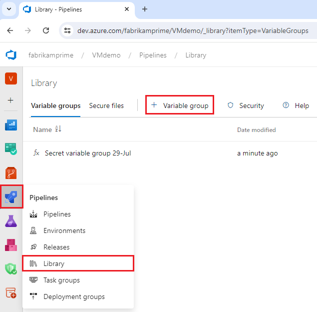
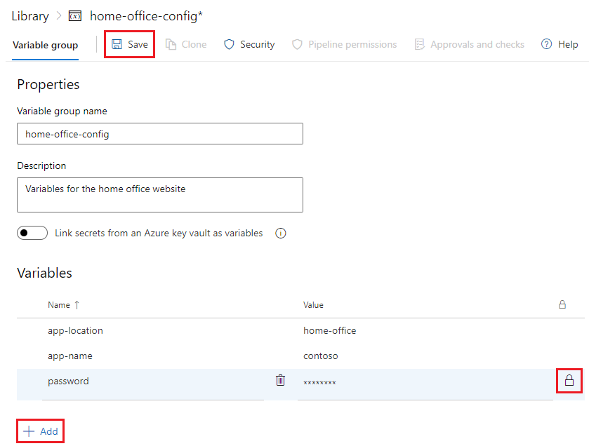

# Managing Variable Groups

### **Introduction**

In Continuous Deployment (CD) pipelines, variables play a crucial role in managing configurations, environment-specific settings, and sensitive information. Azure DevOps provides a powerful feature called Variable Groups, which allows you to centralize and manage variables across multiple pipelines. This page will guide you through the concepts of Variable Groups, how to use them effectively in your CD pipelines, and best practices for securing and managing sensitive information.

***

### **Understanding Variable Groups**

#### **What Are Variable Groups?**

Variable Groups in Azure DevOps are a collection of variables that can be shared across multiple pipelines. These groups help you manage environment-specific configurations, secrets, and other settings centrally, ensuring consistency and reducing duplication.

#### **Key Benefits of Using Variable Groups:**

* **Centralized Management:** Manage all related variables in one place, making it easier to update and maintain configurations.
* **Reusability:** Variable Groups can be reused across multiple pipelines, reducing redundancy and ensuring consistency.
* **Security:** Sensitive information such as API keys, connection strings, and passwords can be securely stored within Variable Groups, with access controlled through permissions.

**Example:**\
Imagine you have multiple pipelines deploying to different environments (e.g., Dev, Staging, Production). By using Variable Groups, you can define environment-specific settings like database connection strings or API endpoints in one place and reference them across all your pipelines.

<div align="left">

<figure><figcaption><p>Create a Variable Group</p></figcaption></figure>

</div>

***

### **Creating and Using Variable Groups in CD Pipelines**

#### **1. Creating a Variable Group**

To create a Variable Group in Azure DevOps:

1. **Navigate to Pipelines:**
   * Go to the **Pipelines** section in Azure DevOps.
   * Select **Library** from the side menu.
2. **Create a New Variable Group:**
   * Click on **+ Variable group**.
   * Name your Variable Group (e.g., `CD_Variables`).
   * Add variables by providing a name and value for each.
3. **Securing Sensitive Information:**
   * For sensitive information like passwords or API keys, check the **Keep this value secret** option. This ensures the variable value is encrypted and only accessible within the pipeline.
   * Set permissions to restrict who can view or edit the Variable Group.

**Example:**

```plaintext
Name: DBConnectionString
Value: Server=myserver.database.windows.net;Database=mydb;User=myuser;Password=mypassword;
```

<figure><figcaption><p>Add Variables</p></figcaption></figure>

**2. Using Variable Groups in a YAML Pipeline**

To use a Variable Group in your CD pipeline, you can reference it in the YAML file:

```yaml
variables:
- group: CD_Variables  # Reference the variable group

jobs:
- job: DeployToStaging
  pool:
    vmImage: 'ubuntu-latest'
  steps:
  - script: echo "Deploying to Staging with DB Connection: $(DBConnectionString)"
    displayName: 'Deploy to Staging'
```

In this example, the `DBConnectionString` variable from the `CD_Variables` group is accessed using `$(DBConnectionString)`.


**Tip:** When referencing secret variables, ensure they are handled securely and not exposed in logs or outputs.


***

### **Variable Scopes in YAML Pipelines**

In Azure DevOps YAML pipelines, variables can have different scopes, determining their availability and visibility within the pipeline.

**1. Pipeline-Wide Variables:**

These variables are defined at the root level of the YAML file and are available throughout the entire pipeline.

**Example:**

```yaml
variables:
  Environment: 'Production'
  BuildConfiguration: 'Release'
```

**2. Stage-Specific Variables:**

Variables can be scoped to a specific stage, making them available only within that stage.

**Example:**

```yaml
stages:
- stage: Build
  variables:
    BuildConfiguration: 'Debug'
  jobs:
  - job: BuildJob
    pool:
      vmImage: 'ubuntu-latest'
    steps:
    - script: echo "Building with configuration $(BuildConfiguration)"
      displayName: 'Build'
```

In this example, the `BuildConfiguration` variable is scoped to the `Build` stage.

**3. Job-Specific Variables:**

Variables can be scoped to a specific job within a stage.

**Example:**

```yaml
jobs:
- job: DeployToProduction
  variables:
    DeploymentTarget: 'ProductionServer'
  steps:
  - script: echo "Deploying to $(DeploymentTarget)"
    displayName: 'Deploy'
```

Here, `DeploymentTarget` is available only within the `DeployToProduction` job.

**4. Variable Group Scope:**

Variable Groups can be included at any level (pipeline, stage, or job) depending on the required scope.

**Example:**

```yaml
variables:
- group: CD_Variables  # Available pipeline-wide

stages:
- stage: Deploy
  variables:
    Environment: 'Staging'
  jobs:
  - job: DeployJob
    variables:
      TargetServer: 'StagingServer'
    steps:
    - script: echo "Deploying to $(TargetServer) with DB: $(DBConnectionString)"
      displayName: 'Deploy to Staging'
```

In this example, `DBConnectionString` is available pipeline-wide, while `TargetServer` is scoped to the `DeployJob` job.


**Best Practice:** Scope variables appropriately to limit their availability and reduce the risk of unintended usage or exposure.


***

### **Best Practices for Securing and Managing Sensitive Information**

Managing sensitive information in CD pipelines is critical for maintaining security and compliance. Azure DevOps provides several features and best practices to ensure that sensitive data is handled securely.

<figure><figcaption><p>Securing Sensitive Information</p></figcaption></figure>

#### **1. Use Secure Files for Sensitive Data**

When dealing with sensitive files (e.g., certificates or configuration files), use the **Secure Files** feature in Azure DevOps:

* **Upload Secure Files:**
  * Navigate to **Pipelines** -> **Library** -> **Secure Files**.
  * Upload the sensitive file and set permissions for access.
* **Use Secure Files in a Pipeline:**

```yaml
steps:
- task: DownloadSecureFile@1
  inputs:
    secureFile: 'my-certificate.pfx'
  displayName: 'Download Secure Certificate'
```

#### **2. Use Azure Key Vault for Secrets**

Azure Key Vault is an excellent solution for managing secrets, keys, and certificates. Integrating Azure Key Vault with Azure DevOps allows you to securely access secrets without exposing them in your pipeline code.

Azure Key Vault is a cloud service that securely stores and tightly controls access to secrets, such as API keys, passwords, certificates, and cryptographic keys. Integrating Azure Key Vault with Azure DevOps pipelines allows you to fetch these secrets securely during pipeline execution without exposing them in your code or logs.

**Steps to Use Azure Key Vault in a Pipeline:**

1. **Create a Key Vault:**
   * In the Azure portal, navigate to **Key Vaults** and create a new Key Vault if you don't already have one.
   * Store the necessary secrets (e.g., API keys, connection strings) in the Key Vault.\

2. **Link Azure Key Vault to Azure DevOps:**
   * In your Azure DevOps project, go to **Pipelines** -> **Library**.
   * Click on **+ Variable group** and then select **Link secrets from an Azure Key Vault as variables**.
   * Choose your Azure subscription and the Key Vault you want to use.
   * Select the secrets you want to make available to your pipeline and click **Add**.\

3.  **Use Secrets from Key Vault in Your Pipeline:**

    Once linked, you can access the secrets in your YAML pipeline by referencing the variable names you defined in the Variable Group linked to the Key Vault.\


    ```yaml
    variables:
    - group: KeyVaultSecrets  # Link the Variable Group containing Key Vault secrets

    jobs:
    - job: Deploy
      pool:
        vmImage: 'ubuntu-latest'
      steps:
      - script: |
          echo "Deploying with the following secret:"
          echo "Database connection string: $(DBConnectionString)"  # Accessing the secret
        displayName: 'Deploy with Key Vault Secret'
    ```

    \
    **Explanation:**

    * **Linking the Key Vault:** The `KeyVaultSecrets` variable group is linked to the Azure Key Vault containing the secrets. This step allows your pipeline to securely access the secrets during runtime.
    * **Accessing Secrets in the Pipeline:** In the pipeline, the secret `DBConnectionString` stored in the Key Vault is accessed using `$(DBConnectionString)`. This ensures that the secret is fetched securely and can be used in the deployment or any other steps in the pipeline.
    * **Security Considerations:** The secret values are never exposed in the pipeline logs or output, maintaining the confidentiality of sensitive information.\

4. **Secure Your Key Vault Access:**
   * Ensure that only authorized pipelines have access to the Key Vault by setting appropriate access policies in the Azure portal.
   * Regularly rotate your secrets and update the references in Azure DevOps to maintain security.

#### **3. Limit Access to Variable Groups**

Restrict access to Variable Groups to only those who need it. This can be managed through Azure DevOps security settings:

* **Set Permissions:**
  * Go to the Variable Group -> **Security**.
  * Assign appropriate roles (e.g., Reader, Contributor) to control access.


**Important:** Regularly review and update permissions to ensure that only authorized users have access to sensitive information.


***

### **\[EXTRA] Accessing Shared Variable Groups Across Projects Using YAML Templates**

Azure DevOps does not natively allow you to share variable groups directly across projects. However, you can achieve a similar outcome by using YAML templates stored in a central repository. This approach allows you to define variables in one place and then reference them across multiple projects, ensuring consistency and ease of maintenance.

#### **Step 1: Create a Central Repository for Shared Variables**

First, set up a central repository where you will store your shared variable definitions. This repository will serve as the single source of truth for variables used across multiple projects.

1. **Create a Central Repository:**
   * In your Azure DevOps organization, create a new project or use an existing one to serve as your central project.
   * Inside this project, create a new repository dedicated to storing shared YAML templates (e.g., `SharedTemplates`).

#### **Step 2: Create a YAML Template with Variables in the Central Repository**

Once your central repository is set up, define the variables you want to share in a YAML file stored in this repository.

1. **Navigate to the Central Repository:**
   * Go to your central project in Azure DevOps.
   * In the central repository, create a new YAML file, such as `shared-variables-template.yml`.
2.  **Define the Variables in the YAML File:**

    * In the YAML file, define the variables you want to share across projects.

    Example of `shared-variables-template.yml`:

    ```yaml
    # shared-variables-template.yml
    variables:
      - name: DATABASE_URL
        value: jdbc:mysql://localhost:3306/mydb
      - name: API_KEY
        value: your_api_key_here
      - name: STORAGE_ACCOUNT
        value: mystorageaccount
      - name: ENVIRONMENT
        value: 'Production'
    ```

    This file contains a list of variables such as `DATABASE_URL`, `API_KEY`, `STORAGE_ACCOUNT`, and `ENVIRONMENT` that you want to use across different projects.

    **Note:** Alternatively, you can use a Variable Group to manage these variables. However, be aware that sharing Variable Groups across projects is not straightforward and requires careful management of access permissions. If you choose to use a Variable Group, you need to ensure that the pipeline in the target project has the necessary permissions to access the Variable Group.

    Example using a Variable Group:

    ```yaml
    variables:
      - group: SharedVariableGroup  # Reference a variable group if you choose to use one
    ```

#### **Step 3: Reference the YAML Template in a Pipeline in Another Project**

Once you’ve defined your variables in the central project, you can reference them in a pipeline in another project by linking to the YAML template.

1.  **Add the Repository as a Resource in the Target Project’s Pipeline:**

    * In the pipeline YAML file of the target project, use the `resources` keyword to reference the central repository where the YAML template is stored.

    Example:

    ```yaml
    resources:
      repositories:
        - repository: templates
          type: git
          name: CentralProject/SharedTemplates  # Replace with your central project and repository name
          ref: refs/heads/main  # Replace with the appropriate branch
    ```

    This tells the pipeline to use the central repository to access the YAML templates.
2.  **Include the YAML Template in the Pipeline:**

    * Reference the YAML template in your pipeline using the `variables` keyword.

    Example:

    ```yaml
    variables:
      - template: shared-variables-template.yml@templates  # Reference the shared template

    jobs:
      - job: Deploy
        pool:
          vmImage: 'ubuntu-latest'
        steps:
          - script: |
              echo "Deploying with the following configurations:"
              echo "Database URL: $(DATABASE_URL)"
              echo "API Key: $(API_KEY)"
              echo "Storage Account: $(STORAGE_ACCOUNT)"
              echo "Environment: $(ENVIRONMENT)"
            displayName: 'Print Shared Variables'
    ```

    In this example, the variables defined in `shared-variables-template.yml` (stored in the central repository) are accessed within the pipeline.
3. **Run the Pipeline:**
   * When you run this pipeline, it will automatically pull the variables from the `shared-variables-template.yml` file in the central repository. This ensures that any updates to the variables in the central file are automatically reflected in all pipelines that reference it.

#### **Benefits of Using YAML Templates for Shared Variables**

* **Single Source of Truth:** By centralizing your variable definitions in one YAML file, you ensure that all projects use the same values, reducing the risk of discrepancies.
* **Easy Maintenance:** Updates to variables only need to be made in one place (the central YAML file), and they automatically propagate to all pipelines that reference the template.
* **Consistency:** Ensures that all pipelines across different projects use the same configuration settings, leading to more predictable and reliable builds.

#### **Considerations and Best Practices**

* **Version Control:** Since the YAML template is stored in a repository, you can leverage version control to track changes and roll back if necessary.
* **Security:** Be cautious with sensitive information. While this method works well for non-sensitive variables, consider using Azure Key Vault or other secrets management tools for sensitive data.
* **Scope Management:** Ensure that the variables defined in the YAML template are scoped appropriately for your needs. You can combine this method with pipeline-specific variables as needed.
* **Variable Groups:** If you choose to use a Variable Group instead of directly defining variables in the YAML template, make sure that the appropriate access permissions are configured to allow cross-project access. This might involve manual configuration and ensuring the correct service accounts have the necessary permissions.

***

### **Conclusion**

Managing Variable Groups in Azure DevOps is a powerful way to centralize, secure, and reuse environment-specific configurations across your CD pipelines. By understanding variable scopes, leveraging secure practices, and effectively organizing your pipelines, you can enhance the security, consistency, and efficiency of your Continuous Deployment process. As you implement these best practices, you’ll be able to manage complex deployments with greater confidence and control.
