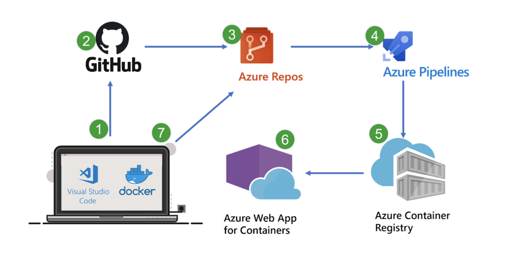
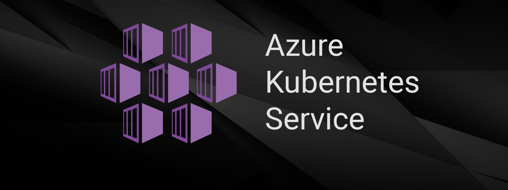
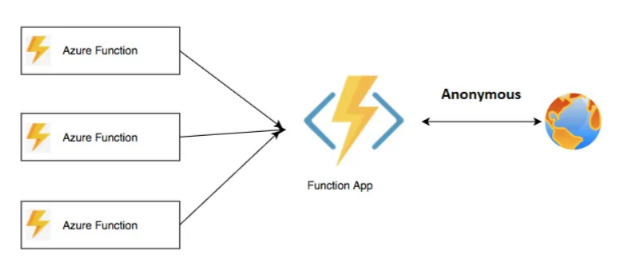

# Understanding Deployment Methods

### **Introduction**

Deployment is a crucial phase in the software development lifecycle, where your application is moved from a development environment to production or other environments. Various deployment methods are available, each suited to different scenarios and infrastructure setups. This page provides an overview of these methods, detailing their use cases and advantages. We'll then focus on the deployment method used in this course: deploying to Heroku.

***

### **1. Overview of Deployment Methods**

Deployment methods vary significantly depending on the infrastructure, application type, and operational requirements. Here are some of the most common external deployment methods:

#### **1.1. Manual Deployments**

Manual deployments involve directly transferring code or files to a server or environment without automation tools. While straightforward, manual deployments are often time-consuming and prone to human error.

**Use Cases:**

* **Small Projects:** Suitable for simple applications with infrequent updates.
* **Initial Setup:** Used during the initial deployment when automation is not yet configured.
* **Ad-Hoc Deployments:** When you need to deploy quickly without setting up a CI/CD pipeline.

**Advantages:**

* **Control:** Full control over each step of the deployment process.
* **Flexibility:** Easily adjust deployment steps based on immediate needs.

**Challenges:**

* **Error-Prone:** High risk of mistakes due to manual intervention.
* **Time-Consuming:** Deployments can be slow, especially for larger applications.

**Example:** Uploading files to a server via FTP or using SSH to copy files to a production environment.


Manual deployments are generally discouraged for larger projects or those requiring frequent updates due to the risk of errors and inefficiency.


#### **1.2. Automated Deployments**

Automated deployments use scripts, CI/CD pipelines, or other tools to manage the deployment process, reducing the need for manual intervention and ensuring consistency.

**Use Cases:**

* **Continuous Integration/Continuous Deployment (CI/CD):** Ideal for projects that require frequent updates and fast, reliable deployments.
* **Large Teams:** Ensures that deployments are consistent across multiple environments.
* **Complex Applications:** Automates complex deployment processes, reducing the risk of human error.

**Advantages:**

* **Speed:** Deployments are fast and can be repeated consistently.
* **Reliability:** Automated processes reduce the likelihood of human error.
* **Scalability:** Can easily scale to accommodate more frequent releases.

**Challenges:**

* **Initial Setup:** Requires time and expertise to set up automated pipelines correctly.
* **Maintenance:** Pipelines must be maintained to adapt to changing application requirements.

**Example:** Using Azure DevOps pipelines to automate the deployment process from build to production.

```yaml
jobs:
- job: Deploy
  pool:
    vmImage: 'ubuntu-latest'
  steps:
  - script: |
      echo "Automating deployment..."
      # Deployment commands go here
    displayName: 'Automated Deployment'
```

#### **1.3. Cloud-Based Deployments**

Cloud-based deployments use cloud service providers like AWS, Azure, Google Cloud, or Heroku to manage and deploy applications. These services often include built-in tools for CI/CD, scaling, monitoring, and more.

<figure><figcaption><p>Cloud Deployment</p></figcaption></figure>

**Use Cases:**

* **Scalable Applications:** Applications that require dynamic scaling and high availability.
* **Multi-Environment Deployments:** Deploying across multiple environments (e.g., dev, staging, production) with minimal effort.
* **Integration with Cloud Services:** Applications that benefit from integrating with other cloud services, such as databases, monitoring, or serverless functions.

**Advantages:**

* **Flexibility:** Easily manage deployments across multiple environments and regions.
* **Integration:** Seamlessly integrate with other cloud services for monitoring, security, and scaling.
* **Efficiency:** Reduce the overhead of managing physical servers or infrastructure.

**Challenges:**

* **Cost:** Cloud-based deployments can be expensive, especially at scale.
* **Complexity:** Requires understanding of cloud architecture and services.

**Example:** Deploying an application to AWS Elastic Beanstalk or Azure App Service using CI/CD pipelines.

```yaml
jobs:
- job: DeployToCloud
  pool:
    vmImage: 'ubuntu-latest'
  steps:
  - script: |
      echo "Deploying to AWS Elastic Beanstalk..."
      # Commands for deployment to AWS
    displayName: 'Cloud-Based Deployment'
```

#### **1.4. External Deployments**

In addition to deploying within a cloud provider's ecosystem, it's also possible to deploy to external services or platforms outside of Azure, AWS, or Google Cloud.

**Use Cases:**

* **Cross-Platform Deployments:** Deploying applications to multiple cloud providers or hybrid environments.
* **Third-Party Services:** Utilizing specialized platforms or services that are external to your primary cloud provider.

**Advantages:**

* **Flexibility:** Ability to leverage best-of-breed services from different providers.
* **Diversification:** Reduces dependency on a single cloud provider.

**Challenges:**

* **Integration Complexity:** May require additional configuration to integrate different platforms.
* **Management Overhead:** Managing multiple deployment endpoints can increase complexity.

**Example:** Deploying an application to a third-party service like Firebase for hosting, or deploying a database to MongoDB Atlas while using Azure for the main application.

```yaml
jobs:
- job: DeployToFirebase
  pool:
    vmImage: 'ubuntu-latest'
  steps:
  - script: |
      npm install -g firebase-tools
      firebase deploy --token $(FIREBASE_TOKEN)
    displayName: 'Deploy to Firebase'
```

***

### **2. Specific Deployment Types in Azure**

Azure provides a range of deployment options tailored for different types of applications and services. Here are some of the most common deployment types available in Azure:

#### **2.1. Deploy to Azure App Service**

Azure App Service is a platform-as-a-service (PaaS) offering that allows you to deploy and manage web applications easily without worrying about the underlying infrastructure.

<figure><figcaption><p>Azure App Service</p></figcaption></figure>

**Use Case:**

* Best for deploying web applications that need to be scalable and accessible with minimal infrastructure management.
* Suitable for applications built in languages like .NET, Java, Python, and more.

**Advantages:**

* **Ease of Use:** Simplifies the deployment and management of web applications.
* **Scalability:** Automatically scales based on traffic and usage.

**Challenges:**

* **Limited Control:** Less control over the underlying infrastructure compared to IaaS solutions.

**Example:** Deploying a web application to Azure App Service using an Azure DevOps pipeline.

```yaml
# Example pipeline step to deploy to Azure App Service
- task: AzureWebApp@1
  inputs:
    azureSubscription: 'myAzureSubscription'
    appName: 'myWebApp'
    package: '$(Build.ArtifactStagingDirectory)/drop'
```

### **2.2. Deploy to Azure Container Registry (ACR)**

Azure Container Registry (ACR) is a managed Docker container registry that allows you to store and manage container images for all types of deployments.

**Use Case:**

* Ideal for containerized applications where you need a central repository to manage Docker images.
* Commonly used in microservices architectures where each service is deployed as a separate container.

**Advantages:**

* **Centralized Management:** Provides a single point to manage all container images.
* **Integration with Azure Services:** Easily integrates with Azure Kubernetes Service (AKS) and other Azure services.

**Challenges:**

* **Complexity:** Requires understanding of containerization and Docker.

**Example:** Building a Docker image and pushing it to ACR, followed by deploying it to Azure Kubernetes Service (AKS).

```yaml
# Example pipeline to build and push a Docker image to ACR
- task: Docker@2
  inputs:
    command: buildAndPush
    containerRegistry: 'myContainerRegistry'
    repository: 'myApp'
    tags: |
      $(Build.BuildId)
```

<figure><figcaption><p>Azure Container Registry</p></figcaption></figure>

### **2.3. Deploy to Azure Kubernetes Service (AKS)**

Azure Kubernetes Service (AKS) is a managed Kubernetes service that simplifies deploying, managing, and operating Kubernetes clusters. It is ideal for running containerized applications in production.

<figure><figcaption><p>Azure Kubernetes Service</p></figcaption></figure>

**Use Case:**

* Suitable for complex, scalable applications that require container orchestration and management.
* Often used in microservices architectures.

**Advantages:**

* **Scalability:** Automatically scales applications based on demand.
* **Management:** Simplifies the management of Kubernetes clusters, including upgrades and scaling.

**Challenges:**

* **Complexity:** Requires understanding of Kubernetes and container orchestration.

**Difference between ACR and AKS:**

* **ACR:** Focuses on storing and managing container images. It acts as a repository for your Docker images, allowing you to manage and share them across your organization. ACR does not deploy these images but makes them available for deployment to services like AKS or other container orchestration platforms.
* **AKS:** Is a managed Kubernetes service that actually runs and orchestrates the deployment of your containerized applications. It pulls images from a container registry like ACR and manages the lifecycle of these containers, ensuring they are deployed, scaled, and updated correctly.

### **2.4. Deploy to Azure Functions**

Azure Functions is a serverless compute service that allows you to run event-driven code without managing any infrastructure. It is ideal for small pieces of code (functions) that can be triggered by HTTP requests, timers, or other events.

<div align="left">

<figure><figcaption><p>Azure Functions</p></figcaption></figure>

</div>

**Use Case:**

* Best for scenarios requiring event-driven execution, such as processing messages from a queue or responding to HTTP requests.
* Suitable for microservices or small tasks that need to scale automatically.

**Advantages:**

* **Serverless:** No need to manage infrastructure; automatically scales based on demand.
* **Cost-Efficient:** Pay only for the compute resources used when functions are running.

**Challenges:**

* **Cold Start:** May experience latency during the first execution after being idle.

**Example:** Deploying a function app to Azure Functions using an Azure DevOps pipeline.

```yaml
# Example pipeline step to deploy to Azure Functions
- task: AzureFunctionApp@1
  inputs:
    azureSubscription: 'myAzureSubscription'
    appType: 'functionApp'
    appName: 'myFunctionApp'
    package: '$(Build.ArtifactStagingDirectory)/drop.zip'
```

### **2.5. Deploy to Azure Web App for Containers**

Azure Web App for Containers allows you to deploy and run containerized web applications on Azure, combining the benefits of Azure Web App with the flexibility of containerization.

<div align="left">

<figure><figcaption><p>Azure Web App for Containers</p></figcaption></figure>

</div>

**Use Case:**

* Best for web applications that require the flexibility of containers while benefiting from Azure Web App's scalability and management features.
* Suitable for multi-container applications or applications requiring specific runtime environments.

**Advantages:**

* **Containerization:** Run your application in a container, ensuring consistency across environments.
* **PaaS Benefits:** Benefit from Azure Web App's features like scaling, backups, and monitoring.

**Challenges:**

* **Complexity:** Requires knowledge of containerization and managing container registries.

**Example:** Deploying a Docker container to Azure Web App for Containers using an Azure DevOps pipeline.

```yaml
# Example pipeline step to deploy to Azure Web App for Containers
- task: AzureWebAppContainer@1
  inputs:
    azureSubscription: 'myAzureSubscription'
    appName: 'myContainerWebApp'
    imageName: 'myRegistry.azurecr.io/myImage:$(Build.BuildId)'
    registry: 'myRegistry'
    dockerfile: '**/Dockerfile'
```

### **2.6. Other External Deployment Options**

Beyond Azure's native deployment methods, you can also deploy to services and platforms outside of Azure. This flexibility allows you to integrate with third-party services or other cloud providers, depending on your application's needs.

**Use Case:**

* **Cross-Platform Deployments:** Deploying applications to multiple cloud providers or hybrid environments.
* **Third-Party Services:** Utilizing specialized platforms or services that are external to your primary cloud provider.

**Advantages:**

* **Flexibility:** Ability to leverage best-of-breed services from different providers.
* **Diversification:** Reduces dependency on a single cloud provider.

**Challenges:**

* **Integration Complexity:** May require additional configuration to integrate different platforms.
* **Management Overhead:** Managing multiple deployment endpoints can increase complexity.

**Example:** Deploying a web application from Azure DevOps to a third-party hosting service like DigitalOcean or deploying a static site to Netlify.

```yaml
jobs:
- job: DeployToDigitalOcean
  pool:
    vmImage: 'ubuntu-latest'
  steps:
  - script: |
      doctl compute droplet create my-droplet --region nyc1 --image ubuntu-20-04-x64 --size s-1vcpu-1gb --ssh-keys $(DIGITALOCEAN_SSH_KEY)
    displayName: 'Deploy to DigitalOcean'
```

***

### **3. Deploying to Heroku**

In this course, we focus on deploying our application to Heroku, a cloud-based platform as a service (PaaS) that simplifies the deployment process. Heroku offers numerous benefits, such as simplified scaling, built-in security, and easy integration with CI/CD pipelines.

**Why Heroku?**

Heroku is known for its simplicity and ease of use, making it an ideal choice for small to medium-sized applications. It handles infrastructure management, scaling, and security, allowing you to concentrate on building and deploying your application.

**Steps to Deploy to Heroku:**

* **Step 1:** Set up a Heroku account and install the Heroku CLI.
* **Step 2:** Use the Heroku CLI to create a new Heroku application.
* **Step 3:** Configure your Azure DevOps pipeline to build your application, create a JAR file, and deploy it to Heroku using the CLI.
* **Step 4:** Monitor and manage your application using Heroku's built-in tools.

**Example:**

```bash
# Example command to deploy JAR file to Heroku
heroku create my-app
heroku deploy:jar target/my-app.jar --app my-app
```


Heroku simplifies the deployment process, making it easier to focus on application development and deployment without managing complex infrastructure.


***

### **Conclusion**

Understanding the different deployment methods available, both in Azure and other platforms like Heroku, is crucial for selecting the right approach for your project. Whether you're deploying to Azure Container Registry, Azure Kubernetes Service, Azure Web App, or Heroku, each method offers unique benefits that can cater to various application needs. As we proceed in this course, you’ll gain hands-on experience with deploying a Java application to Heroku, integrating CI/CD practices, and managing your application in a cloud environment.
