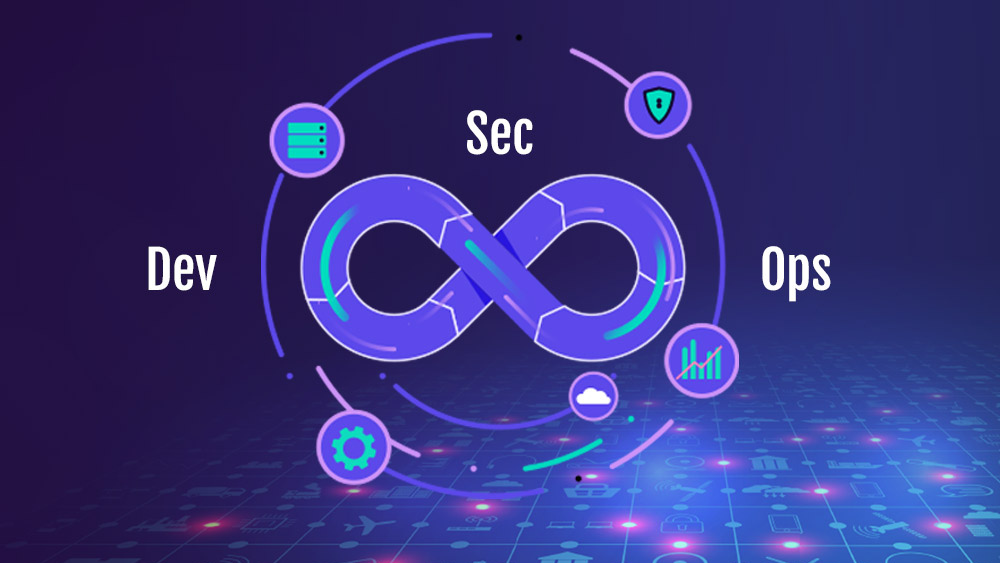
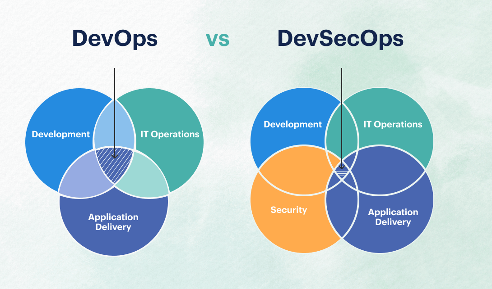
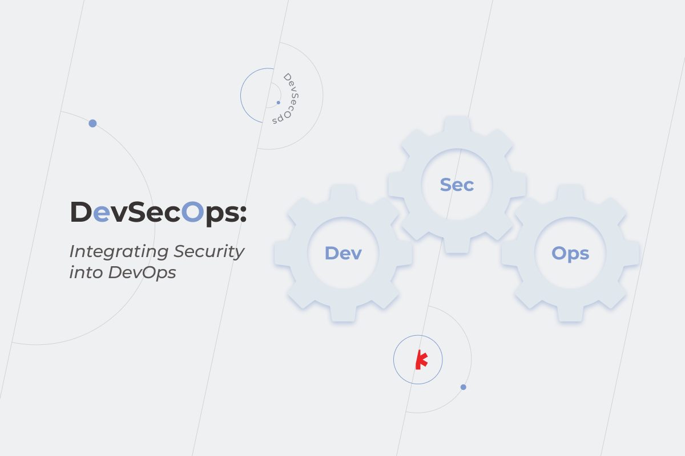
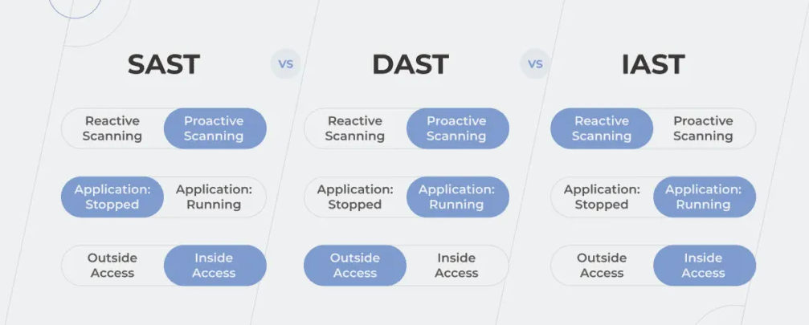

# Introduction to DevSecOps

### **Introduction**

DevSecOps is the practice of integrating security into every phase of the DevOps lifecycle, ensuring that security is not an afterthought but a continuous, proactive process. As organizations increasingly adopt DevOps to accelerate software delivery, the need to embed security into these practices has become paramount. DevSecOps addresses this need by fostering a culture where security is everyone’s responsibility, from developers to operations teams.

***

### **What is DevSecOps?**

DevSecOps, short for Development, Security, and Operations, is a methodology that integrates security practices into the DevOps process. Unlike traditional approaches where security is handled separately from development and operations, DevSecOps ensures that security is built into every stage of the software development lifecycle (SDLC).

<figure><figcaption>
DevSecOps
</figcaption></figure>

#### **Key Goals of DevSecOps:**

1. **Shift Security Left:** Incorporate security earlier in the development process, allowing teams to identify and fix vulnerabilities before they reach production.
2. **Automate Security Processes:** Use automated tools to continuously monitor and test code for security issues, reducing the manual effort required.
3. **Foster Collaboration:** Encourage collaboration between development, security, and operations teams to ensure that security is a shared responsibility.
4. **Continuous Improvement:** Regularly update security practices to respond to new threats and vulnerabilities as they emerge.

**Example:**\
Consider an organization that releases software updates weekly. Without DevSecOps, security testing might only occur at the end of the release cycle, potentially delaying the release if issues are found. With DevSecOps, security checks are automated and integrated into the CI/CD pipeline, ensuring that vulnerabilities are identified and addressed early in the development process.

***

### **DevOps vs. DevSecOps**

While DevOps focuses on the collaboration between development and operations to streamline software delivery, DevSecOps expands this collaboration to include security as a core component. The primary difference between DevOps and DevSecOps is the integration of security practices throughout the development process.

<figure><figcaption>
DevOps vs DevSecOps
</figcaption></figure>

#### **DevOps:**

1. **Focus on Speed:** Emphasizes faster development cycles and quicker releases.
2. **Collaboration:** Bridges the gap between development and operations teams to improve efficiency and reduce silos.
3. **Automation:** Uses automation tools to streamline the CI/CD pipeline, making software delivery faster and more reliable.

#### **DevSecOps:**

1. **Focus on Security:** Integrates security into every phase of the development process, from planning to deployment.
2. **Security as a Shared Responsibility:** Encourages all team members, including developers, operations, and security professionals, to take ownership of security.
3. **Continuous Monitoring:** Implements continuous security checks throughout the development lifecycle, using tools to detect and fix vulnerabilities early.

#### **Comparison Table:**

| **Aspect**         | **DevOps**               | **DevSecOps**                      |
| ------------------ | ------------------------ | ---------------------------------- |
| **Primary Focus**  | Speed and Collaboration  | Security Integration               |
| **Responsibility** | Development & Operations | Development, Security & Operations |
| **Automation**     | CI/CD Pipeline           | CI/CD Pipeline + Security          |
| **Security**       | Often Post-Development   | Throughout Development             |

***

### **A Brief History of DevSecOps**

DevSecOps emerged as a response to the limitations of traditional DevOps, where security was often siloed and addressed too late in the development process. As organizations began to adopt DevOps to speed up software delivery, they encountered new security challenges that required a different approach.

#### **Evolution of DevSecOps:**

1. **Traditional Development and Security:** Initially, security was a separate phase that occurred after development, leading to delays and potential risks if vulnerabilities were found late in the process.
2. **DevOps Movement:** The adoption of DevOps aimed to break down silos between development and operations, enabling faster and more reliable releases. However, security was often overlooked in this transition.
3. **The Rise of DevSecOps:** As security breaches became more common and costly, the need to integrate security into DevOps practices became clear. DevSecOps was born out of this necessity, blending security into the rapid pace of DevOps.

**Example:**\
In the early 2000s, a typical software development process might involve a lengthy security review at the end of the project, often leading to significant delays. With the advent of DevSecOps, security is now an ongoing activity, integrated into every phase of development, from code commit to production deployment.

***

### **The Importance of Integrating Security into DevOps**

<figure><figcaption>
Integrating Security Into DevOps
</figcaption></figure>

Security is no longer just a final checkpoint before deployment; it must be a continuous process that runs parallel to development and operations. Integrating security into DevOps is crucial for several reasons:

1. **Reducing Risk:** By addressing security early and often, organizations can significantly reduce the risk of vulnerabilities making it into production.
2. **Faster Time-to-Market:** Automated security checks allow for faster releases without compromising security, aligning with the goals of DevOps.
3. **Compliance:** Many industries have stringent security requirements. DevSecOps ensures that compliance is maintained throughout the development process.
4. **Building Trust:** Delivering secure software builds customer trust, which is essential for maintaining a competitive edge.

> "Security should not be an afterthought in DevOps; it should be an integral part of the entire process."

***

### **Tools Used in DevSecOps**

Implementing DevSecOps effectively requires integrating various security tools that automate testing, monitor vulnerabilities, and ensure secure code throughout the SDLC. Here are the primary categories of tools used in DevSecOps:

#### **1. Static Application Security Testing (SAST):**

SAST tools analyze source code, bytecode, or binaries for security vulnerabilities without executing the code. These tools help identify issues early in the development process, often integrated directly into the CI/CD pipeline.

* **Examples:** SonarQube, Checkmarx

#### **2. Dynamic Application Security Testing (DAST):**

DAST tools assess the security of an application in its running state. Unlike SAST, which focuses on the code, DAST tests the application in its deployed environment, simulating external attacks to identify vulnerabilities like SQL injection, cross-site scripting (XSS), and others.

* **Examples:** OWASP ZAP, Burp Suite

#### **3. Software Composition Analysis (SCA):**

SCA tools scan the open-source libraries and dependencies used in an application to identify known vulnerabilities. These tools ensure that the third-party components integrated into the software are secure and up-to-date.

* **Examples:** Snyk, WhiteSource

#### **4. Interactive Application Security Testing (IAST):**

IAST tools combine aspects of both SAST and DAST by analyzing running applications. IAST tools work within the application, providing real-time feedback on security vulnerabilities as the application runs, giving deeper insights into how vulnerabilities might be exploited in a live environment.

* **Examples:** Contrast Security, Veracode

#### **Comparison between DAST and IAST:**

* **DAST:** Tests the application externally, simulating attacks from a user's perspective. It’s effective for identifying runtime vulnerabilities but lacks visibility into the internal workings of the application.
* **IAST:** Works inside the application during runtime, providing more detailed information about vulnerabilities by analyzing the code's behavior. IAST can identify vulnerabilities that might be missed by DAST because it has access to the internal code and data flows.

<figure><figcaption>
DevSecOps Tools
</figcaption></figure>

***

### **Challenges in Adopting DevSecOps**

While the benefits of DevSecOps are clear, organizations often face several challenges when trying to implement it:

1. **Cultural Resistance:** Shifting the mindset from a separate security phase to integrated security can be difficult, especially in organizations with established processes.
2. **Tooling Complexity:** Implementing DevSecOps requires the integration of various tools for security testing, monitoring, and compliance, which can be complex and costly.
3. **Skill Gaps:** Developers and operations teams may lack the necessary security knowledge, requiring additional training and education.
4. **Balancing Speed and Security:** One of the core promises of DevOps is speed, but this can sometimes conflict with thorough security practices. Finding the right balance is crucial.

**Example:**\
A company that has been using traditional development practices might struggle to adopt DevSecOps because its developers are not familiar with security testing tools. Overcoming this challenge would involve training and integrating security into the development process gradually.

***

### **Conclusion**

DevSecOps represents a significant shift in how organizations approach security in the software development process. By integrating security into every phase of the DevOps lifecycle, organizations can reduce risks, improve compliance, and deliver secure software faster. While there are challenges in adopting DevSecOps, the benefits of building security into the foundation of development far outweigh the hurdles. As we move forward, we’ll explore specific practices and tools that make DevSecOps a reality, helping you to integrate security seamlessly into your DevOps workflows.
