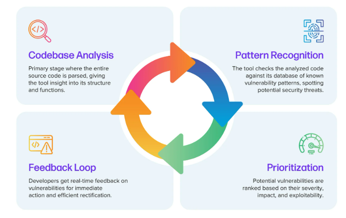
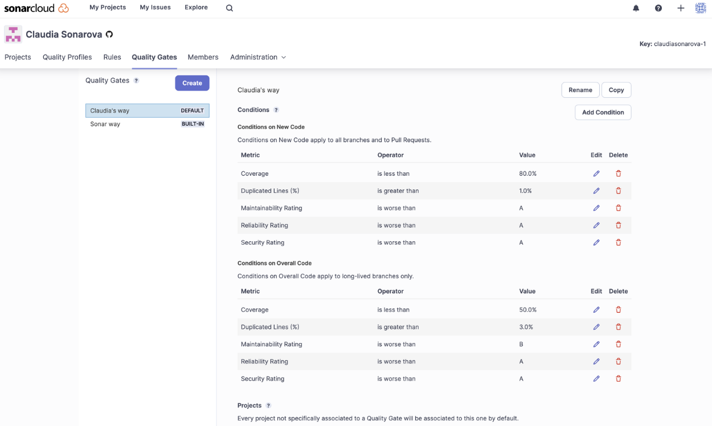
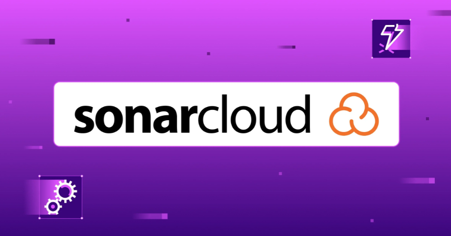
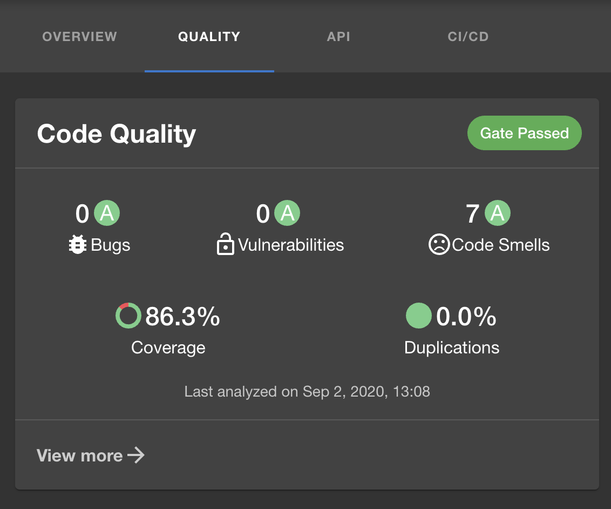
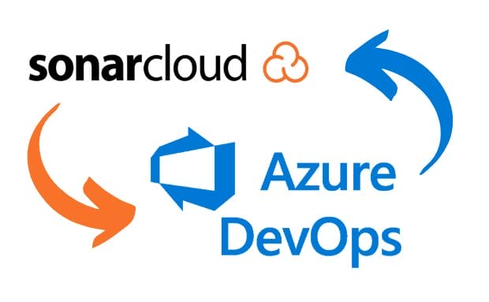
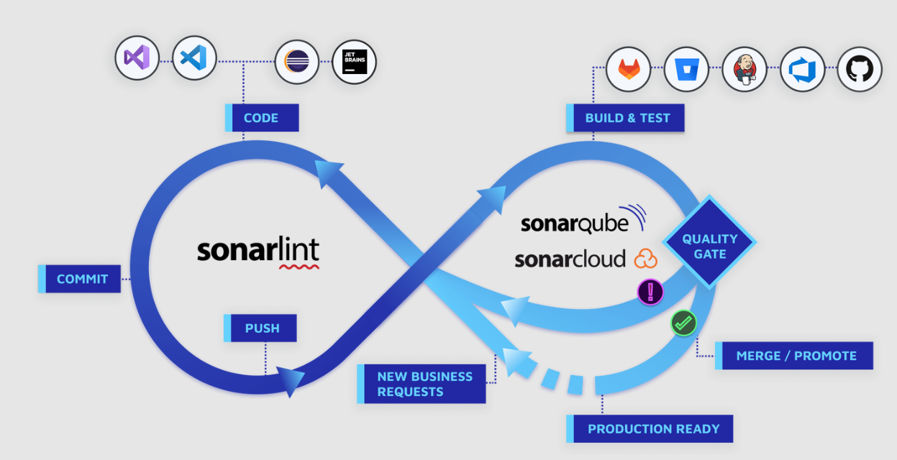
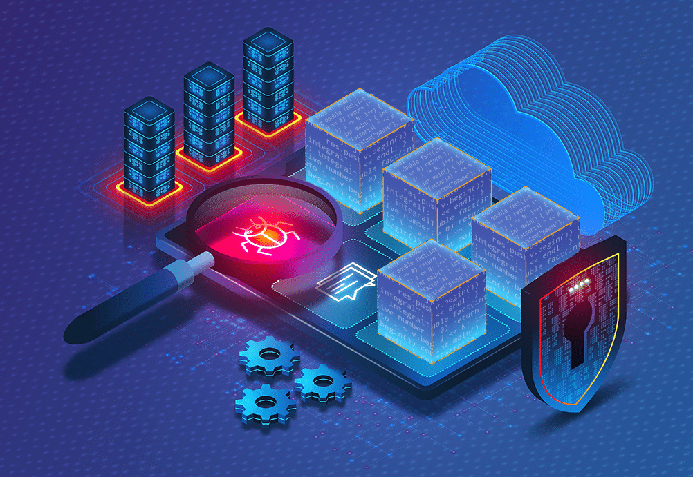

# SAST (Static Application Security Testing)

### **Introduction**

Static Application Security Testing (SAST) is a critical component of the DevSecOps pipeline. SAST analyzes an application's source code, bytecode, or binary code for security vulnerabilities without executing the code. This early detection of vulnerabilities allows developers to address issues before the application is built and deployed, significantly reducing the risk of security breaches.

***

### **The Role of SAST in Identifying Security Vulnerabilities**

<figure><figcaption>
SAST
</figcaption></figure>

SAST tools work by scanning the codebase to identify common security issues, such as SQL injection, cross-site scripting (XSS), buffer overflows, and more. By integrating SAST into the CI pipeline, organizations can:

1. **Detect Vulnerabilities Early:** SAST allows vulnerabilities to be detected early in the development process, reducing the cost and effort required to fix them later.
2. **Automate Security Checks:** Integrating SAST with CI pipelines automates the security testing process, ensuring that every code change is analyzed for potential vulnerabilities.
3. **Improve Code Quality:** Regular SAST scans help maintain high code quality by enforcing secure coding practices and identifying potential issues that could lead to security breaches.

**Example:**\
Consider a web application where a developer introduces a new feature. By running SAST as part of the CI pipeline, the code is automatically scanned for vulnerabilities before being merged into the main branch. If an issue like SQL injection is detected, the developer can address it immediately, preventing the vulnerability from reaching production.

***

### **Benefits of Integrating SAST into CI Pipelines**

Integrating SAST into CI pipelines offers numerous benefits, ensuring that security is embedded into the development process from the start.

1. **Continuous Security Monitoring:** Every time code is pushed to the repository, it is automatically scanned for security vulnerabilities, providing continuous security monitoring throughout the development lifecycle.
2. **Early Detection and Mitigation:** By catching vulnerabilities early, SAST helps reduce the time and cost associated with fixing security issues.
3. **Compliance with Security Standards:** SAST tools often support industry standards like OWASP, ensuring that the codebase complies with best practices and regulatory requirements.
4. **Developer Awareness and Education:** SAST tools can help developers learn about secure coding practices by providing detailed feedback on vulnerabilities and how to fix them.

**Example:**\
In a CI/CD pipeline, integrating a SAST tool ensures that every code commit triggers a security scan. If vulnerabilities are found, the pipeline can be configured to fail the build, preventing insecure code from being deployed.

***

### **Quality Gates in SonarCloud and Azure DevOps**

**Quality Gates** are a key feature of SonarCloud that help enforce code quality and security standards. A quality gate is essentially a set of conditions that the code must meet before it can pass to the next stage of the CI/CD pipeline. These conditions typically include thresholds for metrics such as code coverage, maintainability, and the presence of security vulnerabilities.

<figure><figcaption>
Quality Gates in SonarCloud
</figcaption></figure>

#### **Using Quality Gates in SonarCloud:**

1. **Pre-Defined Criteria:** SonarCloud provides default quality gates based on industry standards, which can be customized to fit the project's needs.
2. **Enforcing Standards:** If the code fails to meet the quality gate criteria, the build fails, preventing insecure or low-quality code from being deployed.
3. **Integration with Azure DevOps:** When integrated with Azure DevOps, SonarCloud quality gates can be used to block pull requests that do not meet the defined standards, ensuring only high-quality code is merged.

**Example:**\
A quality gate in SonarCloud might require at least 80% code coverage and no critical vulnerabilities. If a developer submits a pull request with 70% code coverage and one critical vulnerability, the quality gate will fail, and the pull request cannot be merged until the issues are resolved.

***

### **Understanding SonarCloud: A Key SAST Tool**

SonarCloud is a popular cloud-based SAST tool that analyzes code for vulnerabilities, code smells, bugs, and other issues. It supports a wide range of programming languages and integrates seamlessly with CI/CD pipelines.

<figure><figcaption>
SonarCloud
</figcaption></figure>

#### **Key Features of SonarCloud:**

1. **Multi-Language Support:** SonarCloud supports over 20 programming languages, making it a versatile tool for different projects.
2. **Cloud-Based:** As a cloud-based tool, SonarCloud does not require any local installation, making it easy to set up and scale.
3. **Continuous Code Quality:** SonarCloud continuously monitors code quality, providing real-time feedback on potential issues.
4. **Integration with DevOps Tools:** SonarCloud integrates with popular DevOps tools like Azure DevOps, GitHub, and Bitbucket, enabling seamless integration into existing workflows.

**Example:**\
When a developer pushes code to the repository, SonarCloud automatically analyzes the code for security vulnerabilities, code smells, and bugs. The results are displayed in the SonarCloud dashboard, where developers can view detailed information about each issue and how to resolve it.

***

### **Key Metrics in SonarCloud and How to Interpret Them**

SonarCloud provides various metrics to help developers understand the quality and security of their code. Below are some of the key metrics and their detailed explanations:

<figure><figcaption>
SonarCloud Metrics
</figcaption></figure>

1. **Security Vulnerabilities:**
   * **What it Measures:** Identifies security weaknesses in the code that could be exploited by attackers.
   * **Importance:** These are critical issues that could lead to security breaches, so they must be addressed immediately.
   * **Example:** A vulnerability might be detected in how user input is handled, potentially leading to SQL injection.
2. **Code Smells:**
   * **What it Measures:** Indicates areas of the code that are not technically incorrect but could lead to maintenance issues.
   * **Importance:** While not as severe as vulnerabilities, code smells can accumulate over time, making the codebase harder to maintain and increasing technical debt.
   * **Example:** A method that is too complex or has too many parameters might be flagged as a code smell.
3. **Coverage:**
   * **What it Measures:** Measures the percentage of code that is covered by automated tests.
   * **Importance:** High coverage is essential for ensuring that most of the code is tested, reducing the likelihood of undetected bugs.
   * **Example:** If a project has 70% code coverage, it means 70% of the code is tested by the automated test suite.
4. **Duplication:**
   * **What it Measures:** Detects duplicated code, which can lead to inconsistencies and increase maintenance efforts.
   * **Importance:** Duplicated code should be refactored to improve maintainability and reduce the risk of bugs.
   * **Example:** The same block of code appearing in multiple places might be flagged as duplicated code.
5. **Maintainability Rating:**
   * **What it Measures:** Provides a rating (A to E) indicating the ease with which the code can be maintained.
   * **Importance:** High maintainability means that the codebase is easier to work with, leading to fewer bugs and lower costs over time.
   * **Example:** A project with a maintainability rating of A indicates that the code is well-structured and easy to maintain.

**Example:**\
A project might have a high maintainability rating (A) but show several code smells. Developers can prioritize addressing the code smells to improve the overall code quality.

***

### **SonarCloud Extension for Azure DevOps**

The SonarCloud extension for Azure DevOps simplifies the process of integrating SonarCloud with your CI/CD pipelines. This extension allows you to add SonarCloud analysis tasks directly into your Azure Pipelines, enabling seamless quality checks as part of your CI/CD workflow.

<figure><figcaption>
SonarCloud in Azure DevOps
</figcaption></figure>

#### **Key Features:**

1. **Seamless Integration:** The extension integrates directly into Azure Pipelines, making it easy to add SonarCloud analysis to your build and release pipelines.
2. **Automated Quality Gates:** The extension ensures that quality gates are automatically applied, blocking builds that do not meet the required standards.
3. **Detailed Reporting:** SonarCloud provides detailed reports on code quality and security directly within the Azure DevOps interface, allowing teams to quickly identify and address issues.

**Example:**\
By adding the SonarCloud extension to an Azure Pipeline, every build will automatically include a SonarCloud analysis step. If the code does not meet the quality gate criteria, the build will fail, preventing the code from being deployed.

***

### **What is New Code in SonarCloud and How Does it Work?**

In SonarCloud, the concept of **New Code** is central to maintaining and improving code quality over time. New Code refers to the lines of code that have been added or modified in a project since a specific date or baseline. SonarCloud allows you to focus on maintaining high standards for this new code, ensuring that issues are not introduced or carried forward.

#### **How New Code Works:**

1.  **Defining New Code:**

    * New Code is typically defined based on a reference date, such as the start of a sprint, the date of the last release, or a custom date you choose. SonarCloud allows you to configure this date to align with your development workflow.

    **Example:**\
    If you set the New Code reference date to the start of the current sprint, all changes made after this date will be considered New Code.
2.  **Monitoring New Code Quality:**

    * SonarCloud tracks the quality of New Code by applying the same metrics used for the overall codebase, such as security vulnerabilities, code smells, coverage, and duplications. This focus on New Code helps teams maintain or improve code quality with each new development cycle.

    **Example:**\
    A development team might set a quality gate that requires 100% coverage on New Code. If a developer introduces a new feature with inadequate tests, the quality gate will fail, prompting the developer to add sufficient tests before merging.
3.  **Setting Quality Gates on New Code:**

    * Quality gates can be configured to apply specifically to New Code. This means that even if the overall codebase has legacy issues, the team can enforce stricter standards on new or modified code to avoid further technical debt.

    **Example:**\
    A project might have legacy code with a maintainability rating of C, but the team decides that all New Code must meet an A rating. SonarCloud will enforce this by flagging any new changes that do not meet the A standard.
4.  **Integrating New Code with CI/CD Pipelines:**

    * When integrated into CI/CD pipelines, SonarCloud can automatically analyze New Code in pull requests, providing immediate feedback to developers. If the New Code introduces any issues, the build can be set to fail, preventing problematic code from being merged.

    **Example:**\
    A pull request is submitted with code that reduces coverage by 5% on New Code. SonarCloud detects this and fails the build, ensuring that the code is not merged until the coverage is improved.

#### **Benefits of Focusing on New Code:**

1. **Preventing Technical Debt:** By enforcing strict quality standards on New Code, teams can prevent the accumulation of technical debt over time.
2. **Continuous Improvement:** Regularly addressing issues in New Code helps gradually improve the overall quality of the codebase.
3. **Targeted Remediation:** Developers can prioritize fixing issues in New Code, ensuring that recent changes are secure and maintainable.

**Example:**\
Consider a project where security vulnerabilities are prevalent in legacy code. By focusing on New Code, the team can ensure that no new vulnerabilities are introduced, gradually reducing the overall risk.

***

### **Code Coverage**

Code coverage is a crucial metric that measures the percentage of code tested by automated tests. It provides insight into how much of your codebase is actually being tested, which is essential for ensuring that all critical parts of the application are covered by tests.

<figure><figcaption>
Code Coverage
</figcaption></figure>

#### **Why Code Coverage Matters:**

1. **Identifying Gaps in Testing:** Code coverage helps identify parts of the code that are not being tested, which could potentially hide bugs or vulnerabilities.
2. **Improving Test Quality:** High code coverage generally indicates a more robust test suite, which can catch more issues before they reach production.
3. **Balancing Coverage and Quality:** While high coverage is important, it is equally important to focus on the quality of the tests. Tests should not just increase coverage but also provide meaningful checks that catch real issues.

**Example:**\
If a project has 90% code coverage, but the remaining 10% includes critical areas like authentication or payment processing, the test suite might miss significant issues. It's essential to ensure that critical parts of the application are well-covered by tests.

***

### **Using SonarLint with IntelliJ IDEA for Real-Time Feedback**

SonarLint is a plugin that provides real-time feedback in IntelliJ IDEA as developers write code. It works by analyzing the code in the IDE and highlighting potential issues as they arise.

<figure><figcaption>
SonarLint
</figcaption></figure>

**Steps to Set Up SonarLint in IntelliJ IDEA:**

1. **Install SonarLint Plugin:**
   * Open IntelliJ IDEA, go to **File > Settings > Plugins**.
   * Search for "SonarLint" and click **Install**.
2. **Configure SonarLint:**
   * After installation, go to **File > Settings > Tools > SonarLint**.
   * You can connect SonarLint to a SonarCloud or SonarQube server or use it in standalone mode.
3. **Real-Time Analysis:**
   * As you write code, SonarLint will automatically analyze the code and highlight issues.
   * Detailed information about each issue is available, along with suggestions for how to fix it.

**Example:**\
When a developer writes a new function, SonarLint analyzes the code in real-time and highlights a potential security vulnerability, allowing the developer to address the issue immediately.

***

### **Comparison of SAST Tools**

<figure><figcaption>
SAST Tools
</figcaption></figure>

While SonarCloud is used in this course, several other SAST tools are available in the market. Here’s a comparison of some popular options:

| **Tool**       | **Languages Supported** | **Cloud/On-Premises** | **Key Features**                                                           |
| -------------- | ----------------------- | --------------------- | -------------------------------------------------------------------------- |
| **SonarCloud** | 20+                     | Cloud                 | Multi-language support, real-time analysis, integration with CI/CD         |
| **Checkmarx**  | 20+                     | On-Premises/Cloud     | Advanced security testing, compliance checks, extensive reporting          |
| **Veracode**   | 20+                     | Cloud                 | Comprehensive security testing, integration with CI/CD, detailed reporting |
| **Fortify**    | 25+                     | On-Premises/Cloud     | Deep code analysis, integration with CI/CD, extensive language support     |

**Why SonarCloud is Chosen for This Course:**

* **Ease of Use:** SonarCloud’s cloud-based nature makes it easy to set up and use without needing to manage infrastructure.
* **Comprehensive Metrics:** SonarCloud provides detailed metrics that help improve both security and code quality.
* **Integration:** SonarCloud integrates seamlessly with Azure DevOps, making it ideal for the CI/CD pipelines used in this course.

***

### **Conclusion**

SAST is a powerful technique for identifying security vulnerabilities early in the development process. By integrating SAST tools like SonarCloud into CI pipelines, organizations can continuously monitor code quality and security, ensuring that vulnerabilities are caught and addressed before they reach production. Tools like SonarLint further enhance the development process by providing real-time feedback, empowering developers to write secure and maintainable code. Understanding quality gates, code coverage, and how to effectively interpret SonarCloud’s metrics will be essential as we implement these practices in real-world scenarios.
