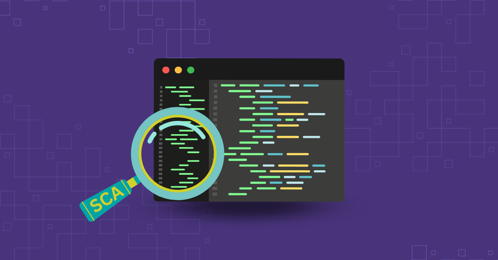
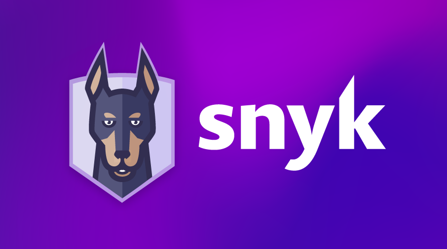
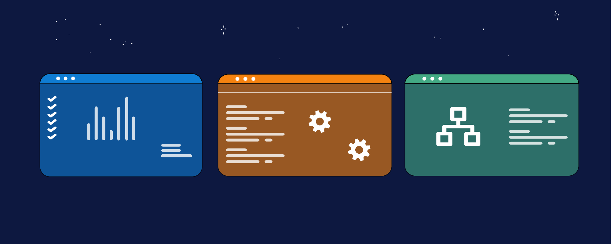

# SCA (Software Composition Analysis)

### **Introduction**

Software Composition Analysis (SCA) is a vital component in modern software development, focusing on the management and security of open-source components and third-party dependencies. SCA tools help identify vulnerabilities in these components, ensuring that applications remain secure and compliant with licensing requirements. As open-source software becomes more prevalent, the need for effective SCA has never been more critical.

***

### **The Importance of SCA in Managing Open-Source Components**

SCA tools provide visibility into the open-source components used within a project, helping developers and security teams identify vulnerabilities, outdated dependencies, and licensing issues. By integrating SCA into the DevSecOps pipeline, organizations can maintain a secure codebase while leveraging the benefits of open-source software.

<figure><figcaption>
Software Composition Analysis
</figcaption></figure>

#### **Key Benefits of SCA:**

1. **Vulnerability Detection:** Automatically identifies known vulnerabilities in third-party libraries.
2. **License Compliance:** Ensures that all open-source components comply with licensing requirements.
3. **Risk Mitigation:** Helps mitigate the risks associated with using vulnerable or outdated components.

**Example:**\
Consider a web application that relies on several open-source libraries. If a critical vulnerability is discovered in one of these libraries, SCA tools can quickly identify the affected components, allowing developers to address the issue before it becomes a security risk.

***

### **Integrating SCA into CI Pipelines with Snyk**

Snyk is a leading SCA tool that integrates seamlessly into CI pipelines, providing continuous monitoring of open-source dependencies for vulnerabilities. Snyk automatically scans for known security issues, suggests fixes, and ensures that only secure, compliant components are used in production.

<figure><figcaption>
Snyk
</figcaption></figure>

#### **Key Features of Snyk:**

1. **Automated Scanning:** Snyk scans dependencies for vulnerabilities at every build, ensuring continuous security.
2. **Fix Suggestions:** Provides automated fix suggestions for vulnerabilities, often with one-click remediation.
3. **License Management:** Monitors and flags any license compliance issues, helping avoid potential legal risks.

**Example:**\
When a developer pushes code to the repository, Snyk automatically scans the dependencies and reports any vulnerabilities in the CI pipeline. If a vulnerability is found, Snyk suggests a remediation, which the developer can apply with a single click, ensuring that the codebase remains secure.

***

### **Best Practices for Managing Dependencies**

Effective dependency management is crucial for maintaining a secure and stable software project. Here are some best practices to follow:

**1. Regularly Update Dependencies:**

* **Why:** Keeping dependencies up to date ensures that your project benefits from the latest security patches and improvements.
* **How:** Use tools like Dependabot or Renovate to automate dependency updates and integrate them into your CI pipeline.

**2. Monitor Deprecated Libraries:**

* **Why:** Deprecated libraries may no longer receive security updates, leaving your project vulnerable.
* **How:** SCA tools can help identify deprecated dependencies, allowing you to plan for their replacement.

**3. Use Version Pinning:**

* **Why:** Pinning dependency versions prevents unintentional upgrades that could introduce breaking changes or vulnerabilities.
* **How:** Specify exact versions in your dependency management files (e.g., `pom.xml`, `package.json`) and review updates carefully.

**4. Avoid Over-Reliance on Single Libraries:**

* **Why:** Relying too heavily on a single library can create a single point of failure if the library becomes vulnerable or unsupported.
* **How:** Consider using alternative or complementary libraries to diversify risk.

**Example:**\
A project that uses a wide range of open-source libraries could implement version pinning to avoid unexpected updates. By regularly reviewing and updating these dependencies, the project minimizes the risk of introducing vulnerabilities or breaking changes.

***

### **Snyk Integration with Azure DevOps**

Integrating Snyk with Azure DevOps enables seamless security checks within your CI/CD pipelines. This integration ensures that every build is automatically scanned for vulnerabilities, and any issues are surfaced directly within the Azure DevOps environment.

#### **Key Benefits:**

1. **Automated Vulnerability Scanning:** Snyk automatically scans dependencies during the build process, ensuring that vulnerabilities are detected early.
2. **Real-Time Alerts:** Issues are flagged in real-time, allowing developers to address them immediately.
3. **Comprehensive Reporting:** Snyk provides detailed reports on vulnerabilities and license issues, helping teams prioritize and manage security risks.

**Example:**\
By integrating Snyk with Azure DevOps, a development team can ensure that every pull request is scanned for vulnerabilities. If a security issue is detected, the build fails, and the team is alerted to the problem before the code is merged into the main branch.

***

#### **Comparison of SCA Tools**

<figure><figcaption>
SCA Tools
</figcaption></figure>

While Snyk is the focus of this course, several other SCA tools are available. Here’s a comparison of some popular options:

| **Tool**                   | **Key Features**                                                       | **Cloud/On-Premises** | **Supported Languages**  |
| -------------------------- | ---------------------------------------------------------------------- | --------------------- | ------------------------ |
| **Snyk**                   | Automated scanning, license management, detailed reports               | Cloud                 | Multi-language support   |
| **Black Duck**             | Deep dependency analysis, compliance management, extensive reporting   | On-Premises/Cloud     | Multi-language support   |
| **WhiteSource**            | Real-time vulnerability alerts, license compliance, policy enforcement | Cloud                 | Multi-language support   |
| **OWASP Dependency-Check** | Free, open-source, focuses on known vulnerabilities                    | On-Premises           | Java, .NET, Python, etc. |

**Why Snyk is Chosen for This Course:**

* **Ease of Use:** Snyk’s cloud-based nature and user-friendly interface make it accessible for teams of all sizes.
* **Integration Capabilities:** Snyk integrates smoothly with CI/CD pipelines, including Azure DevOps, making it ideal for automated security checks.
* **Comprehensive Features:** Snyk’s combination of vulnerability scanning, license management, and fix suggestions make it a well-rounded choice for managing open-source dependencies.

***

### **Conclusion**

SCA is a critical practice in modern software development, ensuring that open-source components and third-party dependencies are secure and compliant. Tools like Snyk offer powerful features that integrate seamlessly into CI/CD pipelines, providing continuous monitoring and automated remediation of vulnerabilities. By adopting best practices for managing dependencies and integrating SCA tools like Snyk into your development process, you can significantly reduce the risk of security breaches and ensure the long-term stability of your software projects.
