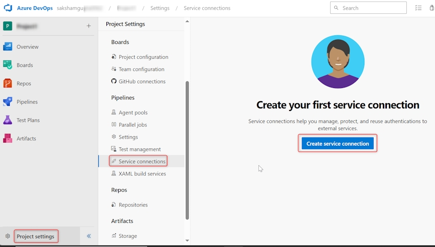

# Service Connections in Azure DevOps

### **Introduction**

Service connections in Azure DevOps are essential for securely connecting your pipelines to external services like Snyk, SonarCloud, and other similar tools. These connections enable your DevOps pipelines to authenticate with third-party services and automate tasks such as security scanning, code quality analysis, and more, ensuring that these integrations are both seamless and secure.

***

### **The Role of Service Connections for External Services**

Service connections act as a secure bridge between Azure DevOps and external services, allowing pipelines to interact with tools such as Snyk and SonarCloud without exposing sensitive credentials or compromising security. By setting up these connections, you ensure that your CI/CD workflows can leverage the full power of external tools, automating tasks like vulnerability scanning, code analysis, and compliance checks.

#### **Key Benefits of Using Service Connections:**

1. **Security:** Service connections store and manage credentials securely, reducing the risk of leaks or unauthorized access.
2. **Automation:** They enable continuous integration and deployment pipelines to interact with external tools automatically, improving efficiency and consistency.
3. **Scalability:** Service connections can be reused across multiple pipelines and projects, streamlining the setup of new CI/CD processes.

**Example:**\
When integrating SonarCloud into an Azure DevOps pipeline, a service connection ensures that the pipeline can authenticate with SonarCloud to perform code quality analysis without requiring manual intervention or exposing sensitive API keys.

***

### **Types of External Service Connections**

<figure><figcaption>
Service Connection
</figcaption></figure>

When working with external services in Azure DevOps, it’s important to understand the different types of service connections available. Here are some of the most common types used to connect to external tools:

1. **SonarCloud:**
   * **Purpose:** Connects Azure DevOps pipelines to SonarCloud for automated code quality analysis and security scanning.
   * **Typical Use Cases:** Analyzing code for bugs, vulnerabilities, and code smells during the CI process.
2. **Snyk:**
   * **Purpose:** Connects to Snyk to perform software composition analysis (SCA) and identify vulnerabilities in open-source dependencies.
   * **Typical Use Cases:** Scanning dependencies for known vulnerabilities and licensing issues during the CI pipeline.
3. **GitHub:**
   * **Purpose:** Although primarily used for source control, a GitHub service connection can also be leveraged to integrate with GitHub Actions or other third-party tools linked with your GitHub repositories.
   * **Typical Use Cases:** Triggering CI pipelines based on GitHub activity or pulling code from GitHub repositories for analysis.
4. **Generic REST API Service Connection:**
   * **Purpose:** Provides a generic connection to any service that supports REST APIs, enabling custom integrations.
   * **Typical Use Cases:** Integrating with custom tools, internal systems, or lesser-known third-party services.

**Example:**\
A team might use both Snyk and SonarCloud service connections in their pipeline. Snyk scans the open-source dependencies for vulnerabilities, while SonarCloud performs code quality analysis. Both tools are automatically triggered during the CI process through their respective service connections.

***

### **Setting Up Service Connections for External Services in Azure DevOps**

To connect Azure DevOps pipelines to external services, you need to set up service connections. Here’s a step-by-step guide to setting up these connections:

#### **Step-by-Step Guide to Setting Up Service Connections:**

1. **Navigate to Project Settings:**
   * In your Azure DevOps project, go to **Project settings** > **Service connections**.
   * Click on **New service connection**.
2. **Select the Service Connection Type:**
   * Choose the appropriate service connection type for the external service you are integrating with (e.g., SonarCloud, Snyk).
3. **Authenticate and Configure:**
   * Follow the prompts to authenticate with the external service. This may involve entering an API key, OAuth token, or other credentials.
   * Configure any additional settings required by the service, such as selecting specific projects or repositories to integrate.
4. **Test and Save:**
   * Test the connection to ensure it’s working correctly.
   * Save the service connection so it can be used in your pipelines.


**Best Practice:** Use service connections at the project level to maintain consistency and security across all pipelines in the project.


***

### **Best Practices for Managing and Securing External Service Connections**

When dealing with external services, it’s crucial to manage and secure service connections to protect your CI/CD pipeline from potential security threats.

**1. Store Credentials Securely:**

* **Why:** Service connections often involve sensitive credentials such as API keys or OAuth tokens. Storing them securely ensures that they are not exposed or compromised.
* **How:** Use Azure DevOps’ secret management features to encrypt and securely store credentials. Never hard-code credentials in your pipeline YAML files.

**2. Regularly Rotate API Keys and Tokens:**

* **Why:** Regularly rotating API keys and tokens reduces the risk of long-term exposure if a credential is compromised.
* **How:** Set up a process to rotate keys and update the service connections in Azure DevOps accordingly.

**3. Monitor and Audit Service Connections:**

* **Why:** Regular monitoring and auditing help identify any unauthorized or suspicious activity related to service connections.
* **How:** Use Azure DevOps’ logging and auditing features to track the use of service connections, and review access logs regularly.

**Example:**\
A security-conscious organization may enforce a policy where API keys for service connections to Snyk are rotated every 90 days. The DevOps team regularly reviews audit logs to ensure that service connections are only used as intended.

***

### **Troubleshooting Common Issues with Service Connections to External Services**

When integrating external services like Snyk or SonarCloud with Azure DevOps, you may encounter issues that need troubleshooting. Here are some common problems and their solutions:

**1. Authentication Failures:**

* **Problem:** The service connection fails to authenticate, preventing the pipeline from accessing the external service.
* **Solution:** Verify that the API key or OAuth token is correct and hasn’t expired. Ensure that the service connection has the necessary permissions.

**2. Rate Limits Exceeded:**

* **Problem:** The external service limits the number of API calls, causing the pipeline to fail.
* **Solution:** Implement retries in your pipeline and consider optimizing API usage by reducing the frequency of calls or batch processing.

**3. Permissions Issues:**

* **Problem:** The pipeline encounters permission errors when trying to perform actions using the service connection.
* **Solution:** Review the permissions granted to the service connection and ensure that it has the necessary access rights for the actions it needs to perform.

**Example:**\
If a pipeline fails to perform a Snyk scan due to a permissions error, reviewing the service connection setup in Azure DevOps may reveal that the API token used lacks the necessary permissions for the specific Snyk project.

***

### **Conclusion**

Service connections in Azure DevOps are vital for integrating external services like Snyk and SonarCloud into your CI/CD pipelines. By understanding how to set up, manage, and secure these connections, you can ensure that your pipelines operate smoothly and securely. Properly configured service connections enable seamless automation, allowing your pipelines to leverage the full capabilities of external tools while maintaining a strong security posture. As you implement these integrations, keep best practices in mind to maximize efficiency and minimize risks.
