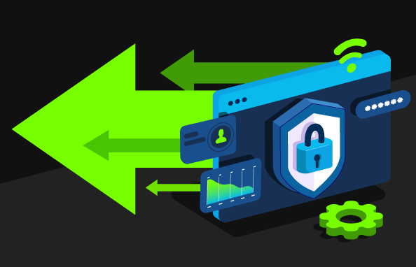
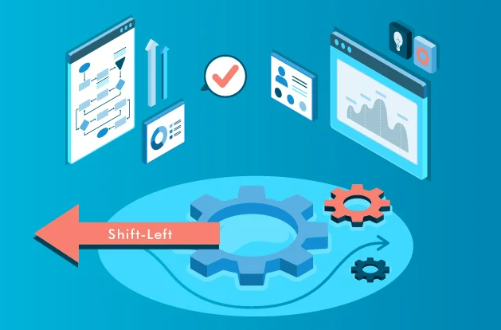

# Shift-Left Mindset in DevSecOps

### **Introduction**

The shift-left mindset is a core principle in DevSecOps, emphasizing the need to integrate security practices early in the software development lifecycle (SDLC). By "shifting left," security is introduced from the beginning of the development process rather than being addressed at the end, leading to earlier detection and mitigation of vulnerabilities, reducing costs, and enhancing overall software quality.

***

### **What is the Shift-Left Mindset?**

The shift-left approach involves shifting security practices to the earliest stages of the SDLC, such as during design, coding, and testing phases. This proactive approach ensures that security is not an afterthought but an integral part of the development process.

<figure><figcaption>
Shift Left Security
</figcaption></figure>

#### **Key Concepts:**

* **Proactive Security:** Incorporates security checks and measures from the start, rather than reacting to issues later in the process.
* **Continuous Testing:** Integrates security testing into continuous integration (CI) pipelines to catch vulnerabilities as early as possible.
* **Collaborative Culture:** Encourages collaboration between development, operations, and security teams to create a unified approach to security.

***

### **Importance of the Shift-Left Approach in DevSecOps**

In traditional development models, security is often a final step, sometimes even an afterthought. This approach can result in significant security vulnerabilities being discovered late in the process, making them more costly and time-consuming to address. The shift-left approach advocates for embedding security practices and testing early in the SDLC, leading to several key benefits:

* **Early Detection of Vulnerabilities:** Identifying and fixing security issues early prevents them from becoming more complex and expensive to resolve later.
* **Reduced Costs:** The cost of fixing a vulnerability increases exponentially as it moves through the development cycle. By addressing issues early, organizations save time and resources.
* **Improved Code Quality:** Integrating security early leads to more secure code, reducing the risk of security breaches and improving the overall quality of the software.
* **Faster Time-to-Market:** By incorporating security throughout the development process, teams can avoid delays caused by last-minute security fixes, leading to faster releases.

***

### **Strategies for Implementing Shift-Left in DevSecOps**

Successfully implementing the shift-left mindset requires a combination of cultural, procedural, and technical changes. Below are some key strategies to promote a shift-left approach in DevSecOps:

#### **1. Security Champions Within Teams**

Security champions are team members with a strong understanding of security best practices who advocate for security within the development process. By embedding security champions within each development team, organizations can ensure that security is considered in every aspect of the SDLC.

* **Role of Security Champions:** They serve as the first point of contact for security-related queries, help integrate security tools into the CI/CD pipeline, and ensure that security is a priority in all development activities.
* **Training and Empowerment:** Organizations should provide ongoing training to security champions to keep them updated on the latest threats and security practices.

#### **2. Regular Security Training**

To embed security into the culture of the organization, regular security training is essential. This training should be tailored to the needs of different teams, ensuring that developers, testers, and operations staff understand their role in maintaining security.

* **Customized Training Programs:** Offer different training modules for various roles (e.g., secure coding practices for developers, incident response for operations teams).
* **Continuous Learning:** Security threats evolve rapidly; therefore, regular updates and refresher courses are necessary to keep teams informed.

#### **3. Using Security as a Key Metric in Code Reviews**

Code reviews are a critical opportunity to enforce security standards. By incorporating security as a key metric in code reviews, teams can ensure that security is consistently considered in every code change.

* **Security Checklists:** Develop a security checklist that must be reviewed for every code change. This can include checking for common vulnerabilities like SQL injection, cross-site scripting (XSS), and proper authentication mechanisms.
* **Automated Code Analysis:** Use automated tools to assist in identifying security flaws during the code review process, providing additional support to manual reviews.

#### **4. Cultural Changes Needed to Implement Shift-Left Effectively**

Shifting left is not just about changing processes; it requires a cultural shift within the organization. Security must be seen as everyone's responsibility, not just the security team's.

* **Encouraging Collaboration:** Foster a collaborative environment where development, security, and operations teams work together from the start of the project.
* **Incentivizing Secure Practices:** Recognize and reward teams that prioritize security and achieve secure outcomes, reinforcing the importance of security in the development process.
* **Leadership Support:** Ensure that leadership is committed to the shift-left approach, providing the necessary resources and support to integrate security early in the SDLC.

> "Security is not a feature; it is a process. Shifting left means integrating security into every step of that process."

***

### **Case Studies: Successful Shift-Left Implementations**

<figure><figcaption>
Shift Left Mindset
</figcaption></figure>

#### **Case Study 1: Financial Institution**

A large financial institution implemented the shift-left approach by integrating static application security testing (SAST) early in the development process. By doing so, they reduced the number of security vulnerabilities discovered in production by 60%, leading to significant cost savings and enhanced customer trust.

#### **Case Study 2: E-Commerce Platform**

An e-commerce platform adopted the shift-left mindset by training developers on secure coding practices and implementing automated security checks in their CI pipeline. This approach resulted in faster detection of security issues, reducing the average time to remediate vulnerabilities from weeks to days.

***

### **Common Pitfalls and How to Avoid Them**

<figure><figcaption>
Common Pitfalls
</figcaption></figure>

#### **Pitfall 1: Resistance to Change**

Organizations may face resistance to the shift-left approach, particularly from developers who see security as a hindrance to productivity. To overcome this, it's essential to demonstrate the benefits of early security integration and provide adequate support and training.

**How to Avoid:**

* Provide clear examples of how shift-left can prevent costly issues.
* Encourage collaboration between security and development teams.

#### **Pitfall 2: Inadequate Tooling**

Without the right tools, implementing shift-left can be challenging. Organizations may struggle to integrate security tools seamlessly into their existing workflows.

**How to Avoid:**

* Invest in tools that integrate smoothly with your existing CI/CD pipelines.
* Ensure that security tools are user-friendly and provide actionable insights.

#### **Pitfall 3: Overloading Developers with Security Responsibilities**

While it’s crucial for developers to be aware of security, overloading them with security tasks can lead to burnout and reduced productivity.

**How to Avoid:**

* Balance security responsibilities by leveraging security champions and automated tools.
* Foster a collaborative environment where developers and security experts work together.

***

### **Integrating Shift-Left with Agile and DevOps Practices**

The shift-left approach aligns well with Agile and DevOps methodologies, as all emphasize continuous improvement and rapid feedback. By integrating shift-left into Agile and DevOps practices, organizations can enhance their security posture without sacrificing speed or agility.

#### **Key Integration Points:**

* **Continuous Integration (CI):** Automate security testing as part of the CI process to catch issues early.
* **Sprint Planning:** Include security tasks in sprint planning to ensure that security is considered from the beginning of each development cycle.
* **Retrospectives:** Use retrospectives to review security issues that arose during the sprint and identify opportunities for improvement.

**Example:**\
Incorporating security testing into CI pipelines allows teams to identify and address vulnerabilities as soon as code is committed, reducing the risk of security breaches in production.

***

### **Metrics and KPIs for Measuring Shift-Left Success**

Measuring the success of shift-left initiatives is crucial for continuous improvement. By tracking specific metrics and KPIs, organizations can assess the effectiveness of their shift-left strategies and make data-driven decisions.

#### **Key Metrics:**

* **Time to Remediate (TTR):** Measures how quickly security vulnerabilities are fixed after being discovered.
* **Vulnerability Density:** Tracks the number of vulnerabilities per thousand lines of code (KLOC).
* **Security Coverage:** Assesses the percentage of code that is covered by security testing.
* **False Positive Rate:** Monitors the rate of false positives generated by security tools, which can indicate the need for tool refinement.

**Example:**\
A reduction in Time to Remediate (TTR) from weeks to days after implementing shift-left practices is a strong indicator of success.

***

### **Conclusion**

The shift-left mindset is a transformative approach that integrates security into the earliest stages of the software development lifecycle. By proactively addressing security issues, organizations can reduce costs, improve software quality, and enhance their overall security posture. Implementing shift-left requires cultural changes, strategic planning, and the right tools, but the benefits far outweigh the challenges. As DevSecOps continues to evolve, the shift-left approach will remain a cornerstone of secure and efficient software development practices.
