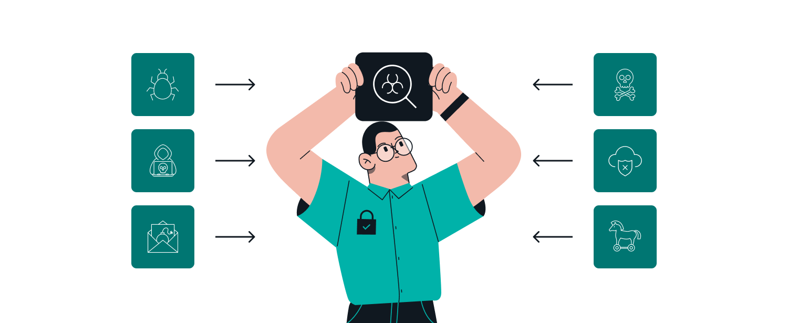
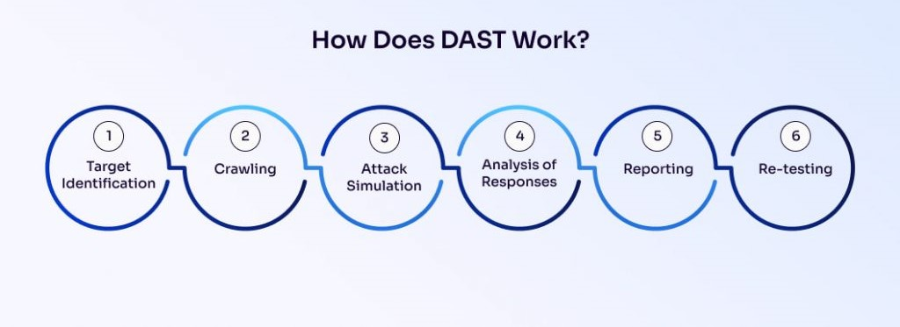

# Introduction to Dynamic Application Security Testing (DAST)

### **Introduction**

Dynamic Application Security Testing (DAST) is a key component in the DevSecOps pipeline. Unlike Static Application Security Testing (SAST), which inspects an application's source code, DAST evaluates a running application to identify vulnerabilities. By simulating real-world attacks, DAST allows you to detect security flaws that might only become apparent when the application is running, making it an indispensable tool for ensuring application security.

***

### **What is DAST?**

<figure><figcaption>
DAST
</figcaption></figure>

Dynamic Application Security Testing (DAST) is a security testing methodology that focuses on identifying vulnerabilities in a running application. Here's how DAST operates:

1. **Simulates External Attacks:** DAST tools operate like external attackers, probing the application without access to the source code. This "black-box" approach allows DAST to uncover vulnerabilities that only manifest during runtime.
2. **Scans for Vulnerabilities:** DAST scans the application from the outside to identify vulnerabilities such as:
   * **SQL Injection**
   * **Cross-Site Scripting (XSS)**
   * **Cross-Site Request Forgery (CSRF)**
   * **Insecure Server Configurations**
3. **Interacts with the Application:** DAST tools interact with the application in real-time, sending various inputs and monitoring responses to detect security flaws.


DAST is often referred to as "black-box" testing because it evaluates the application from the outside, mimicking the perspective of an attacker without requiring access to the source code.


**Example:**\
Consider an e-commerce application that processes user payments. A DAST tool could simulate a series of malicious transactions to identify weaknesses in payment processing, such as a vulnerability that allows unauthorized discounts through input manipulation.

***

### **How Does DAST Work?**

<figure><figcaption>
How DAST Work
</figcaption></figure>

DAST operates through a structured process designed to mimic the behavior of potential attackers. Here's how it typically works:

1. **Crawling the Application:**
   * The DAST tool begins by crawling the application to discover all accessible endpoints, such as:
     * Web pages
     * Forms
     * APIs
   * This crawling phase maps out the attack surface of the application, identifying all potential entry points for an attacker.
2. **Sending Test Requests:**
   * The DAST tool then sends a series of crafted requests designed to test for vulnerabilities, including:
     * **SQL Injection:** Sending malicious SQL queries to identify if the application improperly handles database queries.
     * **XSS:** Injecting scripts into input fields to see if they are executed in the user's browser.
     * **CSRF:** Testing if unauthorized actions can be performed on behalf of a user.
3. **Analyzing Responses:**
   * The responses from the application are analyzed to identify potential vulnerabilities. For example:
     * An unexpected SQL error message may indicate a SQL injection vulnerability.
     * Redirects or unexpected responses may reveal security flaws.
4. **Reporting Findings:**
   * Finally, the DAST tool generates a detailed report, highlighting the vulnerabilities discovered, their severity, and recommended remediation steps.

**Example:**\
A DAST tool might inject a SQL command into a search bar to see if the application is vulnerable to SQL injection. If the application responds with an error revealing the database structure, the tool will flag this as a critical vulnerability.

***

### **OWASP ZAP**

<figure><figcaption>
OWASP ZAP
</figcaption></figure>

OWASP ZAP (Zed Attack Proxy) is one of the most popular and widely used DAST tools. Developed by the Open Web Application Security Project (OWASP), ZAP is an open-source tool that helps find security vulnerabilities in web applications during development and testing.

**Key Features of OWASP ZAP:**

1. **Automated Scanning:**
   * ZAP includes automated scanners that can quickly identify common vulnerabilities.
2. **Manual Testing Tools:**
   * In addition to automated scanning, ZAP offers a range of manual tools for in-depth security analysis, including:
     * **Fuzzer:** A tool to test how applications handle unexpected inputs.
     * **Intercepting Proxy:** Allows testers to intercept and modify requests between the browser and the web application.
3. **Active Community Support:**
   * OWASP ZAP has a large community of users and contributors, ensuring continuous updates and improvements.
4. **Integration with CI/CD Pipelines:**
   * ZAP can be integrated into CI/CD pipelines, enabling automated security testing as part of the build process.


OWASP ZAP is often chosen for DAST due to its ability to integrate seamlessly into CI/CD pipelines, supporting both automated and manual testing.


**Example:**\
A development team might integrate OWASP ZAP into their CI/CD pipeline to automatically scan their web application for vulnerabilities every time new code is deployed to a staging environment.

***

### **Types of Vulnerabilities Detected by DAST**

DAST is particularly effective at detecting a variety of vulnerabilities, many of which are critical to securing a web application:

1. **Injection Attacks:**
   * **SQL Injection:** Occurs when an attacker can insert or manipulate SQL queries within the application’s input fields, potentially allowing them to access or modify database content.
   * **Example:** A poorly validated login form that accepts SQL commands like `1' OR '1'='1` might allow attackers to bypass authentication and gain unauthorized access.
2. **Cross-Site Scripting (XSS):**
   * **XSS Vulnerabilities:** Allow attackers to inject malicious scripts into web pages, which can be executed in the context of another user’s browser.
   * **Example:** A comment field that doesn't sanitize input could allow an attacker to inject JavaScript that steals session cookies from other users who view the page.
3. **Authentication and Session Management Issues:**
   * **Weak Authentication:** Occurs when authentication mechanisms are insecure, such as allowing weak passwords or not properly securing session tokens.
   * **Example:** An application that stores session tokens in cookies without proper encryption could allow attackers to hijack user sessions by intercepting these tokens.
4. **Insecure Configurations:**
   * **Misconfigurations:** Involve improper settings in servers or applications that expose them to attacks, such as enabling directory listings or leaving default credentials in place.
   * **Example:** A web server with directory listing enabled might inadvertently expose sensitive files to attackers.


Regularly using DAST in your pipeline can help mitigate these risks by catching vulnerabilities before they reach production.


***

### **Pros and Cons of DAST**

Like any security testing method, DAST has its strengths and limitations. Understanding these can help in effectively implementing DAST in your security strategy.

#### **Pros:**

1. **Broad Coverage:**
   * DAST can test the entire application, including components and services that might be missed by SAST or other security tests.
2. **Realistic Testing:**
   * Since DAST interacts with the running application, it can uncover vulnerabilities that only manifest in a live environment.
3. **Ease of Use:**
   * DAST tools are generally easy to integrate into existing CI/CD pipelines and do not require access to the source code.

**Example:**\
DAST can identify a misconfigured server in production that static analysis might miss, providing a more comprehensive security assessment.

#### **Cons:**

1. **Limited Code Insight:**
   * DAST cannot see the underlying code, which may limit its ability to detect certain types of vulnerabilities.
2. **Performance Impact:**
   * Running DAST in production or production-like environments can impact application performance if not managed carefully.
3. **False Positives:**
   * Like many security tools, DAST can sometimes generate false positives, requiring manual review and validation.


Always review DAST findings carefully to differentiate between genuine vulnerabilities and false positives.


***

### **Importance of DAST in DevSecOps**

DAST plays a crucial role in the DevSecOps pipeline, where the integration of security practices into the development and operations processes is essential. The benefits of DAST in this context include:

* **Continuous Security Testing:** DAST ensures that security testing is not just a one-time activity but a continuous process that occurs throughout the software development lifecycle (SDLC).
* **Early Detection of Vulnerabilities:** By integrating DAST into CI/CD pipelines, security issues can be detected and addressed early, reducing the risk of vulnerabilities being deployed to production.
* **Enhanced Collaboration:** DAST fosters collaboration between development, security, and operations teams, ensuring that security is a shared responsibility.

**Example:**\
In a DevSecOps pipeline, DAST can be scheduled to run automatically on staging environments, identifying vulnerabilities before the application is deployed to production, thereby reducing the attack surface.

***

### **DAST in Production-like Environments**

For DAST to be most effective, it should be run in environments that closely resemble production. This ensures that:

* **Test Results Are Accurate:** Running DAST in a staging environment that mirrors production allows for the identification of vulnerabilities that are likely to exist in the live environment.
* **Risks Are Mitigated:** By testing in a controlled environment, vulnerabilities can be identified and fixed before they impact real users.

**Best Practices:**

1. **Use Staging Environments:**
   * Test in an environment that replicates the production setup, including all services, configurations, and data flows.
2. **Implement Safeguards:**
   * Ensure that DAST tests do not disrupt normal operations by running them during off-peak hours and monitoring the application's performance.


Never run DAST directly against a live production environment without proper safeguards, as it could disrupt normal operations.


***

### **Conclusion**

Dynamic Application Security Testing (DAST) is an indispensable tool in modern application security, particularly within a DevSecOps framework. By integrating DAST into your CI/CD pipeline, you ensure that security is continuously monitored and improved. Tools like OWASP ZAP facilitate the implementation of DAST, providing comprehensive insights into your application's security posture.

In the following sections, we will delve deeper into how to implement DAST using OWASP ZAP, discuss best practices for incorporating DAST into your development workflow, and explore the role of DAST in maintaining a secure, resilient application environment.
