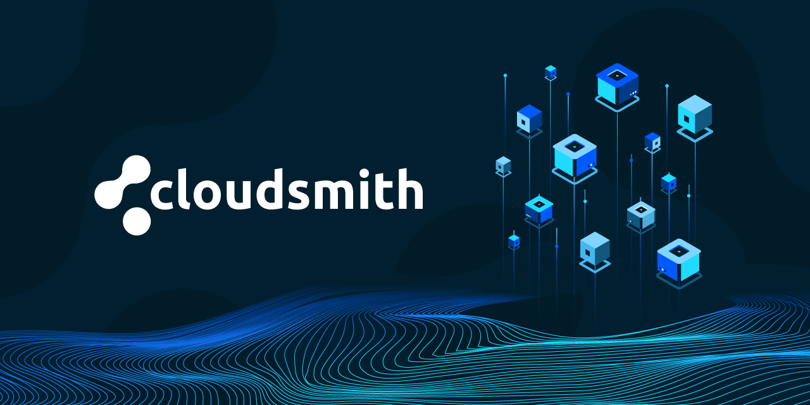
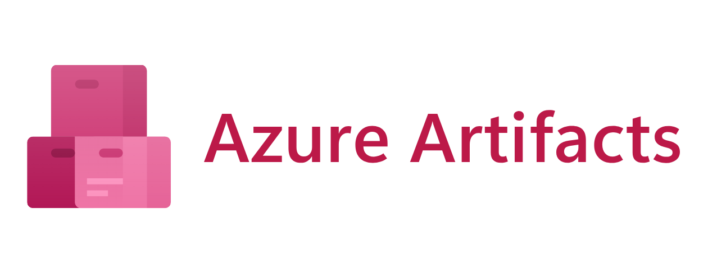
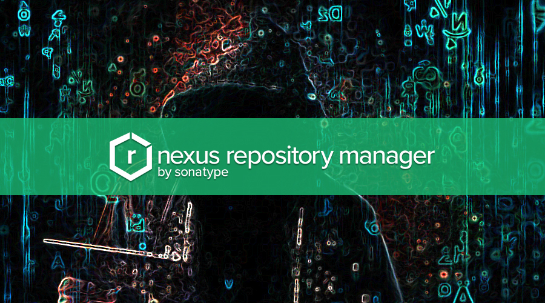

# Artifact Management Repositories

### **Introduction**

Artifact management is a crucial aspect of modern software development. As software projects grow, managing the build artifacts—such as binaries, libraries, and other packaged files—becomes essential to maintain efficiency and consistency across different stages of the software development lifecycle. This page provides an overview of artifact management, comparing different artifact repositories like Cloudsmith, Azure Artifacts, and Nexus, and discussing their benefits and use cases.

***

### **What is Artifact Management?**

Artifact management refers to the process of storing, organizing, and managing the artifacts generated during the build process of a software project. These artifacts could include compiled binaries, dependencies, configuration files, and more. Effective artifact management ensures that the correct versions of these files are available for deployment and testing.

<figure><figcaption>
Artifact Management
</figcaption></figure>

#### **Key Concepts in Artifact Management:**

* **Artifacts:** The outputs of the build process, such as JAR files, Docker images, or configuration files.
* **Artifact Repositories:** Centralized storage locations where artifacts are stored, versioned, and retrieved as needed.
* **Versioning:** Assigning unique versions to artifacts to keep track of changes and ensure consistency across deployments.

***

### **Artifact Repositories: Cloudsmith vs. Azure Artifacts vs. Nexus**

#### **Cloudsmith:**

**Overview:** Cloudsmith is a fully managed, universal package management service that supports a wide variety of package formats, including Docker, Maven, NuGet, and more. It provides a secure and scalable way to store and distribute your build artifacts.

<figure><figcaption>
Cloudsmith
</figcaption></figure>

**Key Features:**

* **Universal Support:** Supports over 20+ package formats, making it a versatile choice for managing different types of artifacts.
* **Global CDN:** Distributes artifacts globally, ensuring fast and reliable access regardless of geographic location.
* **Security:** Provides robust security features, including encryption at rest and in transit, along with fine-grained access controls.

**Use Cases:**

* **Multi-format Projects:** Ideal for projects that use a combination of different package formats.
* **Global Teams:** Beneficial for teams spread across different locations, as the global CDN ensures low-latency access to artifacts.
* **Security-focused Environments:** Suitable for organizations with stringent security requirements, given Cloudsmith’s advanced security features.

#### **Azure Artifacts:**

**Overview:** Azure Artifacts is a service within Azure DevOps that allows you to create, host, and share packages with your team. It supports package types like Maven, npm, NuGet, and Python, and integrates seamlessly with other Azure DevOps services.

<figure><figcaption>
Azure Artifacts
</figcaption></figure>

**Key Features:**

* **Tight Azure DevOps Integration:** Works seamlessly with Azure Pipelines, Boards, and Repos, providing a unified experience.
* **Upstream Sources:** Allows you to integrate with public repositories like npm or Maven Central, and cache packages locally.
* **Scalability:** Scales with your project, allowing you to store an unlimited number of packages.

**Use Cases:**

* **Azure Ecosystem Users:** Ideal for teams already using Azure DevOps for their CI/CD pipelines, as it integrates smoothly with other Azure services.
* **Package Management:** Suitable for managing dependencies and internal packages within an organization.
* **Version Control Integration:** Works well for projects where artifacts need to be tightly integrated with source control and CI/CD pipelines.

#### **Nexus Repository:**

**Overview:** Nexus Repository is a popular open-source artifact management tool that supports multiple formats, including Maven, npm, Docker, and more. It can be self-hosted or used as a managed service, providing flexibility for different organizational needs.

<figure><figcaption>
Nexus
</figcaption></figure>

**Key Features:**

* **Wide Format Support:** Supports a wide range of package formats, making it a versatile option for diverse project needs.
* **Repository Grouping:** Allows grouping of multiple repositories, enabling centralized access to different artifact sources.
* **Security and Access Control:** Provides robust security features, including role-based access control (RBAC) and audit logging.

**Use Cases:**

* **Self-hosted Solutions:** Ideal for organizations that prefer or require on-premises solutions.
* **Large Organizations:** Suitable for large enterprises needing a flexible, scalable, and customizable artifact management solution.
* **Integration with Other Tools:** Works well in environments with diverse tooling, providing compatibility with a broad range of CI/CD tools.

***

### **Why Use an Artifact Management Service Instead of Just Azure Artifacts?**

Using a dedicated artifact management service, such as Cloudsmith or Nexus, offers several advantages over using Azure Artifacts:

1. **Support for Multiple Formats and Environments:** While Azure Artifacts is tightly integrated with Azure DevOps and supports several package formats, services like Cloudsmith and Nexus offer broader support for various package formats and environments. This versatility is especially beneficial for projects that require managing diverse types of artifacts, including Docker images, Helm charts, and more.
2. **Advanced Security and Compliance Features:** Services like Cloudsmith and Nexus provide advanced security features, such as encryption at rest and in transit, fine-grained access controls, and audit logging. These features go beyond what Azure Artifacts offers and are critical for organizations with stringent security and compliance requirements.
3. **Global Distribution with High Availability:** Cloudsmith offers a global Content Delivery Network (CDN), ensuring fast, reliable access to artifacts from anywhere in the world. This is particularly advantageous for global teams needing low-latency access to artifacts, which Azure Artifacts may not fully support depending on the region.
4. **Customizability and Flexibility:** Nexus, especially in its self-hosted form, allows organizations to tailor the artifact repository to their specific needs, including custom integrations, repository configurations, and more. This flexibility can be essential for organizations with unique or complex artifact management requirements.
5. **Cost and Scalability:** While Azure Artifacts offers a scalable solution within the Azure ecosystem, services like Cloudsmith and Nexus can provide more competitive pricing and scalability options depending on the organization's size and needs. They often offer more flexible pricing models based on usage rather than a one-size-fits-all approach.
6. **Independence from Cloud Vendors:** Using a platform-agnostic service like Cloudsmith or Nexus allows organizations to maintain flexibility in their cloud strategy, avoiding vendor lock-in. This independence is valuable for organizations that might need to switch cloud providers or operate in multi-cloud environments.

***

### **Comparing Cloudsmith, Azure Artifacts, and Nexus**

| Feature                       | Cloudsmith                                                  | Azure Artifacts                                       | Nexus Repository                                  |
| ----------------------------- | ----------------------------------------------------------- | ----------------------------------------------------- | ------------------------------------------------- |
| **Supported Package Formats** | 20+ (including Docker, Maven, npm, NuGet)                   | Maven, npm, NuGet, Python                             | Wide range (Maven, npm, Docker, more)             |
| **Global Distribution**       | Global CDN with low-latency access                          | Primarily regional based on Azure datacenters         | Global distribution with replication options      |
| **Integration**               | Integrates with various CI/CD tools                         | Seamless integration with Azure DevOps                | Integrates with many CI/CD tools                  |
| **Security**                  | Advanced security features, encryption, and access controls | Integrated security with Azure AD and RBAC            | Role-based access control, audit logging          |
| **Deployment Options**        | Fully managed cloud service                                 | Fully managed within Azure DevOps ecosystem           | Self-hosted or managed service                    |
| **Use Cases**                 | Multi-format projects, security-focused environments        | Teams using Azure DevOps, internal package management | Large organizations, diverse tooling environments |

***

### **Benefits of Using Artifact Repositories**

**1. Version Control and Traceability:** Artifact repositories ensure that all artifacts are versioned, allowing teams to trace back specific versions used in deployments. This is particularly useful for rollback scenarios or auditing purposes.

**2. Improved Build Times:** Storing dependencies in a local repository can significantly reduce build times by avoiding the need to download dependencies from external sources repeatedly.

**3. Security and Compliance:** Artifact repositories provide features like access control, auditing, and encryption, ensuring that only authorized users can access or modify the artifacts.

**4. Centralized Management:** Centralizes the storage of artifacts, making it easier to manage and share them across teams and projects.

**5. Integration with CI/CD Pipelines:** Artifact repositories integrate seamlessly with CI/CD pipelines, automating the process of storing, retrieving, and deploying artifacts, leading to more efficient and reliable deployments.

***

### **Conclusion**

Artifact management repositories are a cornerstone of modern CI/CD pipelines, enabling teams to manage their build outputs efficiently and securely. Whether using Cloudsmith for its universal support and global distribution, Azure Artifacts for its tight integration with Azure DevOps, or Nexus for its flexibility and wide format support, selecting the right artifact repository can significantly enhance your development process. By understanding the features, benefits, and use cases of these tools, you can make informed decisions that align with your project’s needs, ensuring smoother deployments and better version control.

Moreover, opting for a dedicated artifact management service instead of simply using Azure Repos brings about numerous advantages, including enhanced version control, scalability, and security—essential elements for any robust CI/CD process.
