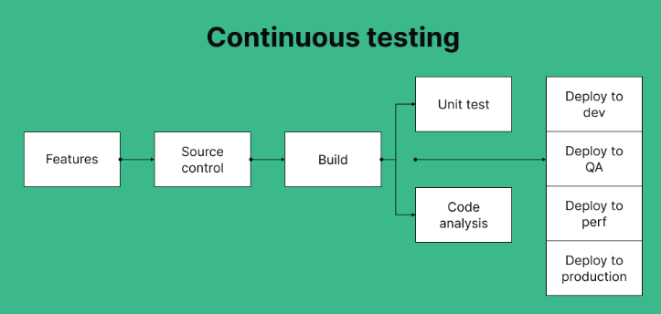
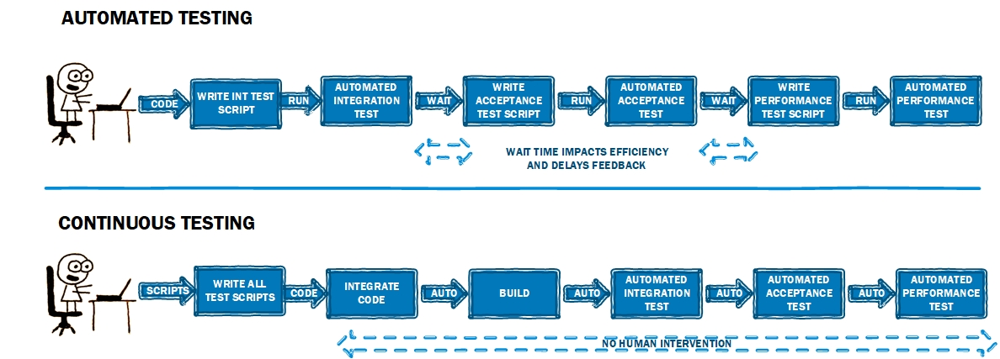

# Continuous Testing in CI Pipelines

### **Introduction**

Continuous testing is a fundamental practice in modern software development, especially within the framework of Continuous Integration (CI) pipelines. By embedding testing at every stage of the development lifecycle, continuous testing ensures that code quality is maintained and that issues are detected and resolved as early as possible. In this lesson, we will explore the role of continuous testing in CI pipelines, its importance, strategies for effective test automation, and additional considerations for integrating testing into your CI/CD process.

***

### **The Role of Continuous Testing in CI Pipelines**

Continuous testing in CI pipelines involves executing automated tests as part of the build process, ensuring that every change to the codebase is validated by a series of tests before it is integrated into the main branch. This approach helps to maintain code quality, prevent regressions, and provide immediate feedback to developers.

#### **Core Aspects of Continuous Testing:**

* **Automated Testing:** Automated tests are triggered automatically as part of the CI pipeline, covering unit, integration, functional, and end-to-end tests.
* **Early Detection of Issues:** Continuous testing enables the early detection of issues, allowing developers to address bugs and errors before they reach production.
* **Integration with CI/CD Tools:** Continuous testing is tightly integrated with CI/CD tools, ensuring that testing is an integral part of the deployment process.

**Example: Integrating Automated Tests in a CI Pipeline**


```yaml
# Example YAML snippet for integrating tests into a CI pipeline
jobs:
- job: Build  # Job for building and compiling the application
  steps:
  - script: mvn clean install  # Command to clean, compile, and install the Maven project
    displayName: 'Build and Compile'  # Display name for the build step
  
- job: Test  # Job for running tests
  dependsOn: Build  # This job depends on the successful completion of the Build job
  steps:
  - script: mvn test  # Command to run unit tests using Maven
    displayName: 'Run Unit Tests'  # Display name for the unit test step
  - script: mvn verify  # Command to run integration tests and other checks using Maven
    displayName: 'Run Integration Tests'  # Display name for the integration test step

```


**Explanation:**

In this example, the CI pipeline is configured with two jobs: `Build` and `Test`. The `Test` job is dependent on the successful completion of the `Build` job and runs unit and integration tests using Maven. This setup ensures that the code is built and tested automatically on every commit, providing immediate feedback on code quality.

<div align="left">

<figure><figcaption><p>Continuous Testing Flow</p></figcaption></figure>

</div>

***

### **Importance of Continuous Testing**

Continuous testing is critical for several reasons, each contributing to the overall success of a software development project.

**1. Ensuring Code Quality**

Continuous testing ensures that code quality is consistently maintained throughout the development process. By running tests frequently, developers can identify and address issues before they become major problems.

**Example:** Consider a scenario where a new feature is added to an application. Continuous testing ensures that this feature does not introduce bugs or negatively impact existing functionality.

**2. Reducing Time to Market**

By automating testing and integrating it into the CI pipeline, continuous testing accelerates the development process. Issues are identified and resolved quickly, reducing delays and allowing teams to deliver features faster.

**Example:** A team practicing continuous testing can catch and fix a critical bug within hours, rather than days, allowing for rapid deployment of updates.

**3. Minimizing Risk**

Continuous testing minimizes the risk of deploying defective code to production. By running comprehensive tests as part of the CI pipeline, teams can ensure that only thoroughly tested code reaches production.

**Example:** In a CI pipeline with continuous testing, a regression test suite can be executed before deployment, ensuring that new changes do not reintroduce previously resolved issues.

**4. Enhancing Collaboration**

Continuous testing fosters a culture of collaboration within development teams. With automated tests providing immediate feedback, developers can work together to resolve issues quickly and improve the overall quality of the codebase.

**Example:** A developer pushes a code change, triggering the CI pipeline. The test results are immediately available to the entire team, who can then collaborate on any issues that arise.

<details>

<summary>Additional Benefits of Continuous Testing</summary>

* **Improved Developer Productivity:** Continuous testing frees developers from manual testing, allowing them to focus on writing code and developing features.

<!---->

* **Better Test Coverage:** Automating tests ensures that a wide range of scenarios are covered, leading to more comprehensive testing and fewer missed issues.

<!---->

* **Increased Confidence in Code:** With continuous testing, developers can be more confident in the stability and reliability of their code.

</details>

***

### **Automated Testing vs. Continuous Testing**

While automated testing and continuous testing are often mentioned together, they serve distinct roles in the software development process. Understanding the differences between the two is crucial for implementing a robust testing strategy.

#### **Automated Testing:**

Automated testing refers to the practice of using scripts and tools to execute tests automatically, without human intervention. These tests can range from unit tests to integration tests, and they are typically run to verify that the code behaves as expected.


**Key Characteristics:**

* **Scope:** Automated testing focuses on individual components or features, validating specific functionalities.
* **Execution:** Tests are triggered manually or by a specific event, such as a code commit or a build.
* **Goal:** The goal is to ensure that specific code changes do not introduce bugs or break existing functionality.

**Example:** Running a suite of unit tests to verify that a new function behaves correctly.

#### **Continuous Testing:**

Continuous testing, on the other hand, is a broader practice that integrates automated testing into the CI/CD pipeline. It involves running tests continuously as part of the development process, providing ongoing feedback on the health of the codebase.

**Key Characteristics:**

* **Scope:** Continuous testing encompasses the entire codebase and includes various types of tests, such as unit, integration, functional, and end-to-end tests.
* **Execution:** Tests are automatically triggered by the CI pipeline on every code change, pull request, or deployment.
* **Goal:** The goal is to maintain continuous validation of the codebase, ensuring that the software remains stable and reliable throughout development.

**Example:** A CI pipeline that runs unit, integration, and end-to-end tests on every code commit to provide immediate feedback on the code's stability.

<figure><figcaption><p>Continuous vs Automated Testing</p></figcaption></figure>

***

### **Continuous Testing Tools and Frameworks**

To effectively implement continuous testing, it's important to choose the right tools and frameworks that integrate seamlessly with your CI/CD pipeline. Here are some popular tools and frameworks used in continuous testing:

#### **1. Jenkins**

Jenkins is an open-source automation server that supports continuous integration and continuous delivery. It allows developers to automate various stages of the software development lifecycle, including continuous testing.

**Features:**

* Extensive plugin ecosystem for integrating with various testing tools.
* Supports the execution of automated tests as part of the CI pipeline.
* Provides real-time feedback on test results and code quality.

#### **2. Selenium**

Selenium is a widely-used framework for automating web applications. It allows you to write scripts in various programming languages to test the functionality of web applications across different browsers.

**Features:**

* Supports multiple programming languages (Java, Python, C#, etc.).
* Can be integrated with CI tools like Jenkins, Azure DevOps, and GitLab CI for continuous testing.
* Ideal for functional and end-to-end testing of web applications.

#### **3. JUnit**

JUnit is a popular testing framework for Java applications. It is commonly used for unit testing and can be easily integrated into CI pipelines for continuous testing.

**Features:**

* Simplifies the creation and execution of unit tests in Java.
* Provides annotations and assertions to streamline test writing.
* Works seamlessly with CI tools like Jenkins, Travis CI, and GitLab CI.

#### **4. NUnit**

NUnit is a testing framework for .NET applications, similar to JUnit. It supports unit testing and can be integrated into CI pipelines for continuous testing.

**Features:**

* Supports parameterized tests and data-driven testing.
* Integrates with CI tools like Jenkins and Azure DevOps.
* Provides detailed test reports and results.

#### **5. TestNG**

TestNG is another testing framework inspired by JUnit but with more powerful features like parallel test execution, data-driven testing, and test configuration.

**Features:**

* Supports a wide range of testing types, including unit, functional, and integration testing.
* Easily integrates with CI tools for continuous testing.
* Allows the grouping and prioritization of tests.

<details>

<summary>Additional Continuous Testing Tools</summary>

* **Postman:** A tool for API testing, allowing you to automate and integrate API tests into your CI pipeline.

<!---->

* **Cypress:** A JavaScript-based end-to-end testing framework that provides real-time feedback and integrates with CI tools for continuous testing.

<!---->

* **SonarQube:** A tool for continuous code quality inspection, integrating with CI pipelines to ensure code quality standards are met.

</details>

***

### **Strategies for Effective Continuous Testing**

Implementing continuous testing successfully requires a well-planned strategy that encompasses various aspects of testing and integration.

#### **1. Prioritize Critical Tests:**

Focus on automating tests that cover the most critical parts of your application. Prioritize unit tests, integration tests, and critical functional tests to ensure that key functionalities are continuously validated.

**Example:** Prioritize testing for payment processing in an e-commerce application, as it is a critical feature that directly affects the user experience.

#### **2. Optimize Test Execution Time:**

To prevent bottlenecks in your CI pipeline, optimize the execution time of your tests. This can be achieved by parallelizing test execution, running tests in isolated environments, and using fast and efficient testing frameworks.

**Example:** Use parallel testing with Selenium Grid to run multiple test cases simultaneously across different browsers, reducing overall test execution time.

#### **3. Use Mocks and Stubs:**

Incorporate mocks and stubs in your testing strategy to simulate external dependencies, reducing the complexity and execution time of your tests.

**Example:** Use Mockito to mock external API calls in your unit tests, allowing you to focus on testing the internal logic of your application without relying on external systems.

#### **4. Continuously Monitor and Improve Tests:**

Regularly review and update your test cases to ensure they remain relevant and effective. Remove obsolete tests, update test cases to reflect changes in the codebase, and improve test coverage over time.

**Example:** Schedule monthly reviews of your test suite to identify and update outdated tests and add new ones that cover recently added features.

<details>

<summary>Best Practices for Continuous Testing</summary>

* **Maintain a Dedicated Test Environment:** Use a dedicated environment for testing to ensure consistency and reliability of test results.

<!---->

* **Automate Everything:** Automate as much of the testing process as possible, from unit tests to deployment tests, to reduce manual intervention and human error.

<!---->

* **Incorporate Feedback:** Use feedback from test results to continuously improve your testing strategy and the quality of your codebase.

</details>

***

### **Challenges and Considerations**

While continuous testing offers many benefits, there are also challenges that teams need to consider when implementing it.

#### **1. Test Maintenance**

As the codebase evolves, maintaining a large suite of automated tests can become challenging. Test cases may become outdated, and false positives or negatives can lead to mistrust in the test results.

**Solution:** Implement a process for regularly reviewing and updating test cases to ensure they remain relevant and accurate. Use tools like TestRail or Zephyr to manage and track test cases.

#### **2. Integration with Legacy Systems**

Integrating continuous testing into a CI pipeline that involves legacy systems can be difficult due to compatibility issues and the lack of existing automated tests.

**Solution:** Start by automating tests for the most critical functionalities of the legacy system. Gradually expand the test coverage as you modernize the system.

#### **3. Test Execution Time**

As the number of tests grows, the time required to execute them all can become a bottleneck in the CI pipeline.

**Solution:** Use parallel testing, test impact analysis, and selective test execution to reduce the overall test execution time. Tools like Azure Test Plans can help manage and optimize test execution.

#### **4. Managing Test Data**

Ensuring consistent and reliable test data can be a challenge, especially when dealing with complex applications that require specific data setups.

**Solution:** Use data-driven testing approaches and tools like TestContainers to manage test data environments and ensure consistent test data across different environments.

<details>

<summary>Additional Considerations</summary>

* **Cultural Shift:** Embrace a cultural shift towards quality and testing, where continuous testing is seen as a shared responsibility across the development team.

<!---->

* **Tool Selection:** Choose the right tools and frameworks that align with your project's needs and integrate well with your CI/CD pipeline.

<!---->

* **Training and Education:** Invest in training and educating your team on best practices for continuous testing and the use of relevant tools and frameworks.

</details>

***

### **\[EXTRA] Metrics and KPIs for Measuring Shift-Left Testing**

Shift-left testing emphasizes the early involvement of testing in the software development lifecycle. To ensure that this approach is effective, it's crucial to track relevant metrics and key performance indicators (KPIs). These metrics provide insights into the success of shift-left testing initiatives and help identify areas for improvement.

#### **1. Defect Density**

**Definition:** Defect density measures the number of defects identified per unit size of code (e.g., per thousand lines of code or per function point). This metric helps assess the quality of code early in the development process.

**Why It Matters:** Lower defect density early in the development lifecycle indicates that the shift-left testing approach is helping to identify and resolve issues sooner, leading to higher code quality.

**Example:** Suppose a team is developing a new module for an e-commerce application. During the unit testing phase, they measure defect density and find 2 defects per 1,000 lines of code. Over the next few sprints, they implement a more rigorous unit testing strategy, which reduces defect density to 0.5 defects per 1,000 lines of code. This improvement suggests that the team’s shift-left testing efforts are effectively catching defects early, leading to a cleaner and more reliable codebase before it even reaches integration testing.

#### **2. Defect Removal Efficiency (DRE)**

**Definition:** DRE is the percentage of defects identified and removed before the software reaches the next phase (e.g., before integration or system testing). It is calculated as:

$$
\text{DRE} = \frac{\text{Defects Removed in a Phase}}{\text{Total Defects Identified}} \times 100
$$

**Why It Matters:** High DRE indicates that a significant portion of defects are being caught early, which is a key goal of shift-left testing.

**Example:** A development team working on a banking application tracks DRE during the unit testing phase. Out of 100 total defects identified across all testing phases, 85 were detected and fixed during unit testing, resulting in a DRE of 85%. To further improve, the team starts using test-driven development (TDD) and pairs programming to write more precise unit tests. In subsequent iterations, their DRE improves to 92%, indicating that their early testing strategies are catching more defects before they can affect later stages of development or, worse, reach production.

#### **3. Test Coverage**

**Definition:** Test coverage refers to the percentage of code that is covered by automated tests. This metric provides an indication of how thoroughly the codebase is being tested.

**Why It Matters:** High test coverage ensures that more parts of the code are tested, reducing the likelihood of undetected bugs slipping through to later stages of development.

**Example:** A team developing a microservices-based application monitors their test coverage regularly. Initially, they achieve 60% test coverage, meaning that 40% of their code is not covered by automated tests. Recognizing the risks of low coverage, they focus on writing additional tests, particularly for critical services like user authentication and payment processing. Over several sprints, they increase their test coverage to 85%. This increase in coverage ensures that critical paths in the application are thoroughly tested, catching potential defects early in the development process and reducing the risk of issues in production.

#### **4. Mean Time to Detect (MTTD) and Mean Time to Resolve (MTTR)**

**Definition:** MTTD measures the average time taken to detect defects, while MTTR measures the average time taken to resolve them after detection.

**Why It Matters:** Lower MTTD and MTTR indicate that defects are being identified and resolved quickly, which is a key objective of shift-left testing.

**Example:** In a software project for a logistics company, the development team tracks MTTD and MTTR for defects found during the integration testing phase. Initially, it takes an average of 12 hours to detect a defect (MTTD) and 24 hours to resolve it (MTTR). To improve these metrics, they introduce nightly builds and more granular unit tests that run automatically with each commit. As a result, MTTD drops to 3 hours and MTTR to 6 hours. This improvement demonstrates that the team is effectively detecting and addressing issues almost immediately after they occur, significantly reducing the potential impact of defects on the project timeline.

#### **5. Number of Escaped Defects**

**Definition:** This metric tracks the number of defects that escape to later stages of testing (e.g., from unit testing to system testing) or to production.

**Why It Matters:** A low number of escaped defects is an indicator that shift-left testing is effectively catching defects early, reducing the chances of issues being discovered later in the development process or by end-users.

**Example:** Consider a team working on a healthcare application. Initially, they notice that several critical defects are being detected during system testing, indicating that these issues were not caught during earlier testing phases like unit or integration testing. For instance, out of 50 critical defects, 15 were found only during system testing. The team decides to enhance their unit and integration tests, focusing on edge cases and complex user scenarios. Over the next few iterations, the number of defects found during system testing drops to 3 out of 50, showing that their shift-left testing efforts are successfully catching issues earlier in the process, resulting in fewer defects escaping to later stages.

#### **6. Feedback Time**

**Definition:** Feedback time measures the time it takes for developers to receive test results after a code commit.

**Why It Matters:** Short feedback times enable developers to address issues more quickly, keeping the development process agile and responsive. This is particularly important in shift-left testing, where rapid feedback is crucial for early defect detection.

**Example:** A team working on a real-time messaging platform aims to reduce their feedback time from code commit to test result delivery. Initially, it takes around 30 minutes for developers to receive feedback after a commit, which delays their ability to make quick adjustments. By optimizing their CI pipeline—such as by parallelizing test execution and using more efficient testing frameworks—they reduce feedback time to under 5 minutes. This faster feedback loop enables developers to fix issues almost immediately after they are introduced, enhancing the overall efficiency and effectiveness of their shift-left testing strategy.

***

### **Conclusion**

Continuous testing is a critical component of a robust CI/CD pipeline, ensuring that code quality is maintained and issues are identified early in the development process. By differentiating between automated testing and continuous testing, you can better understand how to integrate testing into your development workflow. Selecting the right tools and frameworks is essential for successful continuous testing, as they enable seamless integration with your CI pipeline and provide the necessary features to support ongoing code validation. By implementing continuous testing, you can achieve faster releases, higher code quality, and greater confidence in your software delivery process.
