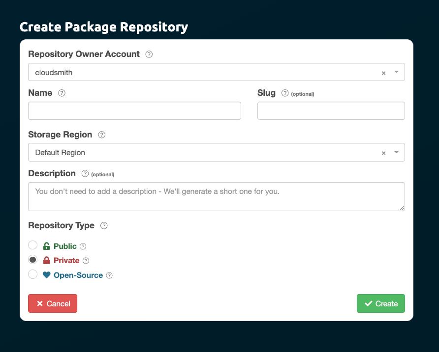
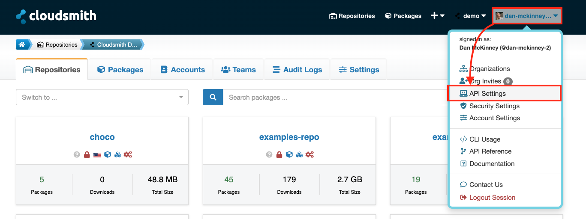

# Live Demo - Integrating Tests and Artifacts

### **Introduction**

The goal of this live demo is to walk through the process of integrating tests into an existing CI pipeline and setting up artifact management using Cloudsmith. By the end of this demo, you will have a working CI pipeline that runs both unit and integration tests and publishes build artifacts to Cloudsmith.

***

### **Step 1: Create a Feature Branch**

Before making any changes, let's create a new feature branch to work on:

```bash
git checkout dev
git pull origin dev
git checkout -b feature/add-tests-to-pipeline
```

***

### **Step 2: Add Tests to the Existing CI Pipeline**

#### **2.1 Tagging the Tests**

To categorize your tests into unit and integration groups, you need to add tags in your test classes:

```java
@Tag("unit") // Tag for unit tests
public class BookServiceTest {
    // Unit test implementation
}

@Tag("integration") // Tag for integration tests
public class BookControllerIntegrationTest {
    // Integration test implementation
}
```

Adding tags helps in selectively running different test suites during the CI pipeline execution.

***

#### **2.2 Update the Pipeline YAML File**

Now, let's update the existing CI pipeline to include these tests:

1.  **Update the Pipeline YAML File:**

    * Open the existing `ci-pipeline.yml` file in the root directory of your project.
    * Add the following configuration to run unit and integration tests:

    ```yaml
    # Run Unit Tests
    - task: Maven@3
      inputs:
        mavenVersionOption: 'Default'
        mavenPomFile: 'pom.xml'
        goals: 'test'
        options: '-Dgroups=unit'   # Run tests in the 'unit' group
      displayName: 'Run Unit Tests'

    # Run Integration Tests
    - task: Maven@3
      inputs:
        mavenVersionOption: 'Default'
        mavenPomFile: 'pom.xml'
        goals: 'test'
        options: '-Dgroups=integration'   # Run tests in the 'integration' group
      displayName: 'Run Integration Tests'
    ```

    This configuration ensures that the unit tests and integration tests are run separately, maintaining test isolation and clarity in your CI pipeline.
2.  **Commit and Push the Updated YAML File:**

    After updating the YAML file, commit and push your changes:

    ```bash
    git add .
    git commit -m "Update CI pipeline configuration to run tests"
    git push origin feature/add-tests-to-pipeline
    ```

***

### **Step 3: Sync Branches**

1. **Create a Pull Request to Merge** `feature/add-tests-to-pipeline` **into `dev`:**
   * **Navigate to Azure DevOps:**
     * Go to Repos -> Pull Requests.
   * **Create a New Pull Request:**
     * Source branch: `feature/add-tests-to-pipeline`
     * Target branch: `dev`
     * Title: "Add tests to CI Pipeline"
     * Description: "This PR adds unit and integration tests to our CI pipeline."
   * **Assign Reviewers:** Add team members as reviewers.
   * **Complete Code Review:** Reviewers will review the changes, add comments, and request changes if necessary.
   * **Merge the PR:** Once the code is approved, merge the pull request **using MERGE**.
2.  **Delete the Feature Branch Locally:**

    After merging the PR, delete the feature branch locally:

    ```bash
    git checkout dev
    git branch -D feature/add-tests-to-pipeline
    ```
3. **Sync the Other Branches:**
   * **Create a Pull Request to Merge** `dev` **into** `staging`:
     * Source branch: `dev`
     * Target branch: `staging`
     * Title: "Sync dev to staging"
     * Description: "This PR syncs the latest changes from dev to staging."
     * Merge the PR **using REBASE AND FF**.
   * **Create a Pull Request to Merge** `staging` **into** `master`:
     * Source branch: `staging`
     * Target branch: `master`
     * Title: "Sync staging to master"
     * Description: "This PR syncs the latest changes from staging to master."
     * Merge the PR **using REBASE AND FF**.
4. **Note:** After syncing the branches, it's recommended to make a minor change to the code and follow the same process to test the entire flow.

***

### **Step 4: Set Up Cloudsmith**

#### **4.1 Register and Set Up Cloudsmith**

1. **Sign Up for Cloudsmith:**
   * Visit the [Cloudsmith website](https://cloudsmith.io/user/signup/) and sign up for an account.
   * Follow the on-screen instructions to set up your organization.
2. **Create Repositories for Each Branch:**
   * Navigate to the Cloudsmith dashboard.
   * Click on **"Repositories"** in the left-hand menu.
   * Click on **"Create Repository"**.
   * Fill in the repository details for each branch:
     * **Name:** `dev-repo`, `staging-repo`, `master-repo`
     * **Visibility:** Choose `Private` for restricted access.
   *   Click **"Create Repository"** to create each repository.\


       <figure><figcaption><p>Create Repository Cloudsmith</p></figcaption></figure>
3.  **Generate API Key:**

    * Navigate to **Account Settings** -> **API Keys**.
    * Click on **Create API Key**, fill in the details, and generate the key.
    * Copy the API Key and save it securely.


    <figure><figcaption><p>API Key Cloudsmith</p></figcaption></figure>
4. **Create Group Variables in Azure DevOps:**
   * Navigate to **Pipelines** and select **Library**.
   * Click on **+ Variable group** and name it `CloudsmithSettings`.
   * Add the following variables:
     * `CLOUDSMITH_API_KEY`: Your Cloudsmith API Key.
     * `ORG`: Your Cloudsmith organization.
     * `REPO_DEV`: The repository name for the `dev` branch.
     * `REPO_STAGING`: The repository name for the `staging` branch.
     * `REPO_MASTER`: The repository name for the `master` branch.
   * Save the variable group.

***

### **Step 5: Integrate Cloudsmith with Azure DevOps**

1.  **Create a New Feature Branch:**

    ```bash
    git checkout dev
    git pull origin dev
    git checkout -b feature/add-cloudsmith
    ```
2.  **Update `ci-pipeline.yml` by adding the following steps to include the group variable group previously created. Add this after the pool settings and before the jobs settings.**

    ```yaml
    # Define variables for the pipeline, including Cloudsmith settings
    variables:
      - group: CloudsmithSettings   # Group containing settings for Cloudsmith, such as API keys
    ```
3.  **Update `ci-pipeline.yml` to Include Artifact Publishing:**

    Modify the `ci-pipeline.yml` to include the following steps for publishing artifacts to Cloudsmith:

    <pre class="language-yaml"><code class="lang-yaml"># Package Project
    - task: Maven@3
      inputs:
        mavenVersionOption: 'Default'
        mavenPomFile: 'pom.xml'
        goals: 'package -DskipTests'                  # Package the project, skipping tests
      displayName: 'Package Project'
      
    <strong># Install Cloudsmith CLI
    </strong>- script: |
        pip install --upgrade cloudsmith-cli
      displayName: "Install Cloudsmith CLI"

    # Test Cloudsmith Login
    - script: |
        cloudsmith whoami -k $(CLOUDSMITH_API_KEY)
      displayName: "Test Cloudsmith Login"

    # Publish Artifacts to Cloudsmith
    - script: |
        cloudsmith push raw --republish $(ORG)/$(Build.SourceBranchName)-repo target/LibraryManagementSystem-0.0.1-SNAPSHOT.jar -k $(CLOUDSMITH_API_KEY)
      displayName: "Publish Artifacts to Cloudsmith"
    </code></pre>
4.  **Commit and Push the Updated YAML File:**

    After updating the YAML file, commit and push your changes:

    ```bash
    git add .
    git commit -m "Update CI pipeline to publish artifacts to Cloudsmith"
    git push origin feature/add-cloudsmith
    ```
5. **Follow the Same Steps to Sync Branches:**
   * Create a PR from `feature/add-cloudsmith` to `dev`, and merge it **using MERGE**.
   *   Delete the feature branch locally:

       ```bash
       git checkout dev
       git branch -D feature/add-cloudsmith
       ```
   * Create PRs to sync `dev` to `staging` and `staging` to `master`, and merge them **using REBASE AND FF**.

***

### **Step 6: Test the Setup**

1.  **Create a Minor Change for Testing:**

    Create a feature branch, make a minor change, and push it:

    ```bash
    git checkout -b feature/test-artifact-publishing
    # Make a small change, e.g., add a comment to pom.xml
    git add .
    git commit -m "Test artifact publishing to Cloudsmith"
    git push origin feature/test-artifact-publishing
    ```
2. **Create a Pull Request and Sync the Branches:**
   * Create a PR from `feature/test-artifact-publishing` to `dev`, and merge it **using MERGE**.
   * Follow the same steps to sync `dev` to `staging` and `staging` to `master`.
   *   Delete the local feature branch after syncing:

       ```bash
       git checkout dev
       git branch -D feature/test-artifact-publishing
       ```

***

### **Step 7: Verify Artifact in Cloudsmith**

1.  **Log into Cloudsmith:**

    * Navigate to your Cloudsmith account.
    * Go to **Repositories** and verify the presence of the artifacts in the respective repositories for `dev`, `staging`, and `master`.


    <figure><figcaption><p>Repositories on Cloudsmith</p></figcaption></figure>

***

### **Conclusion**

This live demo provided a comprehensive guide to integrating tests into your CI pipeline and setting up artifact management using Cloudsmith. By following these steps, you've ensured that your CI/CD pipeline is not only running tests efficiently but also securely managing and storing build artifacts. This practice enhances your deployment process's reliability and traceability, crucial for maintaining high-quality software in a production environment.
