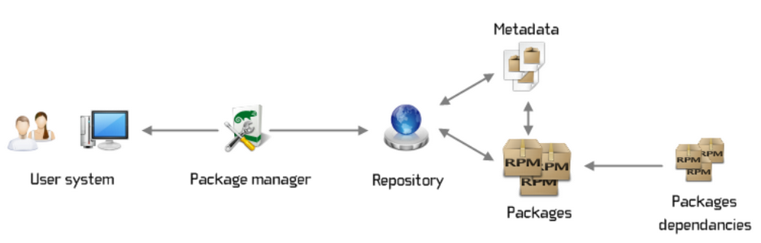

# Managing Dependencies in CI Pipelines

### **Introduction**

Effective dependency management is crucial for building reliable and maintainable software. In Continuous Integration (CI) pipelines, managing dependencies ensures that your codebase consistently builds and runs correctly across different environments. This lesson will explore the importance of dependency management, the role of package managers, and best practices to streamline this process in your CI pipelines.

***

### **Understanding Dependency Management**

Dependency management refers to the process of handling the libraries, frameworks, and tools that your project depends on. These dependencies must be correctly resolved and included in the build process to ensure that the software functions as expected.

#### **Challenges in Dependency Management:**

* **Version Conflicts:** Different versions of the same dependency may cause conflicts, leading to build failures or runtime errors.
* **Transitive Dependencies:** Dependencies of your dependencies can introduce unforeseen issues if not managed properly.
* **Environment Consistency:** Ensuring that all environments (development, testing, production) have the same set of dependencies to avoid "it works on my machine" problems.

#### **Example Scenario:**

Consider a Java project that depends on several libraries like Spring Framework, Hibernate, and Apache Commons. Managing these dependencies involves specifying the correct versions and ensuring that they are available during the build process.

***

### **Role of Package Managers**

Package managers automate the process of downloading, installing, and managing the dependencies for your project. They help ensure that the correct versions of libraries and tools are used, making the build process more reliable and reproducible.

<figure><figcaption><p>Package Manager Flow</p></figcaption></figure>

#### **Popular Package Managers:**

* **Maven (Java):** Manages Java project dependencies by defining them in a `pom.xml` file. Maven automatically resolves transitive dependencies and handles versioning.
* **npm (Node.js):** Manages JavaScript dependencies through a `package.json` file. npm installs the required packages and their dependencies.
* **NuGet (.NET):** Manages .NET project dependencies via a `packages.config` or `csproj` file, automating the download and installation of libraries.

**Example of Maven Dependency Configuration:**


```xml
<dependencies>
    <!-- Spring Core dependency -->
    <dependency>
        <groupId>org.springframework</groupId>  <!-- The group ID of the dependency, identifying the organization or project (Spring Framework) -->
        <artifactId>spring-core</artifactId>  <!-- The artifact ID of the dependency, identifying the specific module (Spring Core) -->
        <version>5.3.8</version>  <!-- The version of the Spring Core dependency to be used -->
    </dependency>

    <!-- Hibernate ORM dependency -->
    <dependency>
        <groupId>org.hibernate</groupId>  <!-- The group ID of the dependency, identifying the organization or project (Hibernate) -->
        <artifactId>hibernate-core</artifactId>  <!-- The artifact ID of the dependency, identifying the specific module (Hibernate Core) -->
        <version>5.5.3.Final</version>  <!-- The version of the Hibernate Core dependency to be used -->
    </dependency>
</dependencies>
```


**Explanation:**

In this Maven configuration, two dependencies are defined: Spring Core and Hibernate ORM. Maven will automatically download and manage these dependencies, including their transitive dependencies.

<details>

<summary>Why Use Package Managers?</summary>

* **Simplified Dependency Management:** Package managers simplify the process of managing libraries and tools needed for your project.
* **Version Control:** They allow you to specify exact versions of dependencies, ensuring consistency across different environments.
* **Automation:** By integrating with CI pipelines, package managers automate the installation and updating of dependencies, reducing manual work and errors.

</details>

***

### **Best Practices for Managing Dependencies in CI Pipelines**

Managing dependencies effectively in CI pipelines is crucial for ensuring that your builds are reliable, reproducible, and consistent across different environments. In this section, we’ll explore best practices for managing dependencies using Maven, a popular build automation tool in Java projects.

#### **1. Define Dependencies in `pom.xml`**

In Maven, dependencies are defined in the `pom.xml` file. This file acts as the project's configuration file and specifies the libraries and modules your project depends on.

**Example of `pom.xml` Dependency Definition:**


```xml
<dependencies>
    <!-- Spring Boot Starter Web dependency -->
    <dependency>
        <groupId>org.springframework.boot</groupId>  <!-- The group ID identifying the Spring Boot project -->
        <artifactId>spring-boot-starter-web</artifactId>  <!-- The artifact ID for the Spring Boot Starter Web module, which includes web-related components like Spring MVC -->
        <version>2.5.4</version>  <!-- The version of the Spring Boot Starter Web dependency to be used -->
    </dependency>

    <!-- JUnit dependency for unit testing -->
    <dependency>
        <groupId>junit</groupId>  <!-- The group ID identifying the JUnit project -->
        <artifactId>junit</artifactId>  <!-- The artifact ID for the JUnit module, used for writing and running tests -->
        <version>4.13.2</version>  <!-- The version of the JUnit dependency to be used -->
        <scope>test</scope>  <!-- The scope of the dependency, indicating that this dependency is only required for the test phase -->
    </dependency>
</dependencies>
```


In this example, we have included two dependencies: one for `spring-boot-starter-web` and another for `JUnit` for testing purposes. The `<scope>` element is used to specify that JUnit should only be available during the testing phase.

#### **2. Use a Local Repository Cache in CI**

To improve build performance and reduce dependency on external repositories, Maven caches downloaded dependencies in a local repository (usually located at `~/.m2/repository` on your machine). In a CI environment like Azure Pipelines, you can use caching to store these dependencies, which can be reused across different builds to speed up the pipeline.

**Caching Maven Repository in Azure Pipelines**

Caching the Maven repository in Azure Pipelines can significantly speed up the build process by reusing downloaded dependencies between pipeline runs. Below is an example of how to implement this caching strategy within a single job using the `Cache@2` task.

**Example of Caching Maven Dependencies**

In this example, we have a build job that caches the Maven repository so that the dependencies downloaded during the build process can be reused in subsequent pipeline runs on the same agent.

```yaml
# Define the pipeline trigger
trigger:
  branches:
    include:
      - main    # Trigger the pipeline for changes in the 'main' branch
      - develop # Trigger the pipeline for changes in the 'develop' branch

# Define the build job
jobs:
- job: Build
  displayName: 'Build Job' # The name of the build job that appears in the UI
  pool:
    vmImage: 'ubuntu-latest' # Specify the agent pool; in this case, it's using the latest Ubuntu image
  steps:
  - task: Cache@2
    inputs:
      key: 'maven | "$(Agent.OS)" | **/pom.xml' # Unique cache key based on OS and the Maven pom.xml file
      restoreKeys: |
        maven | "$(Agent.OS)" # Fallback key if the exact cache key is not found
      path: ~/.m2/repository # Path to the local Maven repository where dependencies are stored
    displayName: 'Cache Maven Dependencies' # Name of the cache step in the UI
  
  - script: mvn clean compile # Command to clean and compile the Maven project
    displayName: 'Compile Project' # Name of the compile step in the UI
```

In this example:

* The `Cache@2` task is used to cache the Maven repository located at `~/.m2/repository`.
* The `key` uniquely identifies the cache based on the OS and the `pom.xml` file. If this cache exists, it is restored to the specified path.
* If the cache does not exist, the `mvn clean compile` step will download the necessary dependencies, and the `Cache@2` task will store them for future use.

**How It Works:**

* **Cache Restoration:** When the pipeline runs, the `Cache@2` task checks if a cache with the specified key exists. If found, it restores the cache, making the dependencies available without re-downloading them.
* **Cache Update:** After the build step, if the cache did not exist or was incomplete, the `Cache@2` task updates the cache with the latest dependencies. This cache is then available for future runs on the same agent.

#### Summary

The `Cache@2` task in Azure Pipelines is a powerful tool to speed up your builds by reusing cached data across builds that run on the same agent. It is most commonly used within a single job to cache dependencies like Maven, npm, or Gradle, reducing the need to download these dependencies every time a build is run.

By implementing caching strategies like this, you can significantly improve the efficiency of your CI pipelines, making your builds faster and more reliable.

#### **3. Version Control Your Dependencies**

Using fixed versions of dependencies in your `pom.xml` ensures that builds are reproducible. Avoid using dynamic versions (like `LATEST` or `RELEASE`) as they can lead to inconsistencies in builds.

**Example:**

```xml
<version>1.0.0</version> <!-- Fixed version for consistent builds -->
```

#### **4. Manage Transitive Dependencies**

Maven resolves transitive dependencies automatically, which means it includes dependencies of your dependencies. It's essential to manage these transitive dependencies to avoid conflicts.

**Best Practice:** Use the `<exclusions>` tag in your `pom.xml` to exclude any unwanted transitive dependencies that might cause conflicts.

**Example of Excluding a Transitive Dependency:**


```xml
<dependency>
    <groupId>org.springframework.boot</groupId>  <!-- The group ID identifying the Spring Boot project -->
    <artifactId>spring-boot-starter-data-jpa</artifactId>  <!-- The artifact ID for the Spring Boot Starter Data JPA module, which provides JPA-related functionalities -->
    <version>2.5.4</version>  <!-- The version of the Spring Boot Starter Data JPA dependency to be used -->
    
    <exclusions>  <!-- Section to specify dependencies that should be excluded from this dependency -->
        <exclusion>  <!-- Define an exclusion for a specific dependency -->
            <groupId>org.hibernate</groupId>  <!-- The group ID of the dependency to be excluded (Hibernate) -->
            <artifactId>hibernate-core</artifactId>  <!-- The artifact ID of the dependency to be excluded (Hibernate Core) -->
        </exclusion>
    </exclusions>
</dependency>
```


In this example, `hibernate-core` is excluded from the transitive dependencies of `spring-boot-starter-data-jpa` to avoid potential conflicts.

#### **5. Regularly Update Dependencies**

Keeping dependencies up-to-date ensures that your project benefits from the latest features, bug fixes, and security patches. However, always test your builds thoroughly when updating dependencies to avoid introducing breaking changes.

**Best Practice:** Use tools like Maven's `Versions Maven Plugin` to check for dependency updates and manage them effectively.

**Example Command to Display Available Dependency Updates:**

```bash
mvn versions:display-dependency-updates
```

This command will list all available updates for the dependencies defined in your `pom.xml`.

#### **6. Use a Dependency Management Tool**

For large projects with multiple modules, it's advisable to centralize dependency management using a `dependencyManagement` section in a parent `pom.xml`. This ensures consistency across all modules.

**Detailed Example of Centralized Dependency Management:**

Imagine you have a multi-module project with several submodules (`module-a`, `module-b`, etc.). Each submodule may rely on common dependencies like Spring Boot or JUnit. Instead of specifying the version of each dependency in every submodule’s `pom.xml`, you can centralize this in a parent `pom.xml`.

**Parent `pom.xml` Example:**


```xml
<project>
    <!-- The version of the POM model being used -->
    <modelVersion>4.0.0</modelVersion>

    <!-- Group ID that uniquely identifies your project across all projects -->
    <groupId>com.example</groupId>

    <!-- Artifact ID which is the name of the project -->
    <artifactId>parent-project</artifactId>

    <!-- Version of the project -->
    <version>1.0.0</version>

    <!-- Specifies that this project is a parent POM (aggregator) for other modules -->
    <packaging>pom</packaging>

    <!-- List of modules that are part of this parent project -->
    <modules>
        <module>module-a</module>  <!-- Module A, which is part of this multi-module project -->
        <module>module-b</module>  <!-- Module B, another module within this multi-module project -->
    </modules>

    <!-- Dependency Management section allows the parent project to control dependency versions for child modules -->
    <dependencyManagement>
        <dependencies>
            <!-- Spring Boot Starter Web dependency -->
            <dependency>
                <groupId>org.springframework.boot</groupId>  <!-- Group ID for the Spring Boot project -->
                <artifactId>spring-boot-starter-web</artifactId>  <!-- Artifact ID for the Spring Boot Starter Web module -->
                <version>2.5.4</version>  <!-- Version of Spring Boot Starter Web -->
            </dependency>

            <!-- JUnit dependency for unit testing -->
            <dependency>
                <groupId>junit</groupId>  <!-- Group ID for the JUnit project -->
                <artifactId>junit</artifactId>  <!-- Artifact ID for the JUnit module -->
                <version>4.13.2</version>  <!-- Version of JUnit -->
            </dependency>
        </dependencies>
    </dependencyManagement>
</project>
```


**Submodule `pom.xml` Example:**


```xml
<project>
    <!-- The version of the POM model being used -->
    <modelVersion>4.0.0</modelVersion>

    <!-- Parent section indicates that this module inherits from a parent project -->
    <parent>
        <groupId>com.example</groupId>  <!-- Group ID of the parent project -->
        <artifactId>parent-project</artifactId>  <!-- Artifact ID of the parent project -->
        <version>1.0.0</version>  <!-- Version of the parent project -->
    </parent>

    <!-- Artifact ID which is the name of this specific module -->
    <artifactId>module-a</artifactId>

    <!-- Dependencies specific to this module -->
    <dependencies>
        <!-- Spring Boot Starter Web dependency -->
        <dependency>
            <groupId>org.springframework.boot</groupId>  <!-- Group ID for the Spring Boot project -->
            <artifactId>spring-boot-starter-web</artifactId>  <!-- Artifact ID for the Spring Boot Starter Web module -->
            <!-- No version specified here because it's inherited from the parent project -->
        </dependency>

        <!-- JUnit dependency for unit testing -->
        <dependency>
            <groupId>junit</groupId>  <!-- Group ID for the JUnit project -->
            <artifactId>junit</artifactId>  <!-- Artifact ID for the JUnit module -->
            <!-- No version specified here because it's inherited from the parent project -->
        </dependency>
    </dependencies>
</project>
```


In this setup, the version numbers for dependencies are centralized in the parent `pom.xml`. All submodules inherit these versions, ensuring consistency and simplifying maintenance. If a version update is needed, you only need to update the parent `pom.xml`.

#### **7. Integrate Dependency Management into CI Pipelines**

Ensure that your CI pipeline includes steps for dependency management. This may involve running commands to verify that all dependencies are up-to-date and resolving any conflicts before proceeding with the build.

**Example CI Pipeline Step for Dependency Management:**


```yaml
- task: Maven@3  # Use the Maven task, version 3, to run Maven commands
  inputs:
    mavenPomFile: 'pom.xml'  # Specifies the path to the Maven POM file (usually named pom.xml)
    goals: 'dependency:resolve'  # Maven goal to resolve all dependencies before the build process begins
  displayName: 'Resolve Dependencies'  # Display name for this task in the CI pipeline
```


This step in your CI pipeline ensures that all dependencies are resolved before the actual build process begins, helping to catch any issues related to dependencies early.

***

### **Conclusion**

Effective dependency management is crucial for maintaining a reliable and efficient CI pipeline. By following best practices such as using fixed versions, managing transitive dependencies, and centralizing dependency management, you can ensure that your builds are consistent and reproducible. Integrating these practices into your CI pipeline will help you avoid common pitfalls such as dependency conflicts and version inconsistencies, leading to smoother and more reliable builds.
