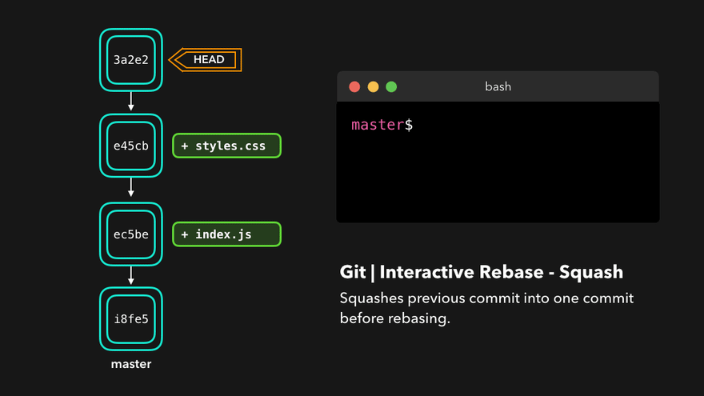
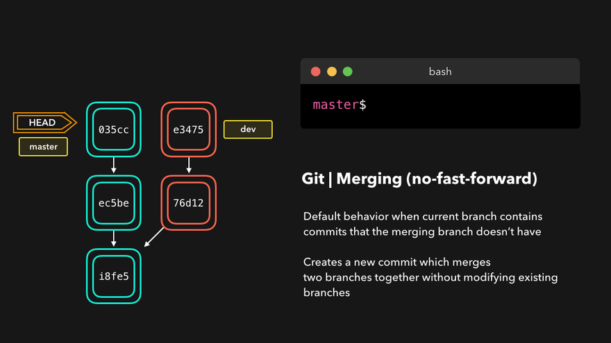

# Advanced Git Commands

In this page, we will explore several advanced Git commands that are crucial for managing branches and changes in your projects. Understanding these commands will help you navigate complex workflows and maintain a clean and organized codebase.

***

### **Merge**

The `merge` command combines the changes from one branch into another. It is commonly used to integrate feature branches into the main codebase.

```bash
# Merging a branch into the current branch
git merge feature-branch
```

***

### **Rebase**

The `rebase` command moves or combines a sequence of commits to a new base commit. It is useful for maintaining a linear project history and integrating changes.

```bash
# Rebasing the current branch onto another branch
git rebase main
```

<figure><figcaption><p>Git Rebase</p></figcaption></figure>

#### **Use Cases**

1.  **Updating Feature Branch:** Keep a feature branch up to date with the main branch without creating a merge commit.

    ```bash
    git checkout feature-branch
    git rebase main
    ```
2.  **Squashing Commits:** Combine multiple commits into one, making the history cleaner.

    ```bash
    git rebase -i HEAD~3
    ```

    The `-i` option stands for interactive, allowing you to pick, squash, or edit commits.

<figure><figcaption><p>Git Rebase Squash</p></figcaption></figure>


Rebasing can rewrite commit history. Avoid rebasing shared branches as it can lead to conflicts and confusion.


***

### **Cherry-Pick**

The `cherry-pick` command allows you to apply changes from a specific commit to another branch. This is useful for applying specific fixes or features without merging an entire branch.

```bash
# Cherry-picking a specific commit
git cherry-pick <commit-hash>
```

<figure><figcaption><p>Git Cherry-Pick</p></figcaption></figure>

#### **Example**

If you want to apply a specific commit from a feature branch to the main branch:

```bash
git checkout main
git cherry-pick <commit-hash>
```

***

### **Fast-Forward**

Fast-forward merges occur when the branch being merged is ahead of the current branch, and there are no changes in the current branch. Git simply moves the branch pointer forward.

```bash
# Fast-forward merge example
git checkout main
git merge feature-branch
```

<figure><figcaption><p>Git Fast Forward</p></figcaption></figure>

In this case, if the main branch has no new commits since the feature branch split off, Git will move the main branch pointer forward without creating a new merge commit.

***

### **No Fast-Forward (No-FF) Merge**

The `--no-ff` option is used with the `git merge` command to ensure that a merge commit is created even when a fast-forward merge is possible. This command is useful for preserving the history of feature branches, making it clear when branches were merged into the main codebase.

```bash
# Merging with no fast-forward
git merge --no-ff feature-branch
```

<figure><figcaption><p>Git No Fast Forward</p></figcaption></figure>

**Use Cases**

1.  **Preserving Merge History:** Ensures that a merge commit is created, even if the feature branch can be fast-forwarded. This helps in maintaining a clear and explicit history of branch integrations.

    ```bash
    git checkout main
    git merge --no-ff feature-branch
    ```
2. **Better Traceability:** By creating a merge commit, you make it easier to trace the origin of changes, as each feature integration is recorded in the project history.
3. **Facilitating Rollbacks:** A dedicated merge commit allows for easier reversion of an entire feature by reverting the merge commit itself, rather than individual commits.

***

### **Reset and Revert**

#### **Reset**

The `reset` command is used to undo changes in your working directory and staging area. It can be used in three modes:

1.  **Soft Reset:** Keeps changes in the working directory and index (staging area).

    ```bash
    git reset --soft HEAD~1
    ```

    <figure><figcaption><p>Git Soft Reset</p></figcaption></figure>
2.  **Mixed Reset:** Keeps changes in the working directory but clears the index.

    ```bash
    git reset --mixed HEAD~1
    ```
3.  **Hard Reset:** Discards all changes, both in the working directory and index.

    ```bash
    git reset --hard HEAD~1
    ```

    <figure><figcaption><p>Git Hard Reset</p></figcaption></figure>

#### **Revert**

The `revert` command creates a new commit that undoes the changes from a previous commit. Unlike `reset`, `revert` is a safe operation for undoing changes in public branches.

```bash
# Reverting a specific commit
git revert <commit-hash>
```

<figure><figcaption><p>Git Revert</p></figcaption></figure>


Use `revert` for public branches to maintain history, and `reset` for local changes that are not yet shared.


***

### **Conclusion**

Advanced Git commands like merge, rebase, cherry-pick, fast-forward, reset, and revert provide powerful tools for managing changes in a project. Understanding when and how to use these commands will help you maintain a clean and organized codebase, handle conflicts efficiently, and collaborate effectively with other developers.

These commands are essential for handling complex workflows, ensuring a smooth integration process, and maintaining the integrity of your project's history.
