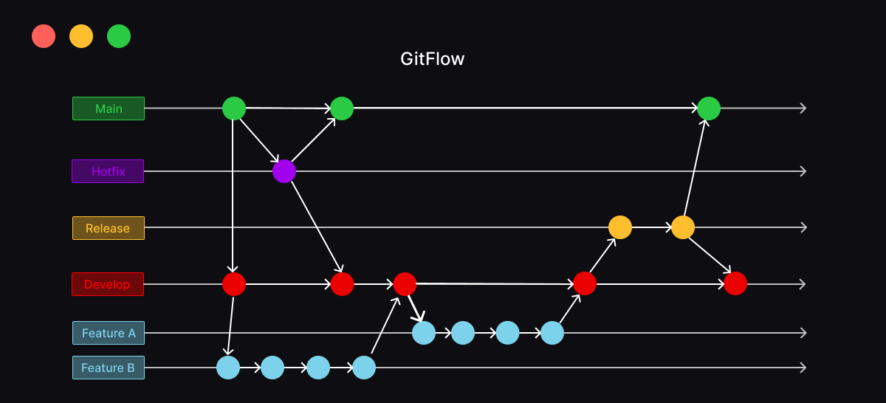
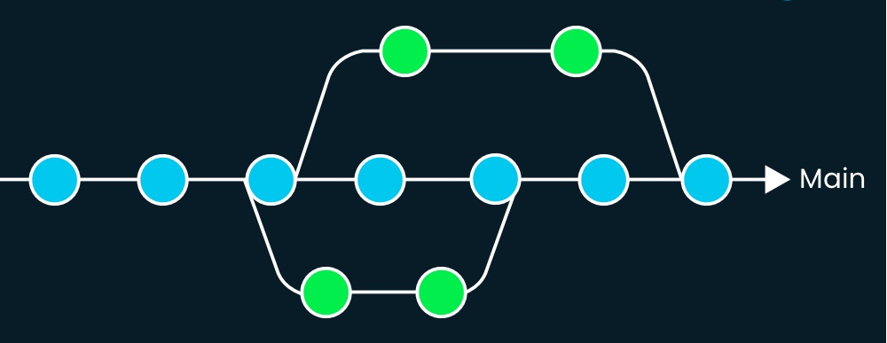
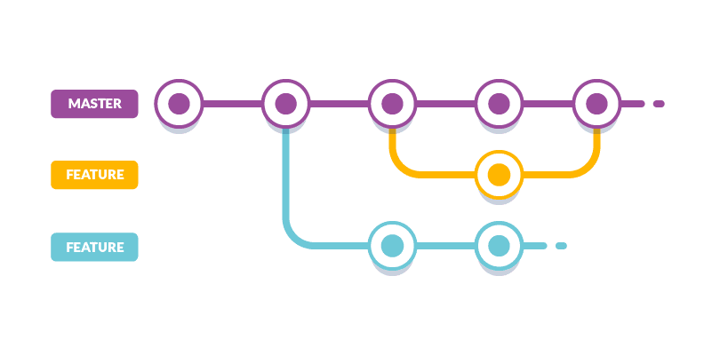
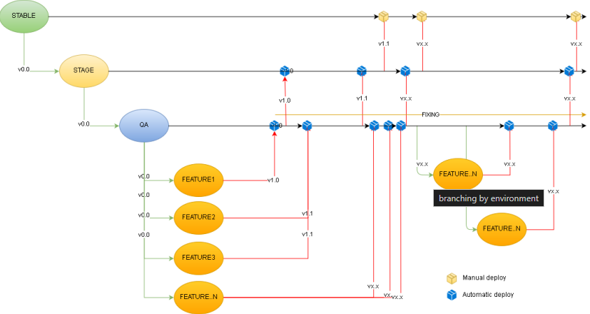

# Branching Strategies

Branching strategies in Git are essential for managing parallel development and ensuring smooth integration of new features, bug fixes, and other updates. In this page, we will explore several popular Git workflows, discuss their advantages and disadvantages, and explain the environment-based branching strategy, which is the chosen approach for this course.

***

### **1. Overview of Git Workflows**

#### **1.1. Git Flow**

Git Flow is a popular branching model that defines a strict branching structure. It includes long-lived branches like `main` (formerly `master`) and `develop`, along with supporting branches such as `feature`, `release`, and `hotfix`.

<figure><figcaption><p>Git Flow</p></figcaption></figure>

* **Main:** Holds the production-ready code.
* **Develop:** Serves as the integration branch for features.
* **Feature:** Created from `develop` for new features and merged back into `develop` once complete.
* **Release:** Prepares for a new production release; branch off `develop` and merge into `main` and `develop`.
* **Hotfix:** For emergency fixes; branch off `main` and merge back into `main` and `develop`.

<div align="left">

<figure><figcaption><p>Git Flow Interactive</p></figcaption></figure>

</div>

#### **1.2. Trunk-Based Development**

Trunk-Based Development emphasizes short-lived branches and frequent merges into the `main` branch. It aims to minimize integration conflicts and supports continuous integration and continuous deployment (CI/CD). We either push directly to the branch or create Short-Lived Branches for it.

* **Main (Trunk):** The only long-lived branch.
* **Short-Lived Branches:** Created for specific tasks and merged quickly into `main`.

<figure><figcaption><p>Trunk-Based Development</p></figcaption></figure>

#### **1.3. Feature Branch Workflow**

The Feature Branch Workflow is a straightforward approach where each feature or bug fix is developed in its own branch. This workflow provides isolation and helps in organizing development.

* **Main (or Master):** The stable branch that contains the production-ready code.
* **Feature Branches:** Created from the main branch for new features or bug fixes and merged back into the main branch once the feature is complete.

<figure><figcaption><p>Feature Branch Workflow</p></figcaption></figure>

***

### **2. Environment-Based Branching**

In this course, we focus on the **Environment-Based Branching** strategy. This approach involves maintaining separate branches for different environments, such as `development`, `staging`, and `production`.

#### **2.1. Key Features**

* **Environment-Specific Branches:** Each environment has a dedicated branch, ensuring isolation and stability.
* **Promotion Pipeline:** Changes are promoted from one branch to another (e.g., `development` to `staging` to `production`) based on testing and approvals.

#### **2.2. Advantages**

* **Clear Separation of Environments:** Ensures that different environments remain isolated, preventing issues in one environment from affecting others.
* **Controlled Deployments:** Enables controlled and systematic promotion of code through environments, reducing the risk of issues in production.

#### **2.3. Disadvantages**

* **Branch Divergence:** Over time, branches may diverge, requiring careful management to avoid conflicts and ensure consistency.
* **Increased Complexity:** Maintaining multiple branches can increase complexity, particularly in managing merges and tracking changes across environments.

<figure><figcaption></figcaption></figure>

1. **Development Branch:** Developers work on new features and bug fixes in the `development` branch.
2. **Staging Branch:** After testing in the development environment, changes are merged into the `staging` branch for further testing.
3. **Production Branch:** Once changes pass all tests, they are merged into the `production` branch and deployed to the live environment.

```bash
# Example of promoting changes from development to staging
git checkout staging
git merge development

# Example of promoting changes from staging to production
git checkout production
git merge staging
```

***

### **3. Why Environment-Based Branching for This Course?**

In this course, we chose the environment-based branching strategy to:

1. **Align with Real-World Practices:** Many organizations use environment-based branching to manage deployments and maintain stability across different stages.
2. **Simplify Learning:** This approach provides a clear and structured workflow, helping you understand the progression of code changes from development to production.
3. **Emphasize Deployment Stages:** Focus on the importance of thorough testing and review processes in different environments before reaching production.

***

### **Conclusion**

Understanding different branching strategies is crucial for effective collaboration and project management. The environment-based branching strategy, chosen for this course, offers clear separation and controlled deployment, making it an ideal approach for managing projects in a structured and organized manner. By mastering this strategy, you will be well-equipped to handle complex workflows and ensure the quality and stability of your projects.
