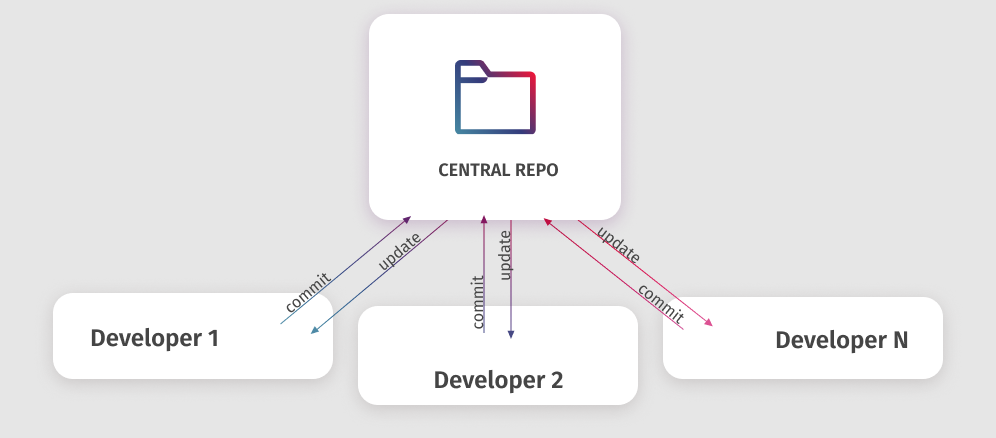
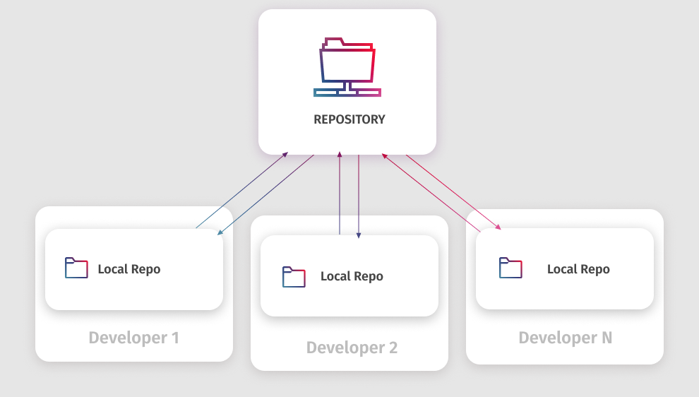

# Introduction to Git

Git is a **distributed version control system** widely used in software development for tracking changes in source code. It enables multiple developers to collaborate on a project efficiently by managing changes to files and directories. This page provides an overview of Git, its fundamental concepts, and its importance in modern collaborative development.

***

### **What is Git?**

Git is a version control system that allows developers to manage changes to code and track the history of a project. It provides tools for merging changes, resolving conflicts, and rolling back to previous versions. Git's distributed nature means that every developer's working copy of the code is also a repository containing the full history of all changes.

<figure><figcaption><p>Git</p></figcaption></figure>

#### **Key Concepts of Git**

1. **Repository (Repo):** A storage space where your project files and the history of all changes are kept. A Git repository can be local to a single developer's machine or hosted on a remote server. A repository acts as the central hub for your project, keeping track of all code changes and collaboration efforts.
2. **Commit:** A snapshot of your project files at a particular point in time. Each commit has a unique identifier (hash) and includes a message describing the changes made.
3.  **Branch:** A parallel version of the repository. Branches are used to develop features, fix bugs, or experiment with new ideas in isolation from the main codebase.

    ```bash
    # Creating a new branch
    git branch feature-branch
    # Switching to the new branch
    git checkout feature-branch
    ```
4. **Merge:** The process of integrating changes from one branch into another. Merging can lead to conflicts if changes overlap, which must be resolved manually.
5. **Clone:** Creating a copy of a Git repository from a remote server. This includes all files and the entire history of changes.
6. **Pull and Push:**
   * **Pull:** Fetching changes from a remote repository and integrating them into your local repository.
   * **Push:** Sending your local changes to a remote repository.

***

### **Git Bash**

Git Bash is a command-line interface (CLI) that emulates a Unix shell environment on Windows. It provides a way to use Git commands and perform various tasks, such as navigating the file system, running shell scripts, and more. Git Bash includes a collection of GNU utilities like `bash`, `awk`, `sed`, and many others, making it a powerful tool for Git users on Windows.

#### **Installing Git Bash**

1. **Download Git for Windows:** Visit the [Git for Windows](https://gitforwindows.org/) website and download the latest installer.
2. **Run the Installer:** Follow the on-screen instructions. You can choose to install Git Bash along with other components like Git GUI and additional Unix tools.
3. **Launch Git Bash:** After installation, you can launch Git Bash from the Start menu or by right-clicking in a folder and selecting "Git Bash Here."


Git Bash provides a consistent experience for Git users across different platforms, especially useful for those accustomed to Unix/Linux environments.


#### **Basic Git Bash Commands**

1. **Navigating Directories:**
   * `pwd`: Print the current working directory.
   * `ls`: List files and directories.
   * `cd <directory>`: Change to a different directory.
2. **File Operations:**
   * `touch <file>`: Create a new file.
   * `rm <file>`: Remove a file.
   * `mkdir <directory>`: Create a new directory.
   * `rmdir <directory>`: Remove an empty directory.
3. **Git Operations:**
   * `git status`: Show the status of the working directory.
   * `git add <file>`: Stage a file for commit.
   * `git commit -m "message"`: Commit changes with a message.
   * `git push`: Push local changes to the remote repository.


Be cautious when using destructive commands like `rm` and `rmdir`, as they permanently delete files and directories.


**Customizing Git Bash**

1. **Aliases:** You can create custom command shortcuts by adding aliases to the `.bashrc` file. For example, `alias gs='git status'` creates an alias for the `git status` command.
2. **Prompt Customization:** Modify the PS1 variable in the `.bashrc` file to change the appearance of the Git Bash prompt. This can include displaying the current branch name, path, etc.

<details>

<summary><strong>Example of Customizing Git Bash Prompt</strong></summary>

```bash
# Display the current path and Git branch
PS1='\w $(__git_ps1 "(%s)")\$ '
```

This customization displays the current directory and Git branch in the prompt.

</details>

***

### **The Importance of Git in Collaborative Development**

1. **Version Tracking:** Git records the entire history of changes, allowing developers to understand what has changed over time and why. This is crucial for debugging and understanding the evolution of a project.
2. **Branching and Merging:** Git's powerful branching and merging features enable teams to work on multiple features or fixes simultaneously without interfering with the main codebase. This promotes parallel development and continuous integration.
3. **Collaboration:** Git's distributed model allows multiple developers to work on a project from different locations, with each having a complete copy of the repository. This makes it easier to collaborate and contribute to a project.
4. **Backup and Recovery:** By hosting repositories on remote servers (like GitHub, GitLab, or Azure Repos), Git provides a reliable backup system. If a local copy is lost, it can be easily restored from the remote.

***

### **Centralized vs. Distributed Version Control Systems**

In centralized version control systems (CVCS), such as **Subversion (SVN)**, there is a single central repository that holds all the versioned files. Developers check out files from the central server, work on them, and then check them back in. This model can create bottlenecks, as developers must communicate with the central server to perform many version control operations.

#### **With Centralized VCS:**

* All changes are stored in a central repository.
* Developers must be connected to the network to commit changes or view the history.
* If the central server goes down, version control operations are unavailable.

<figure><figcaption><p><strong>Centralized VCS</strong></p></figcaption></figure>

#### **With Distributed VCS (like Git):**

* Every developer has a full copy of the repository, including the entire history.
* Most operations are local, making them faster and independent of network access.
* Multiple backups are inherent, as every clone contains the complete history of the project.

<figure><figcaption><p><strong>Distributed VCS</strong></p></figcaption></figure>


Distributed version control systems offer better resilience and flexibility, as each developer's local repository acts as a full backup of the entire codebase


***

### **Scenario: With and Without Version Control**

**Without Version Control:** In a scenario where version control is not used, developers might manually manage different versions of the codebase, leading to confusion and potential data loss. For example, if two developers are working on the same file, they might overwrite each other's changes, causing important updates to be lost. Additionally, tracking changes and understanding the history of the project becomes challenging, making it difficult to revert to a previous state if something goes wrong.

**With Version Control:** With Git, every change is tracked, and the full history of the project is preserved. Developers can work on separate branches, merging their changes back into the main codebase without conflict. For example, if a bug is found in the production code, a developer can quickly create a hotfix branch, make the necessary changes, and merge them back, all while maintaining a clean and organized history of the project.

<details>

<summary><strong>Example of Resolving Conflicts</strong></summary>

When merging branches, conflicts may arise if changes overlap. Git allows you to resolve these conflicts manually:

```bash
# Example of a conflict in a file
<<<<<<< HEAD
// Code from the current branch
=======
// Code from the branch being merged
>>>>>>>
```

Developers can choose which changes to keep or merge both sets of changes.

</details>

***

### **Conclusion**

Git is an essential tool for modern software development, enabling efficient collaboration, version tracking, and management of code changes. Its robust features and flexibility make it a popular choice among development teams worldwide. Understanding Git's basic concepts and workflows is the first step towards mastering version control and contributing effectively to collaborative projects.
