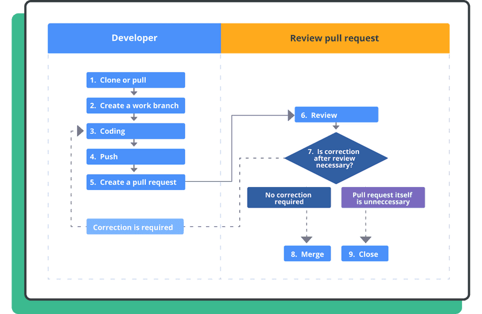
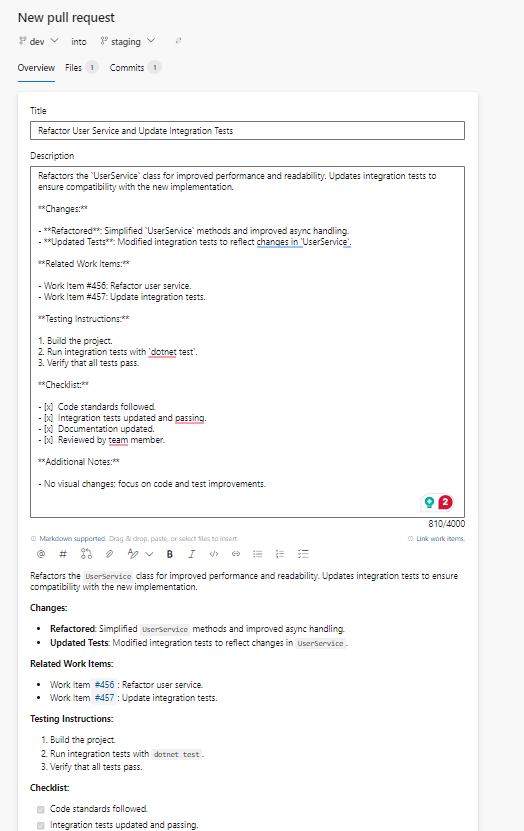

# Pull Requests and Code Reviews

In this page, we will explore the importance of pull requests (PRs) in collaborative development, best practices for conducting code reviews, and how these practices help maintain code quality and team collaboration.

***

### **1. Understanding Pull Requests**

A **pull request** is a mechanism for a developer to notify team members that they have completed a feature, bug fix, or other task in a separate branch and are ready to merge the changes into the main codebase. Pull requests provide a structured way to review and discuss code changes before they are merged.

#### **1.1. Benefits of Pull Requests**

* **Code Quality Assurance:** Pull requests facilitate code reviews, allowing team members to catch bugs, suggest improvements, and ensure adherence to coding standards.
* **Collaboration and Knowledge Sharing:** They encourage discussion and knowledge sharing among team members, fostering a collaborative environment.
* **Documentation of Changes:** PRs provide a history of changes, including discussions and decisions, which can be useful for future reference.

**1.2. The Pull Request Workflow**

1. **Create a Branch:** Developers create a new branch from the main codebase.
2. **Make Changes:** Code changes are made and committed to the new branch.
3. **Open a Pull Request:** Once the work is complete, a PR is opened to merge the branch into the target branch (usually `main` or `develop`).
4. **Code Review:** Team members review the changes, leaving comments, suggestions, and approvals.
5. **Address Feedback:** The developer addresses any feedback and may push additional commits to the branch.
6. **Merge:** Once approved, the PR is merged into the target branch.

<figure><figcaption>
Example of a pull request workflow
</figcaption></figure>

***

### **2. Best Practices for Pull Requests**

To ensure effective and efficient code reviews, it’s essential to follow best practices when creating and managing pull requests.

#### **2.1. Keep Pull Requests Small**

* **Focus on a Single Task:** PRs should focus on a specific feature, bug fix, or task to keep the scope manageable.
* **Easier Review:** Smaller PRs are easier to review and understand, leading to faster feedback and fewer errors.

#### **2.2. Write Clear Descriptions**

* **Provide Context:** Include a clear and detailed description of the changes, including the problem being solved and the solution.
* **Reference Issues:** Link to any related issues, tasks, or user stories to provide additional context.

<figure><figcaption>
Pull Request Azure DevOps Example
</figcaption></figure>

#### **2.3. Use Meaningful Commit Messages**

* **Descriptive Messages:** Each commit message should be descriptive and explain the changes made in that commit.
* **Follow Conventions:** Use a consistent style for commit messages (e.g., "feat: add new payment method").

#### **2.4. Engage in Discussions**

* **Respond to Feedback:** Engage with reviewers by responding to comments and making necessary changes.
* **Ask Questions:** If unclear, ask questions to understand the reviewer's perspective.


Active participation in discussions helps clarify doubts, resolve conflicts, and improve the overall quality of the code.


***

### **3. Conducting Code Reviews**

Code reviews are a critical part of the pull request process. They help maintain code quality, ensure adherence to standards, and facilitate knowledge sharing. Here are some best practices for conducting effective code reviews:

#### **3.1. Review in Chunks**

* **Review Incrementally:** Instead of reviewing the entire code at once, break it down into manageable chunks.
* **Focus on Key Areas:** Pay attention to critical areas like business logic, security, and performance.

#### **3.2. Provide Constructive Feedback**

* **Be Specific:** Highlight specific lines or sections and explain why a change is needed.
* **Be Respectful:** Maintain a respectful and professional tone, focusing on the code, not the person.

#### **3.3. Look for Key Aspects**

* **Code Quality:** Ensure the code adheres to the project's coding standards and best practices.
* **Functionality:** Verify that the code functions as intended and meets the requirements.
* **Performance:** Assess the performance impact of the changes.
* **Security:** Identify potential security vulnerabilities.

Example of Constructive Feedback

"Good work on implementing the new payment method! However, I noticed that the error handling for network failures could be improved. Consider adding a retry mechanism to handle transient errors gracefully."

#### **3.4. Approve or Request Changes**

* **Approval:** If the changes are satisfactory, approve the pull request.
* **Request Changes:** If issues are found, request changes and provide guidance on what needs to be fixed.


Do not merge a pull request with unresolved comments or without thorough review, as this can lead to potential issues in the main codebase.


***

### **4. Automating Code Reviews**

To streamline the review process, many teams use automated tools to check for common issues. These tools can automatically review code for:

* **Syntax Errors:** Basic syntax and formatting issues.
* **Code Style:** Adherence to coding standards and conventions.
* **Security Vulnerabilities:** Potential security flaws and weaknesses.

#### **Popular Tools for Code Reviews**

1. **ESLint:** JavaScript linter that helps identify and fix problems in your code.
2. **SonarQube:** Analyzes code quality and security.
3. **CodeClimate:** Provides automated code review for maintainability, security, and style.

<figure><figcaption>
Automated Code Reviews
</figcaption></figure>

***

### **5. Importance of Pull Requests and Code Reviews**

Pull requests and code reviews play a crucial role in maintaining code quality and fostering a collaborative environment. They help:

* **Identify Bugs Early:** Catch bugs before they make it into the main codebase.
* **Maintain Consistency:** Ensure that all code adheres to the project's standards and conventions.
* **Improve Code Quality:** Through feedback and discussions, developers can learn from each other and improve their coding skills.
* **Enhance Collaboration:** Encourage open communication and teamwork.

***

### **Conclusion**

Pull requests and code reviews are vital components of a robust and efficient development workflow. They not only help maintain high-quality code but also foster a culture of collaboration and continuous improvement. By following best practices for creating and reviewing pull requests, teams can ensure a smooth and effective development process.
