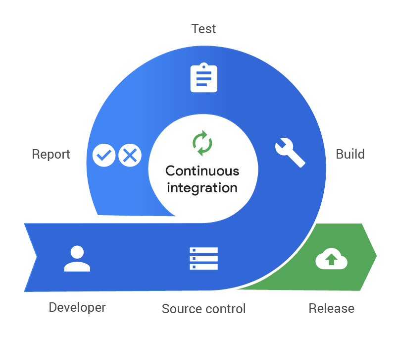

# CI Pipeline Concepts

### **Introduction to Continuous Integration (CI)**

#### **Definition and Importance:**

Continuous Integration (CI) is a software development practice where developers frequently integrate their code changes into a shared repository. Each integration is automatically verified by automated tests to detect integration errors as early as possible. The primary goal of CI is to provide rapid feedback so that if a defect is introduced into the codebase, it can be identified and corrected as soon as possible.

#### **Benefits of CI:**

* **Early Bug Detection:** Identifies defects early in the development cycle, reducing the cost and effort required to fix them.
* **Reduced Integration Problems:** Minimizes integration issues and last-minute chaos at the end of projects.
* **Improved Collaboration:** Encourages collaborative development and improves code quality through frequent code reviews and integrations.
* **Faster Feedback:** Provides immediate feedback to developers about their code, enabling them to make quick adjustments and improvements.
* **Consistent Deployment:** Ensures that the code is consistently built and tested, leading to more reliable deployments.

#### **CI Process Overview:**

The CI process typically includes the following steps:

1. **Code Commit:** Developers commit their code changes to a version control repository. This can be Git, SVN, or any other version control system.
2. **Build:** An automated build is triggered, which compiles the code and runs automated tests.
3. **Test:** The build system runs unit tests, integration tests, and other automated tests to verify the code changes.
4. **Feedback:** Developers receive immediate feedback on the success or failure of the build and tests. This feedback loop helps in quickly identifying and fixing issues.
5. **Integration:** The changes are integrated into the main codebase if the build and tests are successful. This integrated codebase is then used for further development and testing.

<figure><figcaption><p>CI Process</p></figcaption></figure>

***

### **Pipeline as Code vs. Classic Editor**

#### **Definition and Benefits of Pipeline as Code:**

Pipeline as Code involves defining the entire CI/CD pipeline in a version-controlled code file, typically using YAML or JSON. This approach allows pipelines to be versioned, reviewed, and tested just like application code.

#### **Benefits of Pipeline as Code:**

* **Version Control:** Pipelines are stored in the same repository as the application code, allowing for versioning and history tracking.
* **Consistency:** Ensures that the same pipeline is used across different environments and stages, reducing the risk of discrepancies.
* **Collaboration:** Enables collaborative development and review of pipeline definitions, improving the quality and reliability of the pipelines.
* **Reusability:** Pipeline definitions can be reused across multiple projects, saving time and effort in setting up pipelines from scratch.

#### **Example of a Pipeline as Code (YAML):**

```yaml
# Trigger configuration for the pipeline
trigger:
  branches:
    include:
      - main  # The pipeline will trigger on changes to the 'main' branch

# Define jobs in the pipeline
jobs:
- job: Build  # Job for building the application
  pool:
    vmImage: 'ubuntu-latest'  # Use the latest Ubuntu VM image
  steps:
  - script: echo Building...  # Command to run the build script
    displayName: 'Run build script'  # Display name for the build step

- job: Test  # Job for running tests
  pool:
    vmImage: 'ubuntu-latest'  # Use the latest Ubuntu VM image
  steps:
  - script: echo Running tests...  # Command to run the tests
    displayName: 'Run tests'  # Display name for the test step
```

#### **Overview and Comparison with Classic Editor:**

**Pipeline as Code:**

* **Flexibility:** Highly flexible and can be integrated with various tools and services.
* **Maintainability:** Easier to maintain and update as it follows the same version control practices as code.
* **Scalability:** Scales well for large and complex projects.
* **Auditable:** Changes to the pipeline are tracked in version control, providing a clear history of changes.

**Classic Editor:**

* **Ease of Use:** Provides a user-friendly interface for defining pipelines through a graphical interface.
* **Quick Setup:** Suitable for quick and simple pipeline setups without needing to write code.
* **Limited Flexibility:** Less flexible compared to Pipeline as Code, and changes may be harder to track and version.
* **Ideal for Beginners:** Useful for users who are not familiar with YAML or JSON and prefer a visual interface.

<details>

<summary>Comparison Example</summary>

**Pipeline as Code** Allows for detailed and complex pipeline definitions through code, ensuring version control and reusability. For example, a YAML file can define multiple jobs, stages, and triggers with precise control.

**Classic Editor:** Quick and easy setup through a graphical interface, ideal for simpler pipelines or users unfamiliar with YAML/JSON. For example, users can drag and drop tasks to create a build pipeline without writing any code

</details>

***

### **Key Components of CI Pipelines**

#### **Jobs:**

**Definition:** A job is a unit of work that performs a specific task in the CI pipeline. Jobs can run sequentially or in parallel. Each job typically includes steps that execute scripts, run tests, or perform other actions necessary for the build and deployment process.

**Examples:** Compile code, run tests, deploy applications.

**Example Job Configuration in YAML:**

```yaml
# Define jobs in the pipeline
jobs:
- job: Build  # Job for building the application
  pool:
    vmImage: 'ubuntu-latest'  # Use the latest Ubuntu VM image
  steps:
  - script: echo Building...  # Command to run the build script
    displayName: 'Run build script'  # Display name for the build step
```

#### **Triggers:**

**Definition:** Triggers define when and how a pipeline is executed. They can be based on events such as code commits, pull requests, or scheduled times.

**Types of Triggers:**

* **Commit Trigger:** Executes the pipeline when code is committed to the repository.
* **Pull Request Trigger:** Executes the pipeline when a pull request is created or updated.
* **Scheduled Trigger:** Executes the pipeline at predefined intervals.

**Example Trigger Configuration in YAML:**

```yaml
# Trigger configuration for the pipeline
trigger:
  branches:
    include:
      - main  # The pipeline will trigger on changes to the 'main' branch
```

#### **Pipeline Templates:**

**Definition:** Templates are reusable pipeline definitions that can be used across multiple projects. They help in standardizing the CI pipeline setup.

**Benefits:**

* **Reusability:** Allows sharing common pipeline configurations across projects.
* **Consistency:** Ensures consistent pipeline setups and practices across different teams and projects.
* **Maintainability:** Simplifies the maintenance and updates of pipelines.

**Example Template Reference in YAML:**


```yaml
# Define jobs in the pipeline
jobs:
- template: build-template.yaml  # Reference an external template file named 'build-template.yaml'
  parameters:
    buildConfiguration: 'Release'  # Set the build configuration parameter to 'Release'
```


***

### Scheduled Triggers in CI/CD Pipelines

In CI/CD pipelines, scheduled triggers allow us to automate tasks at specific intervals, ensuring that certain jobs run regularly without manual intervention. This is particularly useful for nightly builds, periodic backups, or routine maintenance tasks. To define these schedules, we use cron expressions, which follow a specific syntax to describe the timing of the scheduled tasks.

#### **Structure of a Cron Expression**

A cron expression consists of five fields, each separated by a space. Here’s the breakdown of each field:

```scss
* * * * *
| | | | |
| | | | +----- Day of the week (0 - 7) (Sunday=0 or 7)
| | | +------- Month (1 - 12)
| | +--------- Day of the month (1 - 31)
| +----------- Hour (0 - 23)
+------------- Minute (0 - 59)
```

* **Minute**: The first field specifies the minute of the hour when the task should run, ranging from 0 to 59.
* **Hour**: The second field specifies the hour of the day when the task should run, ranging from 0 to 23 (24-hour format).
* **Day of the Month**: The third field specifies the day of the month when the task should run, ranging from 1 to 31.
* **Month**: The fourth field specifies the month when the task should run, ranging from 1 to 12.
* **Day of the Week**: The fifth field specifies the day of the week when the task should run, ranging from 0 to 7 (both 0 and 7 represent Sunday).

#### **Example Cron Expression**

Let’s look at a practical example used in a CI/CD pipeline configuration:


```yaml
# Trigger configuration for the pipeline

# Trigger on changes to the 'main' branch
trigger:
  branches:
    include:
      - main

# Scheduled trigger configuration
schedules:
  - cron: "0 2 * * *"  # Every day at 2 AM UTC
    displayName: Daily build
    branches:
      include:
        - main  # Schedule applies to 'main' branch only
    always: true  # Always run the scheduled trigger, even if there are no code changes

# Jobs and other pipeline configuration
jobs:
  - job: Build
    displayName: Build job
    pool:
      vmImage: 'ubuntu-latest'
    steps:
      - task: UseNode@2
        inputs:
          version: '16.x'
      - script: |
          npm install
          npm run build
        displayName: 'Install dependencies and build'
```


#### Breakdown of the Example

* **Minute (0)**: The task will run at the 0th minute of the hour (i.e., at the start of the hour).
* **Hour (2)**: The task will run at 2 AM UTC.
* **Day of the Month (\*)**: The task will run every day of the month.
* **Month (\*)**: The task will run every month.
* **Day of the Week (\*)**: The task will run every day of the week.

Therefore, the cron expression `0 2 * * *` means that the pipeline will be triggered every day at 2 AM UTC. This ensures that even if there are no changes in the codebase, the pipeline still runs daily, maintaining a consistent build schedule.

#### Common Cron Patterns

Here are a few more examples of cron expressions and their meanings:

* `0 0 * * *`: Run at midnight every day.
* `0 12 * * *`: Run at noon every day.
* `0 0 * * 0`: Run at midnight every Sunday.
* `0 0 1 * *`: Run at midnight on the first day of every month.
* `*/15 * * * *`: Run every 15 minutes.

#### Notes

* **Time Zones**: Cron expressions use UTC time by default in many CI/CD systems. Adjust the time based on your timezone if necessary.
* **Validation**: Use online [cron expression editors](https://crontab.guru/) or generators to help create and validate your cron expressions.

***

### **Multi-Stage Pipelines and CI/CD**

#### **Multi-Stage Pipelines:**

**Definition:** Multi-stage pipelines allow you to define multiple stages in a single pipeline. Each stage can represent a phase in the CI/CD process, such as build, test, and deploy.

**Benefits:**

* **Modularity:** Breaks down the pipeline into distinct stages, making it easier to manage.
* **Isolation:** Each stage can have its own set of jobs and tasks, providing isolation between phases.
* **Parallelism:** Allows stages to run in parallel or sequentially, optimizing the CI/CD process.

#### **Example Multi-Stage Pipeline Configuration in YAML:**

```yaml
# Define stages in the pipeline
stages:
- stage: Build  # Stage for building the application
  jobs:
  - job: BuildJob  # Job for building the application within the Build stage
    pool:
      vmImage: 'ubuntu-latest'  # Use the latest Ubuntu VM image
    steps:
    - script: echo Building...  # Command to run the build script
      displayName: 'Run build script'  # Display name for the build step

- stage: Test  # Stage for running tests
  jobs:
  - job: TestJob  # Job for running tests within the Test stage
    pool:
      vmImage: 'ubuntu-latest'  # Use the latest Ubuntu VM image
    steps:
    - script: echo Running tests...  # Command to run the test script
      displayName: 'Run tests'  # Display name for the test step

- stage: Deploy  # Stage for deploying the application
  jobs:
  - job: DeployJob  # Job for deploying the application within the Deploy stage
    pool:
      vmImage: 'ubuntu-latest'  # Use the latest Ubuntu VM image
    steps:
    - script: echo Deploying...  # Command to run the deploy script
      displayName: 'Run deploy script'  # Display name for the deploy step
```

#### **CI/CD (Continuous Integration/Continuous Deployment):**

**Definition:** CI/CD is a practice that combines continuous integration with continuous delivery or deployment. CI/CD automates the entire software release process, from code integration to production deployment.

**Benefits:**

* **Rapid Releases:** Enables faster and more frequent releases of software.
* **Automation:** Reduces manual intervention and potential for human error.
* **Quality Assurance:** Ensures that code changes are tested and validated before reaching production.
* **Feedback Loop:** Provides a continuous feedback loop to developers, improving the overall development process.

#### **Example CI/CD Workflow:**

1. **Code Commit:** Developer commits code to the repository.
2. **Automated Build:** CI pipeline builds the code and runs automated tests.
3. **Artifact Storage:** Successful builds are stored as artifacts.
4. **Automated Deployment:** CD pipeline deploys the artifacts to staging or production environments.

<figure><figcaption><p>CI/CD Process</p></figcaption></figure>

***

### **Artifacts in CI Pipelines**

#### **Definition and Role:**

Artifacts are the byproducts of the build process that are stored and used in subsequent stages of the CI/CD pipeline. They can include compiled binaries, libraries, configuration files, or any other files that are necessary for deploying and running the application.

**Role of Artifacts:**

* **Persistence:** Ensures that the results of a build are stored and can be used in later stages, such as testing or deployment.
* **Reusability:** Artifacts can be reused across different stages and even different pipelines, promoting efficiency.
* **Versioning:** Allows different versions of artifacts to be stored, facilitating rollbacks or comparison between versions.

**Example Artifact Configuration in YAML:**


```yaml
# Define stages in the pipeline
stages:
- stage: Build  # Build stage
  jobs:
  - job: BuildJob  # Job for building the application
    pool:
      vmImage: 'ubuntu-latest'  # Use the latest Ubuntu VM image
    steps:
    - script: echo Building...  # Command to run the build script
      displayName: 'Run build script'  # Display name for the build step

    - publish: $(Build.ArtifactStagingDirectory)  # Publish the contents of the Build.ArtifactStagingDirectory
      artifact: drop  # Name of the published artifact
      displayName: 'Publish Artifact'  # Display name for the publish step
```


**Explanation:**

* **publish:** Specifies the directory to be published as an artifact.
* **artifact:** Names the artifact (e.g., "drop") that can be referenced in later stages.

#### **Storing and Accessing Artifacts:**

In Azure DevOps, artifacts are stored in the pipeline's artifact repository. You can access and download these artifacts from the pipeline run summary.

**Using Artifacts in Deployment:**

Artifacts are crucial for deployment stages. They ensure that the exact build output is deployed to the staging or production environment, maintaining consistency and reliability.

**Example Deployment Configuration Using Artifacts:**

```yaml
# Define stages in the pipeline
stages:
- stage: Deploy  # Deploy stage
  jobs:
  - job: DeployJob  # Job for deploying the application
    pool:
      vmImage: 'ubuntu-latest'  # Use the latest Ubuntu VM image
    steps:
    - download: current  # Download the artifacts from the current build
      artifact: drop  # Name of the artifact to download
      displayName: 'Download Artifact'  # Display name for the download step

    - script: echo Deploying...  # Command to run the deploy script
      displayName: 'Run deploy script'  # Display name for the deploy step
```

**Explanation:**

* **download:** Downloads the specified artifact from the build stage.
* **artifact:** Names the artifact to be downloaded (e.g., "drop").

***

### **Conclusion**

Understanding CI pipeline concepts is crucial for setting up efficient and scalable continuous integration processes. By leveraging Pipeline as Code, you can ensure consistency, version control, and reusability in your CI pipelines. Familiarity with key components such as jobs, triggers, pipeline templates, multi-stage pipelines, and artifacts will help you design robust and maintainable CI workflows. Applying these concepts will streamline your development and integration efforts, leading to faster and more reliable software delivery.

Effective CI/CD practices enable rapid, automated, and reliable software releases, enhancing the overall quality and agility of your development process. As you continue to build and refine your CI/CD pipelines, remember to prioritize automation, collaboration, and continuous improvement.
