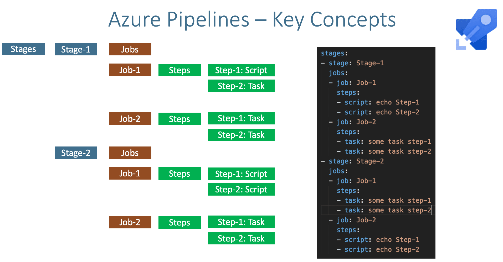

# Stages, Tasks, and Conditions in CI Pipelines

### **Introduction**

In this lesson, we will delve into the key components that make up Continuous Integration (CI) pipelines. Understanding these components is essential for building effective and efficient CI/CD workflows. We will explore stages, jobs, steps, tasks, and conditions, providing detailed explanations and practical examples to help you grasp their significance and usage in real-world scenarios.

***

### **Stages**

<figure><figcaption><p>Stages Azure Pipeline</p></figcaption></figure>

#### **Definition and Configuration:**

**Definition:**

A stage in a CI pipeline represents a distinct phase of the CI/CD process. Each stage groups a set of jobs that should be executed together, often in parallel. Stages help in organizing and managing the workflow by segmenting it into logical units.

**Configuration:**

Stages are defined within the pipeline YAML file. Each stage can contain multiple jobs, and these stages can be run sequentially or in parallel. The stages section in a pipeline configuration allows you to define the order and conditions under which the stages should run.

**Example of Stage Configuration in YAML:**


```yaml
# Define stages in the pipeline
stages:
- stage: Build  # Stage for building the application
  displayName: 'Build Stage'  # Display name for the Build stage
  jobs:
  - job: BuildJob  # Job for building the application within the Build stage
    pool:
      vmImage: 'ubuntu-latest'  # Use the latest Ubuntu VM image
    steps:
    - script: echo Building...  # Command to run the build script
      displayName: 'Run build script'  # Display name for the build step

- stage: Test  # Stage for running tests
  displayName: 'Test Stage'  # Display name for the Test stage
  dependsOn: Build  # This stage depends on the successful completion of the Build stage
  jobs:
  - job: TestJob  # Job for running tests within the Test stage
    pool:
      vmImage: 'ubuntu-latest'  # Use the latest Ubuntu VM image
    steps:
    - script: echo Running tests...  # Command to run the test script
      displayName: 'Run tests'  # Display name for the test step

- stage: Deploy  # Stage for deploying the application
  displayName: 'Deploy Stage'  # Display name for the Deploy stage
  dependsOn: Test  # This stage depends on the successful completion of the Test stage
  jobs:
  - job: DeployJob  # Job for deploying the application within the Deploy stage
    pool:
      vmImage: 'ubuntu-latest'  # Use the latest Ubuntu VM image
    steps:
    - script: echo Deploying...  # Command to run the deploy script
      displayName: 'Run deploy script'  # Display name for the deploy step
```


In this example, the pipeline is divided into three stages: Build, Test, and Deploy. The Test stage depends on the Build stage, and the Deploy stage depends on the Test stage.

***

### **Jobs**

#### **Definition and Configuration:**

**Definition:**

A job in a CI pipeline is a collection of steps that run on the same agent. Jobs define what needs to be done in each stage and can be run sequentially or in parallel within a stage.

**Configuration:**

Jobs are defined within stages in the YAML file. Each job can specify an agent pool, steps to execute, and dependencies on other jobs.

**Example of Job Configuration in YAML:**

```yaml
# Define jobs in the pipeline
jobs:
- job: Build  # Job for building the application
  displayName: 'Build Job'  # Display name for the Build job
  pool:
    vmImage: 'ubuntu-latest'  # Use the latest Ubuntu VM image
  steps:
  - script: echo Building...  # Command to run the build script
    displayName: 'Run build script'  # Display name for the build step

- job: Test  # Job for running tests
  displayName: 'Test Job'  # Display name for the Test job
  pool:
    vmImage: 'ubuntu-latest'  # Use the latest Ubuntu VM image
  steps:
  - script: echo Running tests...  # Command to run the test script
    displayName: 'Run tests'  # Display name for the test step

- job: Deploy  # Job for deploying the application
  displayName: 'Deploy Job'  # Display name for the Deploy job
  pool:
    vmImage: 'ubuntu-latest'  # Use the latest Ubuntu VM image
  steps:
  - script: echo Deploying...  # Command to run the deploy script
    displayName: 'Run deploy script'  # Display name for the deploy step
```

In this example, there are three jobs: Build, Test, and Deploy, each defined with its own set of steps and running on an Ubuntu agent.

***

### **Steps**

#### **Definition and Configuration:**

**Definition:**

Steps are the individual tasks that are executed within a job. Each step performs a specific action such as running a script, installing dependencies, or building code.

**Configuration:**

Steps are defined within jobs in the YAML file. Each step can be a script, a task, or a command.

**Example of Steps Configuration in YAML:**


```yaml
# Define jobs in the pipeline
jobs:
- job: Build  # Job for building the application
  displayName: 'Build Job'  # Display name for the Build job
  pool:
    vmImage: 'ubuntu-latest'  # Use the latest Ubuntu VM image
  steps:
  - script: echo Building...  # Command to run the build script
    displayName: 'Run build script'  # Display name for the build step

  - script: |
      npm install  # Install dependencies using npm
      npm run build  # Run the build process using npm
    displayName: 'Install dependencies and build'  # Display name for the dependency installation and build step
```


In this example, the Build job includes two steps: one to echo a message and another to install dependencies and run the build command.

***

### **Tasks**

#### **Examples and How to Add/Configure Tasks:**

**Definition:**

A task is a single unit of work that is executed as part of a job in a pipeline. Tasks can perform various actions such as running scripts, building code, deploying applications, and more.

**Adding and Configuring Tasks:**

Tasks are defined within jobs in the YAML file. Each task has specific properties that configure its behavior.

**Example of Task Configuration in YAML:**


```yaml
# Define jobs in the pipeline
jobs:
- job: Build  # Job for building the application
  displayName: 'Build Job'  # Display name for the Build job
  pool:
    vmImage: 'ubuntu-latest'  # Use the latest Ubuntu VM image
  steps:
  - task: UseNode@2  # Task to install a specific version of Node.js
    inputs:
      versionSpec: '14.x'  # Specify the version of Node.js to install (version 14.x)
    displayName: 'Install Node.js'  # Display name for the Node.js installation step

  - script: npm install  # Command to install project dependencies using npm
    displayName: 'Install dependencies'  # Display name for the dependencies installation step

  - script: npm run build  # Command to build the application using npm
    displayName: 'Build application'  # Display name for the application build step
```


In this example, the Build job includes three tasks: installing Node.js, installing dependencies, and building the application.

***

### **Build Variables**

#### **Predefined Variables:**

**Definition:**

Predefined variables are built-in variables provided by the CI system. These variables contain useful information about the build, the repository, the source branch, the pipeline run, and more.

**Role:**

* **Customization:** Allows the pipeline to adapt based on contextual information.
* **Information Access:** Provides essential details about the build and pipeline environment without manual input.

#### **Common Predefined Variables:**

1. **Build Variables:**
   * `Build.BuildId`: The ID of the build.
   * `Build.BuildNumber`: The build number.
   * `Build.BuildUri`: The URI of the build.
2. **Repository Variables:**
   * `Build.Repository.Name`: The name of the repository.
   * `Build.Repository.Provider`: The type of repository (e.g., GitHub, Azure Repos).
   * `Build.SourceBranch`: The branch the build was triggered for.
3. **Pipeline Variables:**
   * `Pipeline.Workspace`: The local path on the agent where the source code is downloaded.
   * `System.JobId`: The job identifier.
   * `System.StageName`: The stage name the job is running in.
4. **Agent Variables:**
   * `Agent.Id`: The ID of the agent.
   * `Agent.OS`: The operating system of the agent.
   * `Agent.Version`: The version of the agent.

#### **Using Predefined Variables:**

Predefined variables can be used directly in the YAML configuration of your pipeline. They are accessed using the `$(variableName)` syntax.

**Example of Using Predefined Variables in YAML:**


```yaml
# Define jobs in the pipeline
jobs:
- job: Build  # Job for building the application
  displayName: 'Build Job'  # Display name for the Build job
  pool:
    vmImage: 'ubuntu-latest'  # Use the latest Ubuntu VM image
  steps:
  - script: echo "Building application in branch: $(Build.SourceBranch)"  # Use predefined variable for source branch
    displayName: 'Display Source Branch'  # Display name for the build step

  - script: echo "Build ID: $(Build.BuildId)"  # Use predefined variable for build ID
    displayName: 'Display Build ID'  # Display name for the build step
```


In this example, predefined variables `$(Build.SourceBranch)` and `$(Build.BuildId)` are used to display the source branch and build ID during the build process.

#### **Viewing Predefined Variables:**

You can view a list of predefined variables available in your pipeline environment by checking the official [documentation](https://learn.microsoft.com/en-us/azure/devops/pipelines/build/variables?view=azure-devops\&tabs=yaml) of Azure DevOps.

<details>

<summary>Expand to see more predefined variables examples</summary>

* **Agent.MachineName**: The name of the machine on which the agent is running.
* **Build.SourceVersion**: The commit ID of the build.
* **System.TeamProject**: The name of the team project.

</details>

By understanding and utilizing predefined variables, you can create more dynamic and informative CI pipelines that adjust based on the build environment and conditions.

***

### Output Variables

In Azure DevOps, output variables are a powerful feature that allows you to pass data from one job or stage to another within your pipeline. This capability enables more complex and dynamic workflows by sharing information across different parts of your CI/CD process.

#### **Defining and Setting Output Variables**

Output variables are typically defined within a job and can be set using specific syntax in your YAML pipeline. Here's a basic example of how to define and set an output variable in Azure DevOps:

```yaml
jobs:
- job: JobA
  pool:
    vmImage: 'ubuntu-latest'
  steps:
  - script: |
      echo "##vso[task.setvariable variable=myOutputVar;isOutput=true]Hello from JobA"
    name: SetOutputVar
```

In this example:

* `##vso[task.setvariable variable=myOutputVar;isOutput=true]Hello from JobA` is the command used to set an output variable named `myOutputVar`.
* `isOutput=true` indicates that this variable is an output variable.
* `name: SetOutputVar` gives a name to this step, which is used later to reference the variable.

The `##vso` prefix stands for **Visual Studio Online**, the former name of Azure DevOps Services. These `vso` commands are used in pipeline scripts to interact with the Azure Pipelines agent, allowing tasks to set variables, upload artifacts, log issues, and perform other agent-level operations.

#### **Referencing Output Variables in Another Job**

To use the output variable in another job or stage, you need to reference the job and step names where the variable was set. Here’s how you can pass and use the output variable from `JobA` in another job `JobB`:

```yaml
jobs:
- job: JobA
  pool:
    vmImage: 'ubuntu-latest'
  steps:
  - script: |
      echo "##vso[task.setvariable variable=myOutputVar;isOutput=true]Hello from JobA"
    name: SetOutputVar

- job: JobB
  dependsOn: JobA
  pool:
    vmImage: 'ubuntu-latest'
  variables:
    myNewVar: $[ dependencies.JobA.outputs['SetOutputVar.myOutputVar'] ]
  steps:
  - script: |
      echo "The value of the output variable is: $(myNewVar)"
    name: UseOutputVar
```

In this example:

* `dependsOn: JobA` ensures that `JobB` runs after `JobA`.
* `myNewVar: $[ dependencies.JobA.outputs['SetOutputVar.myOutputVar'] ]` is used to set `myNewVar` to the value of the output variable from `JobA`.
* `$(myNewVar)` references the variable `myNewVar` in the steps of `JobB`.

#### **Using Output Variables Across Stages**

You can also pass output variables across different stages. The syntax is similar, but you need to use stage-level dependencies.

```yaml
stages:
- stage: StageA
  jobs:
  - job: JobA
    pool:
      vmImage: 'ubuntu-latest'
    steps:
    - script: |
        echo "##vso[task.setvariable variable=myOutputVar;isOutput=true]Hello from StageA"
      name: SetOutputVar

- stage: StageB
  dependsOn: StageA
  jobs:
  - job: JobB
    pool:
      vmImage: 'ubuntu-latest'
    variables:
      myNewVar: $[ dependencies.StageA.outputs['JobA.SetOutputVar.myOutputVar'] ]
    steps:
    - script: |
        echo "The value of the output variable is: $(myNewVar)"
      name: UseOutputVar
```

In this example:

* `dependsOn: StageA` ensures that `StageB` runs after `StageA`.
* `myNewVar: $[ dependencies.StageA.outputs['JobA.SetOutputVar.myOutputVar'] ]` sets `myNewVar` to the value of the output variable from `StageA`.
* `$(myNewVar)` references the variable `myNewVar` in the steps of `JobB`.

***

### **Conditions**

#### **Explanation and Usage:**

**Definition:**

Conditions are expressions used to control the execution of tasks, jobs, or stages based on the outcome of previous tasks, jobs, or stages. They help in creating more dynamic and flexible pipelines by allowing specific actions to occur only when certain conditions are met.

**Using Conditions:**

Conditions are specified in the YAML file using the `condition` keyword. You can use predefined variables, custom variables, and logical operators to define conditions.

**Example of Using Conditions in YAML:**


```yaml
# Define jobs in the pipeline
jobs:
- job: Build  # Job for building the application
  pool:
    vmImage: 'ubuntu-latest'  # Use the latest Ubuntu VM image
  steps:
  - script: echo Building...  # Command to run the build script
    displayName: 'Run build script'  # Display name for the build step

- job: Test  # Job for running tests
  pool:
    vmImage: 'ubuntu-latest'  # Use the latest Ubuntu VM image
  condition: succeeded()  # Run this job only if the previous job (Build) succeeded
  steps:
  - script: echo Running tests...  # Command to run the test script
    displayName: 'Run tests'  # Display name for the test step

- job: Deploy  # Job for deploying the application
  pool:
    vmImage: 'ubuntu-latest'  # Use the latest Ubuntu VM image
  condition: and(succeeded(), eq(variables['Build.SourceBranch'], 'refs/heads/main'))  # Run this job only if the previous jobs succeeded and the source branch is 'main'
  steps:
  - script: echo Deploying...  # Command to run the deploy script
    displayName: 'Run deploy script'  # Display name for the deploy step
```


In this example, the Test job will only run if the Build job succeeds, and the Deploy job will only run if both the Build and Test jobs succeed and the source branch is `main`.

#### **Practical Examples of Using Conditions**

**Example 1: Conditional Deployment Based on Environment:**


```yaml
# Define jobs in the pipeline
jobs:
- job: DeployToStaging  # Job for deploying to the staging environment
  condition: and(succeeded(), eq(variables['Build.SourceBranch'], 'refs/heads/develop'))  # Run this job only if the previous jobs succeeded and the source branch is 'develop'
  pool:
    vmImage: 'ubuntu-latest'  # Use the latest Ubuntu VM image
  steps:
  - script: echo Deploying to Staging...  # Command to run the deploy script for staging
    displayName: 'Deploy to Staging'  # Display name for the staging deploy step

- job: DeployToProduction  # Job for deploying to the production environment
  condition: and(succeeded(), eq(variables['Build.SourceBranch'], 'refs/heads/main'))  # Run this job only if the previous jobs succeeded and the source branch is 'main'
  pool:
    vmImage: 'ubuntu-latest'  # Use the latest Ubuntu VM image
  steps:
  - script: echo Deploying to Production...  # Command to run the deploy script for production
    displayName: 'Deploy to Production'  # Display name for the production deploy step
```


In this example, the pipeline will deploy to the staging environment if the source branch is `develop` and to the production environment if the source branch is `main`.

**Example 2: Skipping Tests for Documentation Changes:**


```yaml
# Define jobs in the pipeline
jobs:
- job: Test  # Job for running tests
  condition: and(
    succeeded(),  # Run this job only if the previous jobs succeeded
    ne(variables['Build.Reason'], 'PullRequest'),  # Only run this job if the build reason is not a pull request
    ne(variables['System.PullRequest.SourceBranch'], 'refs/heads/docs')  # Only run this job if the source branch of the pull request is not 'docs'
  )
  pool:
    vmImage: 'ubuntu-latest'  # Use the latest Ubuntu VM image
  steps:
  - script: echo Running tests...  # Command to run the test script
    displayName: 'Run tests'  # Display name for the test step

```


In this example, the Test job will be skipped if the source branch of the pull request is `docs`, allowing documentation changes to bypass the testing phase.

***

### **Conclusion**

Understanding and effectively using stages, jobs, steps, tasks, and conditions in CI pipelines is crucial for building flexible, maintainable, and efficient CI/CD workflows. By organizing pipelines into stages and jobs, you can manage complex workflows with ease. Tasks and steps allow for granular control over the actions performed within each job, and conditions enable dynamic and context-aware pipeline execution. Leveraging these concepts will help you design robust CI/CD pipelines that adapt to various scenarios, improving the overall efficiency and reliability of your software development process.
