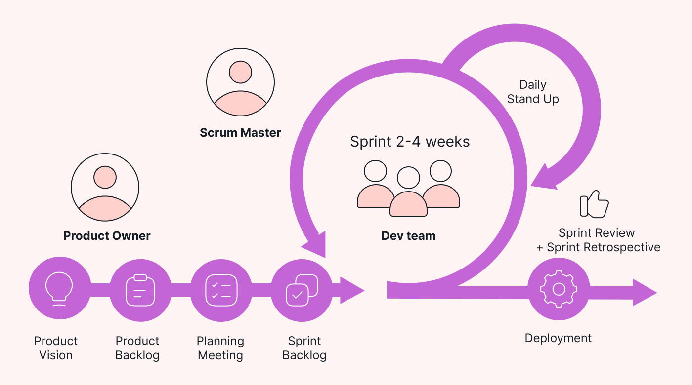

# Agile Methodologies

Agile methodologies emphasize flexibility, collaboration, and customer-centric development. They are designed to adapt to changing requirements and deliver value incrementally. In this section, we will explore the core principles of Agile, as well as the popular frameworks of Scrum and Kanban. We will also discuss work item types and how to effectively use Agile boards.

### Agile Principles

Agile is built on a set of core principles that guide teams towards more efficient and adaptive workflows. The Agile Manifesto outlines these principles, which include:

1. **Individuals and Interactions** over processes and tools.
2. **Working Software** over comprehensive documentation.
3. **Customer Collaboration** over contract negotiation.
4. **Responding to Change** over following a plan.

Agile Manifesto Explained

The Agile Manifesto emphasizes the importance of flexibility and adaptability in software development. It values human collaboration and working solutions, enabling teams to respond to changes quickly and deliver high-quality products.

***

### Scrum

**Scrum** is an Agile framework that organizes work into iterative cycles called **sprints**, typically lasting two to four weeks. It focuses on delivering a potentially shippable product increment at the end of each sprint.

#### Key Roles in Scrum

1. **Product Owner:** Represents the stakeholders and is responsible for maximizing the value of the product.
2. **Scrum Master:** Facilitates the Scrum process, ensuring that the team adheres to Scrum practices and removes any impediments.
3. **Development Team:** A cross-functional group responsible for delivering the product increment.

#### Scrum Artifacts

* **Product Backlog:** A prioritized list of features, enhancements, and bug fixes.
* **Sprint Backlog:** A subset of the Product Backlog selected for a specific sprint.
* **Increment:** The sum of all Product Backlog items completed during a sprint and previous sprints.

#### Scrum Ceremonies

* **Sprint Planning:** Defines what can be delivered in the sprint and how the work will be achieved.
* **Daily Stand-up:** A short meeting to synchronize activities and plan for the next 24 hours.
* **Sprint Review:** A meeting to demonstrate the work completed during the sprint.
* **Sprint Retrospective:** A reflective session to discuss what went well, what didn't, and how to improve.

<figure><figcaption>
Scrum Framework
</figcaption></figure>

***

### Kanban

**Kanban** is another Agile framework that focuses on visualizing the workflow and managing work in progress (WIP). Unlike Scrum, Kanban does not prescribe specific roles or time-boxed iterations.

#### **Key Principles of Kanban**

* **Visualize the Workflow:** Use a Kanban board to make work items and their status visible. This helps in tracking the progress of tasks and identifying bottlenecks in the workflow.
* **Limit Work in Progress (WIP):** Set limits on the number of work items in each workflow stage to prevent overloading and ensure a smooth workflow.
* **Focus on Flow:** Optimize the flow of work from start to finish, reducing bottlenecks and delays. The goal is to improve the efficiency and speed of the work process.
* **Continuous Improvement:** Regularly analyze and improve processes based on feedback and performance data. This helps in enhancing the team's productivity and the quality of the output.

The table below represents a simple Kanban board setup, with stages of the workflow and corresponding WIP limits:

| Stage       | WIP Limit | Description                       |
| ----------- | --------- | --------------------------------- |
| To Do       | N/A       | _Tasks waiting to be started_     |
| In Progress | 3         | _Tasks currently being worked on_ |
| Done        | N/A       | _Completed tasks_                 |

> **Note:** _WIP limits are crucial in Kanban to prevent work overload and ensure that tasks flow smoothly through the stages. The "Done" column typically does not have a WIP limit, as it represents completed tasks._

***

### Work Item Types and Agile Boards

#### Work Item Types

In Agile projects, various work item types are used to manage and track tasks, requirements, and features. The primary work item types you will encounter in this course include:

* **Epics:** Large bodies of work that can be broken down into smaller, more manageable pieces. Epics typically span multiple sprints and are further divided into features.
* **Features:** High-level functionalities or components that provide significant value to the user. Features can be broken down into user stories or tasks.
* **User Stories:** Descriptions of features or functionalities from the end-user's perspective. They are written in a simple format, often following the "As a \[user], I want \[feature] so that \[benefit]" structure.
* **Tasks:** Specific work items required to complete a user story or feature. Tasks are the actionable steps that need to be taken.
* **Test Cases:** Detailed descriptions of test scenarios, including conditions, inputs, and expected outcomes. They are used to verify that a feature or functionality works as intended.
* **Bugs:** Issues or defects in the product that need to be addressed. Bugs are typically identified during testing and are prioritized for resolution.

#### Agile Boards

Agile boards, such as **Scrum boards** and **Kanban boards**, are visual tools that help teams track and manage work items. They typically include columns representing different stages of the workflow, such as To Do, In Progress, and Done. Agile boards provide a clear view of the team's progress and help identify bottlenecks in the process.


_Agile boards are essential for tracking progress, identifying bottlenecks, and ensuring that work is prioritized and completed efficiently. They provide a visual representation of the team's workflow, making it easier to manage tasks and collaborate._


***

### \[EXTRA] Hybrid Models

#### 1. **Water-Scrum-Fall**

**How It Works:**

* **Water-Scrum-Fall** begins with a Waterfall approach to project management for the initial phases of the project. This typically includes detailed planning, requirements gathering, and heavy documentation.
* Once the foundation is laid, the team switches to **Scrum** for development and testing. Scrum involves working in sprints (time-boxed iterations), holding regular ceremonies (e.g., daily stand-ups, sprint reviews), and continuously delivering increments of the product.
* After the iterative development is complete, the project may return to a **Waterfall-like process** for final integration, deployment, and project closure. This stage may involve rigorous testing, final documentation, and approvals.

**Components:**

* **Waterfall Phases**: Initial phases (e.g., planning, requirements gathering) follow a linear, sequential approach.
* **Scrum Phases**: Development and testing are done in iterative cycles (sprints).
* **Final Waterfall Phases**: Final integration, testing, deployment, and documentation.

**Best For:**

* **Projects that require thorough upfront planning** due to regulatory requirements, complex dependencies, or large-scale coordination.
* **Teams transitioning from Waterfall to Agile** who are not ready to fully adopt Agile but want to implement iterative development.

**Example:**

* A financial institution needs to develop a new software platform. They begin with extensive requirements gathering and documentation to meet regulatory compliance (Waterfall). After the planning phase, they move to iterative development using Scrum. Once the core product is developed, they revert to Waterfall for system integration and final compliance checks.

#### 2. **Agile-Waterfall**

**How It Works:**

* **Agile-Waterfall** is a more flexible hybrid where different aspects of the project are managed using Agile or Waterfall depending on the need. For instance, high-level planning and risk management may follow a Waterfall approach, while development and testing use Agile methodologies.
* The project can move back and forth between Agile and Waterfall as required by different project phases or deliverables.

**Components:**

* **Waterfall Components**: Used for initial planning, risk management, and any phase where detailed documentation and linear progression are essential.
* **Agile Components**: Applied to development, testing, and areas where adaptability and quick iterations are beneficial.

**Best For:**

* **Complex projects** where different phases require different levels of flexibility and structure.
* **Organizations with both Agile and non-Agile teams** that need to collaborate on the same project.

**Example:**

* A healthcare provider is implementing an electronic health record system. The initial phase involves detailed planning, vendor selection, and risk management using Waterfall. Once the project moves into software development, they switch to Agile to handle iterative development and testing, accommodating changing user requirements.

#### 3. **Agile at Scale**

**How It Works:**

* **Agile at Scale** involves applying Agile practices across large organizations or multiple teams while maintaining overall coordination, governance, and alignment with strategic goals.
* Frameworks like **SAFe (Scaled Agile Framework)** or **Disciplined Agile Delivery (DAD)** provide structures for scaling Agile, including roles, ceremonies, and processes to ensure alignment across teams.
* **SAFe** involves multiple layers (Team, Program, Large Solution, Portfolio) to coordinate efforts across large projects or product lines.
* **DAD** provides a more customizable approach, allowing teams to tailor Agile practices to their specific needs.

**Components:**

* **Team-Level Agile**: Teams use Agile practices such as Scrum or Kanban.
* **Program-Level Coordination**: Multiple teams are synchronized through Agile Release Trains (ARTs) or similar constructs.
* **Portfolio Management**: Aligning Agile initiatives with strategic goals and managing the flow of value across the organization.

**Best For:**

* **Large organizations** with multiple teams that need to work together on complex projects or product lines.
* **Organizations looking to scale Agile practices** while maintaining alignment with business objectives.

**Example:**

* A large automotive company is developing a new line of connected vehicles. Multiple teams work on different components (software, hardware, etc.) using Agile practices. SAFe is used to coordinate efforts, manage dependencies, and ensure that all teams are aligned with the company's strategic objectives.

#### 4. **Iterative Waterfall**

**How It Works:**

* **Iterative Waterfall** maintains the traditional Waterfall phases (requirements, design, development, testing, deployment) but incorporates iterations within these phases.
* After completing each phase, the output is reviewed, and feedback is incorporated before moving on to the next phase. This allows for adjustments based on insights gained during each iteration.

**Components:**

* **Traditional Waterfall Phases**: Followed in a sequential manner, but with iterative reviews and feedback loops.
* **Feedback Loops**: Built into each phase to allow for adjustments based on new information or changing requirements.

**Best For:**

* **Projects with mostly known requirements** but where some flexibility is needed to incorporate feedback or changes.
* **Organizations with established Waterfall practices** that want to introduce some level of iteration and adaptability.

**Example:**

* A government contractor is building a defense system. The project follows the traditional Waterfall model, but after each phase (e.g., requirements gathering, design), the results are reviewed by stakeholders, and feedback is incorporated before moving to the next phase.

#### 5. **Scrumban**

**How It Works:**

* **Scrumban** combines Scrum’s structure with Kanban’s flow-based approach. Teams maintain Scrum ceremonies (like daily stand-ups and sprint planning) but use a Kanban board to visualize workflow and manage tasks.
* Work is pulled based on capacity, and there are no fixed sprints. This allows for continuous delivery and more flexible prioritization.

**Components:**

* **Scrum Ceremonies**: Daily stand-ups, sprint planning, and retrospectives.
* **Kanban Board**: Visualizes the workflow and helps manage tasks based on team capacity.
* **Work-in-Progress (WIP) Limits**: Control the amount of work in progress to prevent overloading the team.

**Best For:**

* **Teams needing more flexibility** than traditional Scrum allows, especially in environments where priorities frequently change.
* **Maintenance teams** or teams working on ongoing operations where the flow of work is continuous.

**Example:**

* An IT support team uses Scrumban to manage incoming service requests. They hold daily stand-ups and retrospectives but use a Kanban board to prioritize and track requests as they come in, without being constrained by sprint timelines.

#### 6. **Disciplined Agile Delivery (DAD)**

**How It Works:**

* **DAD** is a process decision framework that provides a hybrid approach, incorporating principles from Agile, Lean, and traditional management. It is designed to be tailorable based on the needs of the project and the organization.
* DAD covers the entire delivery lifecycle, from project initiation through to delivery and beyond. It provides guidance on roles, processes, and practices, allowing teams to choose the most appropriate methods for their context.

**Components:**

* **Lifecycle Options**: Choose from Agile, Lean, or Continuous Delivery lifecycles.
* **Process Goals**: Help teams select the best practices for their context.
* **Roles**: Defined roles such as Product Owner, Architecture Owner, and Team Lead.
* **Tailoring Advice**: Recommendations on how to adapt practices based on team size, project complexity, and other factors.

**Best For:**

* **Organizations seeking a comprehensive framework** that allows for flexibility and customization.
* **Teams working on complex projects** that require a mix of Agile, Lean, and traditional practices.

**Example:**

* A large technology company is developing a new enterprise software product. They use DAD to guide their approach, choosing an Agile lifecycle for development but incorporating Lean practices for continuous improvement and traditional management practices for stakeholder communication.

#### 7. **Lean-Agile**

**How It Works:**

* **Lean-Agile** combines Lean principles, which focus on eliminating waste and optimizing flow, with Agile’s iterative development practices. This hybrid approach emphasizes delivering value quickly and efficiently, with a focus on customer needs.
* Lean-Agile promotes continuous improvement and empowers teams to make decisions, with a strong emphasis on reducing waste (e.g., unnecessary documentation or excessive processes).

**Components:**

* **Lean Principles**: Focus on value streams, waste reduction, and flow optimization.
* **Agile Practices**: Iterative development, customer collaboration, and responding to change.
* **Continuous Improvement**: Regular reflection and adaptation to improve processes and outcomes.

**Best For:**

* **Teams aiming to deliver value quickly** and efficiently, especially in fast-paced environments.
* **Organizations looking to streamline processes** and reduce waste while maintaining agility.

**Example:**

* A startup is developing a new mobile app. They use Lean-Agile to prioritize features that deliver the most value to customers, iteratively developing and releasing updates while continuously seeking ways to improve efficiency and reduce unnecessary work.

***

### \[EXTRA] **Effective Inter-Team Collaboration and Dependency Management**

**Description:** This section focuses on strategies for managing dependencies and ensuring smooth collaboration between teams working on shared projects. It covers identifying and mapping dependencies early, setting clear expectations, and utilizing visual tools to track progress. Additionally, it emphasizes the importance of regular cross-team coordination through practices like Scrum of Scrums and joint retrospectives. The section also discusses the significance of a shared Definition of Done (DoD) to prevent misunderstandings, the role of Agile Release Train (ART) in synchronizing teams, and the importance of Service Level Agreements (SLAs) to set clear expectations. Finally, it highlights the need for leadership support, including establishing clear escalation paths and empowering teams to mitigate delays.

#### 1. **Dependency Mapping and Management**

* **Identify Dependencies Early**: During sprint planning or backlog grooming sessions, it’s essential to identify any dependencies your team has on other teams. For example, if your team needs an API to be developed by another team before you can proceed with front-end development, this dependency should be flagged early. You can create a list or use a visual tool like a dependency map to track these.
* **Set Clear Expectations**: Once dependencies are identified, communicate them clearly to the other team. This could involve setting deadlines, defining the scope of the work, and understanding the other team’s capacity. For instance, if your team requires a specific feature by the third sprint, communicate this need well in advance to ensure the other team can accommodate it in their schedule.
* **Use Visual Tools**: Implement tools like dependency boards, which can be part of your project management software (e.g., Jira, Azure Boards). These tools allow teams to visualize all dependencies, track their progress, and see how delays in one team can impact others. For example, a dependency board might show that Team A’s backend work is required before Team B can start UI work. If Team A falls behind, the board will highlight the impact on Team B’s timeline, prompting early intervention.

#### 2. **Regular Cross-Team Synchronization**

* **Scrum of Scrums**: This is a scaled Agile practice where representatives from different teams meet regularly (daily or weekly) to discuss their progress, dependencies, and any blockers they are facing. This meeting is particularly useful for large projects involving multiple teams. For instance, if three teams are working on different components of a product, a Scrum of Scrums can help ensure that everyone is aligned, and any inter-team issues are identified and resolved quickly.
* **Joint Retrospectives**: When multiple teams are working on the same product or project, periodic joint retrospectives can be highly beneficial. These retrospectives allow teams to discuss what went well, what didn’t, and what can be improved in the context of inter-team collaboration. For example, if your team experienced delays because another team’s deliverables were late, a joint retrospective provides a forum to discuss why this happened and how both teams can work together to prevent it in the future.

#### 3. **Shared Definition of Done (DoD)**

* **Align on Standards**: Having a shared Definition of Done across teams ensures that everyone has the same understanding of what “done” means for work that involves multiple teams. This alignment prevents misunderstandings that could lead to delays. For example, if your team is working on a feature that requires both backend and frontend work, both teams should agree on what constitutes “done” for the feature. This might include code being fully tested, documented, and deployed to a staging environment.
* **Collaborate on DoD**: Teams should collaborate to create this shared Definition of Done, especially when they frequently work together. This collaboration might involve joint workshops where team members discuss their workflows and agree on a common standard. For instance, if two teams regularly collaborate on features, they might agree that “done” includes automated tests being written and passing, code reviews completed, and documentation updated. This shared understanding reduces the chances of work being handed off between teams in an incomplete or inconsistent state, which can cause delays.

#### 4. **Agile Release Train (ART) in SAFe (Scaled Agile Framework)**

* **Align Teams to a Common Cadence**: The Agile Release Train (ART) is a key concept in SAFe, where multiple Agile teams work in harmony on a shared release schedule. This alignment ensures that all teams are progressing towards common objectives on a synchronized timeline, reducing the likelihood of delays caused by misalignment. For example, in a large organization where multiple teams are working on different aspects of a product, the ART ensures that all teams are aligned on the same sprint cadence and are aware of key milestones.
* **Program Increment (PI) Planning**: This is a significant event in SAFe, where all teams involved in the Agile Release Train come together to plan their work for the next Program Increment (typically 8-12 weeks). During PI Planning, teams identify dependencies, commit to shared goals, and establish a roadmap for the upcoming increment. This event is crucial for ensuring that all teams are on the same page, reducing the risk of delays caused by uncoordinated work. For example, during PI Planning, Team A might communicate that they need a specific API from Team B by the third sprint. Team B can then plan their work accordingly, ensuring they deliver on time.

#### 5. **Service Level Agreements (SLAs)**

* **Define SLAs for Dependencies**: Establishing Service Level Agreements (SLAs) between teams helps set clear expectations for deliverables, response times, and communication protocols. For example, if your team depends on another team to deliver a database schema, an SLA might specify that the schema will be delivered within three days of the request. This ensures that both teams have a mutual understanding of timelines and reduces the likelihood of delays due to unclear expectations.
* **Monitor and Review SLAs**: It’s important to regularly review SLAs to ensure they are being met and adjust them if necessary. For instance, if a team is consistently unable to meet an SLA due to capacity issues, this can be identified during a review, and the SLA can be adjusted accordingly, or additional resources can be allocated. Regular monitoring of SLAs also helps in identifying patterns of delays, allowing teams to address root causes. For example, if a team is repeatedly late in delivering certain types of work, a review might reveal that they need additional training or resources to meet the SLA.

#### 6. **Leadership Support**

* **Escalation Paths**: Establish clear escalation paths for situations where delays from other teams are impacting your team’s progress. This could involve a predefined process for raising issues to project management or senior leadership when inter-team problems cannot be resolved at the team level. For example, if your team is blocked because another team has not delivered a critical component, you might escalate the issue to a project manager who can prioritize the work or allocate additional resources to unblock your team.
* **Empower Teams**: Leadership should empower teams to make decisions that help mitigate delays. This might involve giving teams the autonomy to reprioritize work, negotiate deadlines, or find alternative solutions when delays occur. For instance, if your team is waiting on a delayed API from another team, leadership might empower you to create a mock API so your team can continue development without waiting. This approach reduces downtime and keeps the project moving forward.

***

### \[EXTRA] **Proven Strategies for Convincing Leadership to Act on Retrospective Findings**

**Description:** This section outlines various established strategies that can effectively persuade higher-ups to take action based on retrospective findings. It covers approaches like aligning retrospective actions with Objectives and Key Results (OKRs), implementing continuous improvement through Kaizen, quantifying the impact of unresolved issues with Lean’s Cost of Poor Quality (COPQ), and utilizing tools like Value Stream Mapping (VSM) and Root Cause Analysis (RCA). Additionally, it discusses leveraging the Plan-Do-Check-Act (PDCA) cycle, Agile metrics, the Technical Debt Quadrant, and structured escalation frameworks. Finally, it emphasizes the importance of maintaining a Retrospective Action Item Tracker to ensure issues are addressed and progress is communicated to leadership.

#### 1. **Objectives and Key Results (OKRs)**

* **Strategy Overview**: OKRs are a goal-setting framework used by companies like Google and Intel. The idea is to set clear, measurable objectives and track progress against key results. By aligning retrospective actions with the company’s OKRs, you can demonstrate how addressing these issues will contribute to achieving broader organizational goals.
* **Example in Use**: If a key result for the quarter is to reduce the number of production bugs by 20%, addressing technical debt raised in retrospectives can be directly tied to this OKR. Showing how retrospective actions contribute to achieving key results can make leadership more likely to prioritize them.

#### 2. **Kaizen (Continuous Improvement)**

* **Strategy Overview**: Kaizen is a Japanese management strategy that focuses on continuous, incremental improvements in all aspects of an organization. Companies like Toyota have successfully implemented Kaizen to enhance their manufacturing processes.
* **Example in Use**: Implementing Kaizen within your Agile teams means regularly revisiting retrospective findings and making small, continuous improvements. Leadership can see the cumulative impact of these improvements on productivity, quality, and employee morale, which can justify allocating time and resources to address them.

#### 3. **Lean Manufacturing’s Cost of Poor Quality (COPQ)**

* **Strategy Overview**: COPQ is a concept from Lean Manufacturing that quantifies the cost of defects and inefficiencies. By calculating the COPQ, organizations can demonstrate the financial impact of not addressing quality issues.
* **Example in Use**: You can use COPQ to quantify the cost of not addressing issues raised in retrospectives. For instance, if unresolved technical debt is leading to recurring production issues, you can calculate the cost of these issues in terms of lost revenue, increased support costs, and delayed product releases. This data can be compelling for leadership when deciding where to allocate resources.

#### 4. **Value Stream Mapping (VSM)**

* **Strategy Overview**: Value Stream Mapping is a Lean technique used to analyze and design the flow of materials and information required to bring a product to the customer. VSM helps in identifying bottlenecks and areas for improvement.
* **Example in Use**: By creating a Value Stream Map of your development process, you can highlight where delays and inefficiencies (such as those identified in retrospectives) are occurring. Presenting this visual map to leadership can clearly show how addressing these issues will improve the overall flow of value to the customer, making it easier to justify the time spent on improvements.

#### 5. **Root Cause Analysis (RCA)**

* **Strategy Overview**: Root Cause Analysis is a method of problem-solving used to identify the underlying causes of defects or issues. It’s often used in conjunction with techniques like the "5 Whys" or Fishbone diagrams.
* **Example in Use**: Conducting a Root Cause Analysis on issues raised in retrospectives can provide a clear, logical explanation of why certain problems are recurring. By presenting this analysis to leadership, along with proposed solutions, you make a strong case for why these issues need to be addressed to prevent future problems. RCA is often used in industries like aviation and healthcare, where preventing the recurrence of issues is critical.

#### 6. **Plan-Do-Check-Act (PDCA) Cycle**

* **Strategy Overview**: The PDCA cycle is a four-step management method used for continuous improvement of processes and products. It’s widely used in various industries, including manufacturing and software development.
* **Example in Use**: After identifying issues in a retrospective, teams can apply the PDCA cycle to plan solutions, implement them (do), check the results, and act on what they learn to make further improvements. By presenting this structured approach to leadership, you can demonstrate that the team is taking a systematic approach to improvement, which can help secure buy-in for dedicating time to these activities.

#### 7. **Agile Metrics and Dashboards**

* **Strategy Overview**: Many Agile frameworks encourage the use of metrics and dashboards to track progress and visualize data. These can include metrics like cycle time, lead time, defect density, and velocity.
* **Example in Use**: By using Agile metrics, you can create dashboards that show the impact of unresolved issues on key performance indicators (KPIs). For example, if unresolved issues are causing cycle time to increase, this can be visually represented in a dashboard. Presenting these metrics to leadership can make a compelling case for why it’s critical to address the issues raised in retrospectives.

#### 8. **Technical Debt Quadrant**

* **Strategy Overview**: The Technical Debt Quadrant, introduced by Martin Fowler, categorizes technical debt based on whether it’s deliberate or inadvertent, and whether it’s prudent or reckless. This helps teams and leadership understand the nature of the debt and how urgently it needs to be addressed.
* **Example in Use**: By categorizing the technical debt identified in retrospectives using the Technical Debt Quadrant, you can communicate to leadership not only the existence of the debt but also the risk associated with it. For instance, reckless and inadvertent debt might require immediate action, whereas prudent and deliberate debt could be managed over time. This framework helps in making a clear case for prioritizing certain issues.

#### 9. **Escalation Frameworks**

* **Strategy Overview**: Escalation frameworks provide a structured approach to raising issues that cannot be resolved at the team level to higher management. These frameworks often include defined escalation paths, criteria for escalation, and timelines for resolution.
* **Example in Use**: If certain issues raised during retrospectives are not being addressed, an escalation framework can be used to bring these issues to the attention of senior leadership. For example, if a recurring delay from another team is significantly impacting your team’s ability to meet sprint goals, this issue can be escalated according to the framework, ensuring it gets the necessary attention and resources from leadership.

#### 10. **Retrospective Action Item Tracker**

* **Strategy Overview**: Some organizations use Retrospective Action Item Trackers to ensure that the issues raised during retrospectives are not forgotten. This can be as simple as a shared document or a more sophisticated tool integrated into the team’s project management software.
* **Example in Use**: By maintaining a Retrospective Action Item Tracker that is reviewed regularly in team meetings and shared with leadership, you can ensure that action items are followed up on. For example, if the tracker shows that certain issues have been unresolved for several sprints, this can be highlighted in a report to leadership, demonstrating the need for dedicated time to address these issues.

***

### Conclusion

Agile methodologies provide a flexible and collaborative approach to software development. By adopting frameworks like Scrum and Kanban, teams can deliver value incrementally, adapt to changes, and continuously improve their processes. As you progress through this course, you will gain hands-on experience with these methodologies and learn how to apply them effectively in real-world projects.
