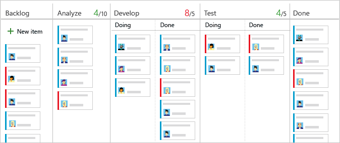
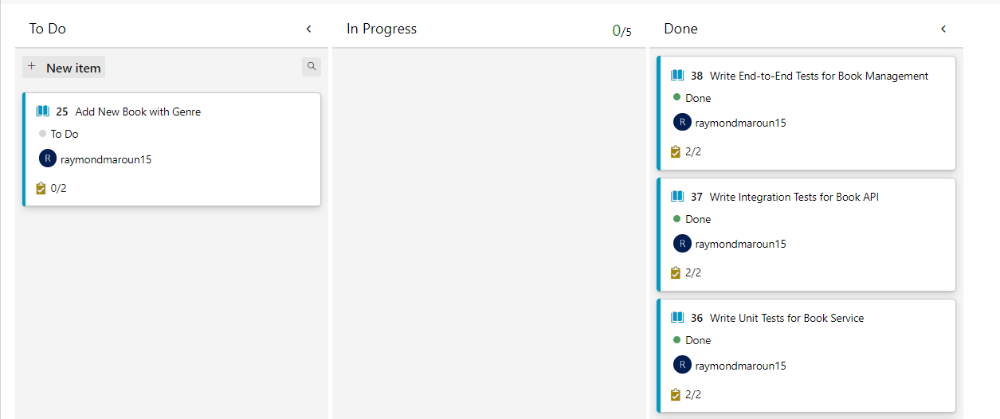

# Azure DevOps Project Setup

Azure DevOps is a comprehensive suite of tools and services designed to support every phase of the software development lifecycle. It offers a rich set of features for project management, version control, continuous integration, continuous deployment, and more. In this page, we'll explore the key components of Azure DevOps, the features available in each area, and how to navigate and utilize the Azure DevOps project that has been set up for this course.

### Overview of Azure DevOps

Azure DevOps provides an integrated environment that enables teams to plan smarter, collaborate better, and ship faster. It includes several core services:

#### **Key Features of Azure DevOps**

* **Azure Boards:** Agile project management tools that support work item tracking, Kanban boards, backlogs, team dashboards, and custom reporting.
* **Azure Repos:** Git repositories for version control, allowing teams to manage code, branches, and pull requests.
* **Azure Pipelines:** CI/CD pipelines that automate the build, test, and deployment processes across various platforms and environments.
* **Azure Test Plans:** A set of tools to perform manual and exploratory testing.
* **Azure Artifacts:** A universal package management system for storing and managing packages and dependencies.

***

### Navigating the Azure DevOps Project

For this course, the Azure DevOps project has been pre-configured and set up. You will be invited to collaborate on the project, and throughout the course, you will work within this environment. Let's explore the key components within the project:

#### **1. Boards**

Azure Boards provides a powerful set of tools for planning and tracking your work. It includes several key features:

**1.1. Work Items**

Work items are the building blocks of Azure Boards, representing individual pieces of work. Common work item types include:

* **Epics:** Large work items that encapsulate significant functionality or business value.
* **Features:** Functionalities that define part of a product.
* **User Stories:** Smaller tasks derived from features, representing a user's requirements.
* **Tasks:** Specific actions required to complete user stories or other work items.
* **Bugs:** Defects or issues in the application.
* **Test Cases:** Scenarios to validate the application's functionality.

**1.2. Boards and Backlogs**

* **Boards:** Visualize your work and track its progress using customizable Kanban boards. You can drag and drop work items between columns to update their status.
* **Backlogs:** Organize and prioritize your work items. You can create a hierarchy of epics, features, and user stories to structure your work.

**1.3. Sprints and Queries**

* **Sprints:** Manage your team's iterations and plan the work for each sprint cycle.
* **Queries:** Create custom queries to filter and find specific work items based on criteria like status, assigned user, or tags.

<div align="left">

<figure><figcaption><p>Azure Board</p></figcaption></figure>

</div>

#### **2. Repos**

Azure Repos provides Git repositories for version control, offering features such as:

* **Repositories:** Host your codebase in a secure and scalable environment. Azure Repos supports both Git and Team Foundation Version Control (TFVC).
* **Branches:** Organize your work with branching strategies. Branch policies can enforce rules like requiring pull requests for merges.
* **Pull Requests:** Collaborate on code changes with peer reviews, commenting, and approvals.
* **Code:** View and manage your repository's files, commits, and branches.

#### **3. Pipelines**

Azure Pipelines offers a robust CI/CD solution, enabling you to automate the entire build, test, and deployment process. Key features include:

* **Build Pipelines:** Define the steps to compile and build your application. You can use YAML or the visual designer.
* **Release Pipelines:** Automate the deployment of your application to various environments (e.g., dev, staging, production).
* **Library:** Manage variables, secure files, and task groups for reuse across pipelines.
* **Artifacts:** Publish and consume build artifacts as part of the pipeline process.

Example Snippet of a Basic CI Pipeline Setup in YAML Format:

```yaml
trigger:
- master

pool:
  vmImage: 'ubuntu-latest'

steps:
- task: UseNode@1
  inputs:
    version: '14.x'
- script: npm install
  displayName: 'Install dependencies'

- script: npm test
  displayName: 'Run tests'

- task: PublishBuildArtifacts@1
  inputs:
    pathtoPublish: '$(Build.ArtifactStagingDirectory)'
    artifactName: 'drop'
```

#### **4. Test Plans**

Azure DevOps provides a comprehensive Test Plans feature that enables teams to define, manage, and execute their testing efforts. This tool is crucial for ensuring the quality and reliability of your software by organizing test cases, tracking test execution, and managing test results.

**Key Features of Test Plans:**

* **Test Suites:** Organize test cases into test suites, which can represent different test scenarios, modules, or requirements. You can have static test suites (manually managed) or query-based test suites (dynamically updated based on work item queries).
* **Test Cases:** Define individual test cases with steps, expected results, and attachments. Test cases can be linked to requirements, bugs, or other work items to ensure traceability.
* **Test Runs:** Execute test cases within a test plan. Test runs track the status of each test case (e.g., passed, failed, blocked) and record detailed results and comments.
* **Manual Testing:** Azure DevOps supports manual testing, allowing testers to run through test cases manually and log results in real-time.
* **Automated Testing:** Integrate automated tests with your test plans. Automated tests can be run as part of CI/CD pipelines, and their results can be linked back to test cases in Azure DevOps.


Test Plans is a paid feature in Azure DevOps. Ensure your organization has the necessary licenses to access and utilize this functionality.


#### **5. Artifacts**

Azure DevOps Artifacts is a package management solution that allows teams to create, host, and share packages, such as NuGet, npm, and Maven, as well as build artifacts. It integrates seamlessly with CI/CD pipelines to manage dependencies and ensure consistent builds.

**Key Features of Artifacts:**

* **Package Management:** Store and manage your project's dependencies and custom packages. Azure Artifacts supports multiple package types, providing a centralized repository for all your project's needs.
* **Feed Management:** Create and manage feeds to organize packages and control access. Feeds can be public or private, depending on your organization's requirements.
* **Upstream Sources:** Configure upstream sources to pull packages from external repositories, such as public npm or NuGet feeds. This feature simplifies dependency management by providing a single source for both internal and external packages.

| Package Type | Example Use Case    | Common Feeds  |
| ------------ | ------------------- | ------------- |
| NuGet        | .NET packages       | NuGet.org     |
| npm          | JavaScript packages | npmjs.com     |
| Maven        | Java dependencies   | Maven Central |

**Using Artifacts in CI/CD Pipelines:**

* **Publishing Artifacts:** In CI pipelines, build artifacts can be published to Azure Artifacts feeds. This ensures that every build has a corresponding set of artifacts that can be deployed or used in subsequent builds.
* **Dependency Management:** In CD pipelines, Azure Artifacts can be used to resolve dependencies, ensuring that the correct versions of packages are used during deployment.

***

### Customizing Boards and Processes

Azure DevOps allows you to customize your boards and processes to match your team's workflow and needs. Here's how you can do it:

#### Customizing Board Columns

* **Board Columns:** You can add, rename, and reorder columns on your boards to reflect your team's workflow stages. For example, you might have columns like "To Do," "In Progress," "Review," and "Done."

<figure><figcaption><p>Customized Kanban Board</p></figcaption></figure>

#### Customizing Processes

* **Processes:** Azure DevOps uses processes to define the work item types and workflow states available in a project. You can create custom processes by inheriting from system processes (e.g., Agile, Scrum, CMMI) and modifying them to suit your team's requirements.
* **Creating a Custom Process:** To create a custom process, you must be added to the Project Collection Administrators group. This access level allows you to create new inherited processes, customize work item types, and manage fields, states, and rules.


You must be a member of the Project Collection Administrators group to create and manage custom processes in Azure DevOps.


#### Automating Work Item State Changes

Azure DevOps includes a feature that automates the transition of parent work items when all child work items are completed. This automation can streamline your workflow by automatically updating the status of parent items, such as epics or features, when associated tasks or user stories are marked as done.

To enable this feature:

1. **Enable New Boards Hub:** First, activate the "New Boards Hub" from the **Preview Features** settings in Azure DevOps.
2. **Backlog Settings:** Go to the Backlog settings, where you can configure the automation rule. When all child work items are marked as done, the parent work item will automatically be set to done.

This feature helps maintain accurate project tracking and ensures that parent work items reflect the status of their child items without manual intervention.

***

### Conclusion

Azure DevOps is a versatile platform that supports the full DevOps lifecycle, from project planning and code versioning to CI/CD and artifact management. By leveraging its robust set of features, you can streamline your development workflows, enhance collaboration, and deliver high-quality software efficiently. In the following pages, we'll dive deeper into setting up and utilizing these tools to their fullest potential.
