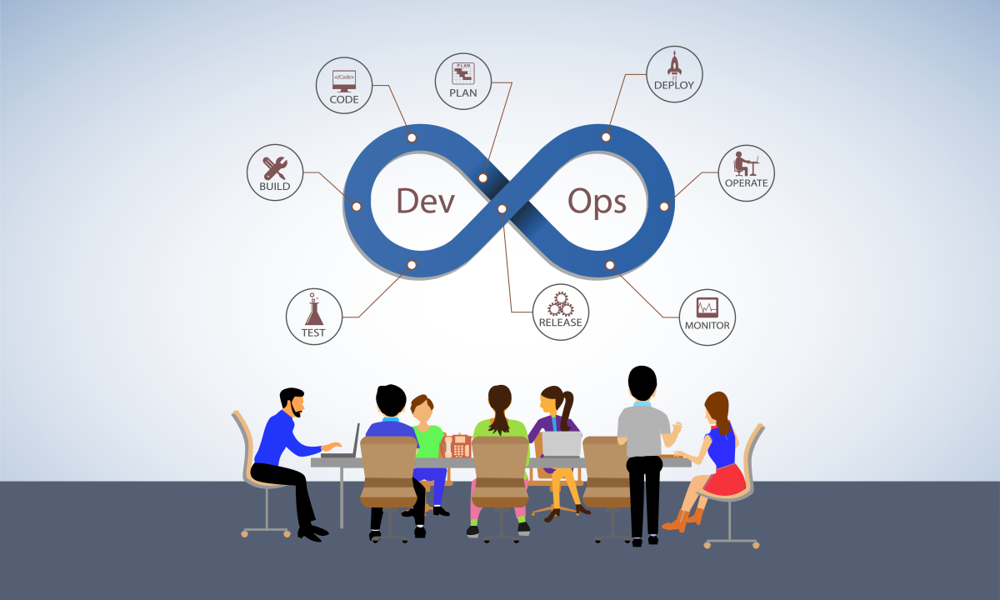
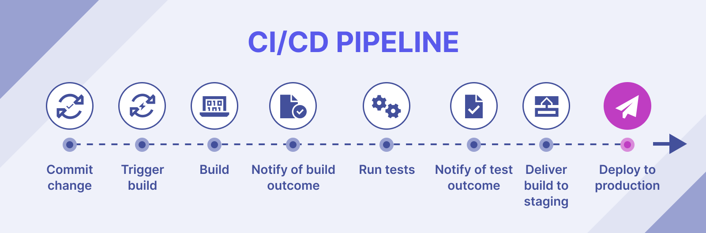

# DevOps Fundamentals

DevOps is a **cultural and professional movement** that emphasizes **collaboration** and **communication** between **software developers** and **IT operations**. It aims to **automate** and **integrate** the processes of software development and IT teams to enable **continuous delivery** and **deployment** of high-quality software. In this section, we'll explore the core **philosophy**, **advantages**, and **practices** of DevOps, as well as provide an overview of **Continuous Integration** and **Continuous Deployment (CI/CD)** concepts and tools.

### Philosophy of DevOps

DevOps is built on the following core principles:

#### 1. Culture of Collaboration

At the heart of DevOps is a **culture of collaboration**. DevOps encourages breaking down **silos** between **development**, **operations**, and other **stakeholders**. By fostering **open communication** and shared goals, DevOps teams work together more effectively, leading to faster and more reliable software delivery.

<div align="left">

<figure><figcaption><p>Collaboration in DevOps</p></figcaption></figure>

</div>

#### 2. Automation

**Automation** is a key component of DevOps, aiming to streamline processes and reduce manual interventions. This includes automating the **build**, **test**, and **deployment** processes, as well as **infrastructure provisioning** and **configuration management**. Automation reduces the risk of human error, accelerates delivery, and ensures consistency across environments.

<div align="left">

<figure><figcaption><p>DevOps Automation</p></figcaption></figure>

</div>

#### 3. Continuous Improvement

DevOps embraces a mindset of **continuous improvement**. By continuously measuring and analyzing performance, teams can identify bottlenecks and areas for improvement. This leads to iterative enhancements in processes, tools, and workflows, driving greater efficiency and effectiveness over time.

<details>

<summary>Examples of Continuous Improvement Practices</summary>

Continuous improvement is at the heart of DevOps. Here are a few practices commonly implemented:

* **Retrospectives:** Regular meetings where teams discuss what went well, what didn’t, and how to improve.
* **Feedback Loops:** Implementing mechanisms to gather feedback from all stakeholders, including developers, operations, and end-users.
* **Metrics Tracking:** Monitoring key performance indicators (KPIs) like deployment frequency, lead time, and mean time to recovery (MTTR) to assess the effectiveness of processes.

</details>

***

### Advantages of DevOps

DevOps offers numerous benefits that improve the overall software development and delivery process:

#### 1. Faster Time to Market

By automating processes and improving collaboration, DevOps enables **faster and more frequent releases**. This allows organizations to respond quickly to **market changes**, **customer feedback**, and new opportunities.

#### 2. Improved Quality and Reliability

**Continuous testing** and monitoring are integral to DevOps, ensuring that code is thoroughly tested and validated before deployment. This leads to **higher-quality software** with fewer defects and more reliable performance.

#### 3. Enhanced Security

DevOps incorporates **security practices** throughout the software development lifecycle, known as **DevSecOps**. By integrating security checks early in the process, organizations can identify and address **vulnerabilities** before they become critical issues.


_Note:_ Ensure that security practices are integrated at every stage of the development lifecycle to avoid common pitfalls and vulnerabilities.


#### 4. Greater Flexibility and Scalability

DevOps practices enable teams to manage **infrastructure** and **applications** more efficiently, allowing for rapid scaling and adaptation to changing needs. This flexibility is crucial in today's dynamic technology landscape.

***

### Core Practices of DevOps

DevOps encompasses several key practices that support its principles:

#### 1. Continuous Integration (CI)

**Continuous Integration (CI)** involves the frequent merging of code changes into a shared repository. Each integration is automatically tested and validated to ensure that new changes do not break the existing codebase. CI helps catch issues early, facilitates collaboration, and speeds up the development process.

#### 2. Continuous Deployment (CD)

**Continuous Deployment (CD)** extends the principles of CI to include automated deployment to production environments. With CD, code changes that pass all tests are automatically deployed to production, enabling rapid delivery of new features and bug fixes.

#### 3. Infrastructure as Code (IaC)

**Infrastructure as Code (IaC)** is the practice of managing and provisioning infrastructure using code and automation tools. This approach allows teams to define infrastructure configurations in a version-controlled manner, ensuring consistency across environments and enabling quick provisioning and scaling.

\
_Example IaC Code Snippet:_

```yaml
# Define an AWS EC2 instance resource
resource "aws_instance" "web" {
  # Amazon Machine Image (AMI) ID for the instance
  ami           = "ami-0c55b159cbfafe1f0"
  # Type of instance (t2.micro is eligible for the free tier)
  instance_type = "t2.micro"

  # Tags to identify the instance
  tags = {
    Name = "WebServer"
  }
}
```

_Explanation:_ This example defines an AWS EC2 instance using Terraform, an IaC tool. The `ami` attribute specifies the Amazon Machine Image ID to use, and `instance_type` defines the hardware configuration. The `tags` attribute assigns a name to the instance for easy identification.

#### 4. Monitoring and Logging

**Continuous monitoring** and **logging** are essential for maintaining the health and performance of applications and infrastructure. By collecting and analyzing metrics and logs, teams can detect and respond to issues proactively, ensuring a smooth user experience.

***

### Overview of CI/CD Concepts and Tools

#### CI/CD Pipeline

A **CI/CD pipeline** is a series of automated steps that facilitate the integration, testing, and deployment of code. The pipeline typically includes stages for **building** the code, **running tests**, deploying to **staging environments**, and eventually deploying to **production**.

<figure><figcaption><p>CI/CD Pipeline</p></figcaption></figure>

#### Key CI/CD Tools

1. **Azure DevOps**: A comprehensive platform for managing CI/CD pipelines, project management, and version control.
2. **Jenkins**: An open-source automation server that supports building, deploying, and automating projects.
3. **GitLab CI**: A continuous integration tool integrated with GitLab that automates the testing and deployment of code.

> **Note:** In this course, we will focus on using **Azure DevOps** as our primary CI/CD tool, leveraging its robust set of features for building and deploying software efficiently.
