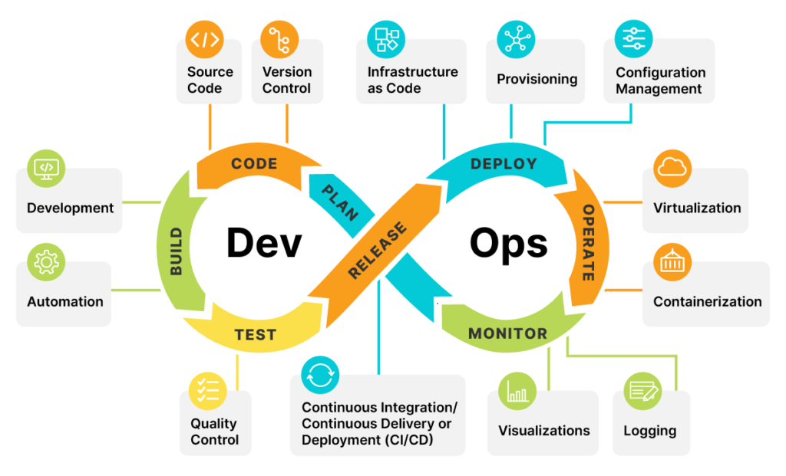

# DevOps Lifecycle

The **DevOps Lifecycle** encompasses a comprehensive approach that emphasizes **continuous development**, **integration**, **testing**, **delivery**, and **monitoring** of applications. It consists of iterative and interconnected phases that facilitate efficient software development and delivery. Let's explore each phase in detail:

<figure><figcaption><p>DevOps Process</p></figcaption></figure>

### 1. Planning

The **Planning** phase is where project requirements and goals are defined. This phase involves:

* **Defining Objectives:** Establishing clear objectives and expected outcomes for the project.
* **Roadmap Creation:** Developing a roadmap that outlines the timeline, milestones, and deliverables.
* **Task Breakdown:** Breaking down work into smaller, manageable tasks that can be tracked and prioritized.

#### Key Tools

* **JIRA** and **Azure Boards**: For project management and tracking.

***

### 2. Coding

The **Coding** phase involves writing, reviewing, and managing the application's source code. Key activities include:

* **Version Control:** Managing code changes through a version control system (VCS).
* **Code Review:** Ensuring code quality and consistency through peer reviews.
* **Branching and Merging:** Utilizing branching strategies to manage parallel development.

#### Key Tools

* **Git**, **Azure Repos**, **GitHub**: For source code management and collaboration.
* **IDE (IntelliJ, Visual Studio Code)**: For writing and editing code.

***

### 3. Building

In the **Building** phase, source code is compiled, linked, and packaged into deployable artifacts. This phase includes:

* **Automated Builds:** Automating the build process to compile code and generate artifacts.
* **Dependency Management:** Managing dependencies and ensuring compatibility.

#### Key Tools

* **Maven**, **Gradle**: For build automation and dependency management.
* **Jenkins**, **Azure Pipelines**: For continuous integration (CI) and build automation.

**Code Block Placeholder:**

```bash
# Example script for automating the build process using Maven
mvn clean install
```

***

### 4. Testing

**Testing** is crucial to ensure the quality and reliability of the application. This phase encompasses:

* **Unit Testing:** Testing individual components for correctness.
* **Integration Testing:** Testing the interaction between integrated components.
* **End-to-End (E2E) Testing:** Testing the complete application workflow to ensure it meets the requirements.

#### Key Tools

* **JUnit**, **TestNG**: For unit testing.
* **Selenium**, **RestAssured**: For E2E and integration testing.
* **Jenkins**, **Azure Pipelines**: For automating test execution.

***

### 5. Releasing

The **Releasing** phase involves preparing and approving the release of the application to various environments. Key activities include:

* **Release Planning:** Coordinating the release schedule and deployment strategy.
* **Artifact Management:** Managing and storing release artifacts.

#### Key Tools

* **Cloudsmith**, **Artifactory**: For artifact management.
* **Azure Pipelines**: For managing release pipelines.

<details>

<summary>Artifact Management Best Practices</summary>

Artifact management involves storing, organizing, and maintaining build outputs. Best practices include using versioning, setting up proper access controls, and maintaining a clean repository by archiving or deleting outdated artifacts.

</details>

***

### 6. Deploying

In the **Deploying** phase, the application is deployed to the production environment. This includes:

* **Deployment Automation:** Automating the deployment process to ensure consistency and reduce errors.
* **Environment Management:** Managing different environments (development, staging, production).

#### Key Tools

* **Azure Pipelines**, **Octopus Deploy**: For deployment automation.
* **Heroku**, **AWS**, **Azure**: For cloud-based environment management.


_Always ensure that your deployment process is automated and version-controlled to minimize the risk of errors and ensure repeatability._


***

### 7. Operating

The **Operating** phase involves monitoring the application's performance and availability in the production environment. Activities include:

* **Infrastructure Management:** Managing the infrastructure that supports the application.
* **Monitoring and Logging:** Monitoring application performance and logging events for analysis.

#### Key Tools

* **Nagios**, **Prometheus**, **Grafana**: For monitoring and alerting.
* **ELK Stack (Elasticsearch, Logstash, Kibana)**: For centralized logging and analysis.

| Metric          | Description                                         | Tool          |
| --------------- | --------------------------------------------------- | ------------- |
| CPU Usage       | _Monitors the CPU usage of the application_         | _Prometheus_  |
| _Response Time_ | _Tracks the response time of API calls_             | _Grafana_     |
| _Log Analysis_  | _Analyzes application logs for errors and patterns_ | _ELK Stack_   |

***

### 8. Monitoring and Continuous Feedback

**Continuous monitoring** and **feedback** are essential for identifying and resolving issues quickly. This phase includes:

* **User Feedback:** Collecting feedback from users to understand their experiences and identify areas for improvement.
* **Performance Analysis:** Analyzing performance metrics to ensure the application meets expected standards.

#### Key Tools

* **Google Analytics**, **Hotjar**: For user feedback and analytics.
* **Dynatrace**, **New Relic**: For performance monitoring.

<details>

<summary>Importance of Continuous Feedback</summary>

Continuous feedback allows teams to quickly identify areas for improvement and adapt to changing user needs. By actively seeking and incorporating feedback, teams can enhance the user experience, address issues promptly, and maintain a high standard of quality.

</details>

***

### 9. Continuous Improvement

**Continuous Improvement** is an ongoing process that focuses on enhancing the application's quality, performance, and user experience. This phase includes:

* **Retrospectives:** Reviewing the development and deployment processes to identify areas for improvement.
* **Process Optimization:** Implementing changes to optimize workflows and reduce bottlenecks.

#### Key Practices

* **Kaizen**: A Japanese term meaning "continuous improvement" that emphasizes small, incremental changes.
* **Lean Methodology**: A methodology that focuses on maximizing value by eliminating waste.


_Continuous improvement is not just about fixing problems but also about seizing opportunities to enhance the system's overall performance and efficiency._


***

The **DevOps Lifecycle** is a dynamic and iterative process that fosters collaboration, automation, and continuous improvement. By embracing these principles, teams can deliver high-quality software faster and more efficiently, meeting the ever-changing demands of the business and its customers.
