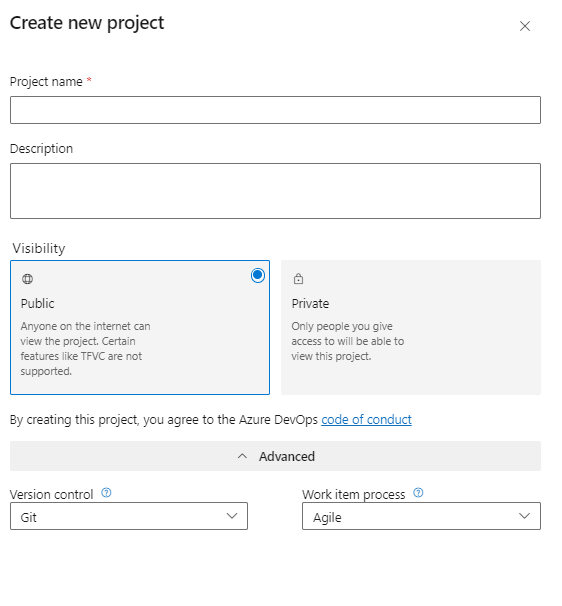
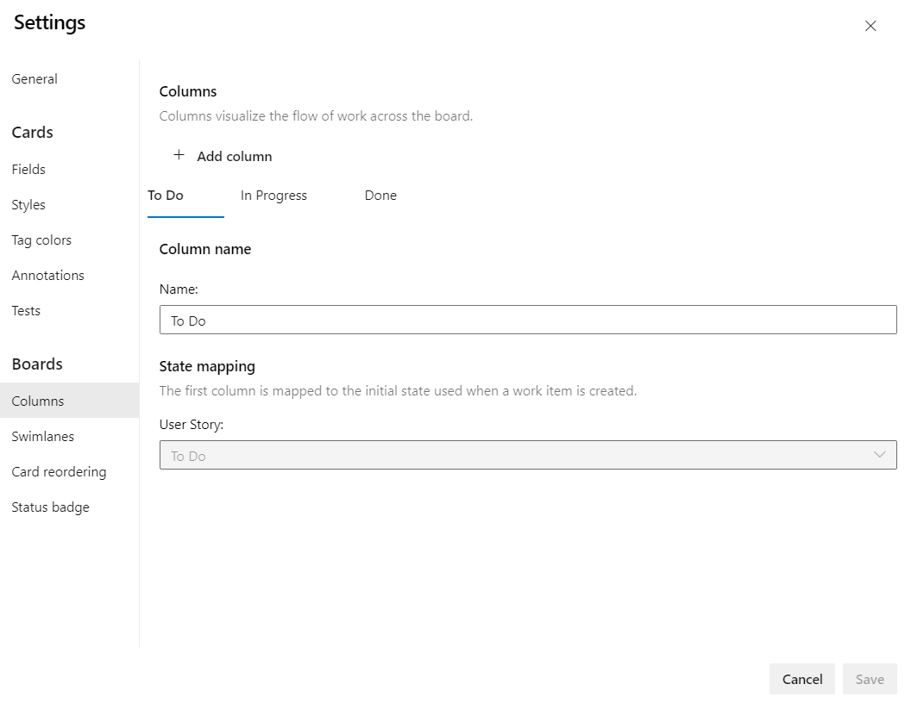
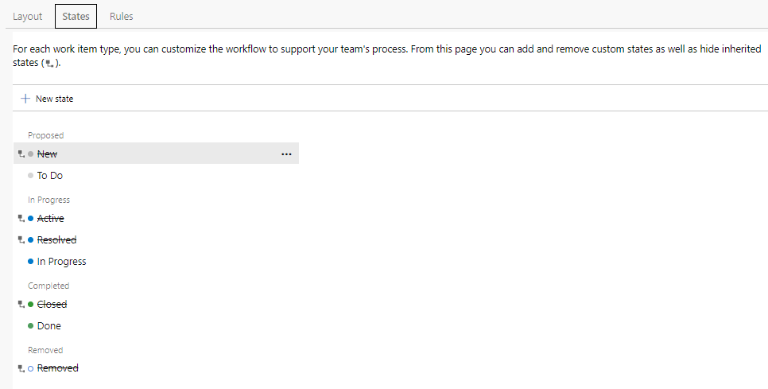
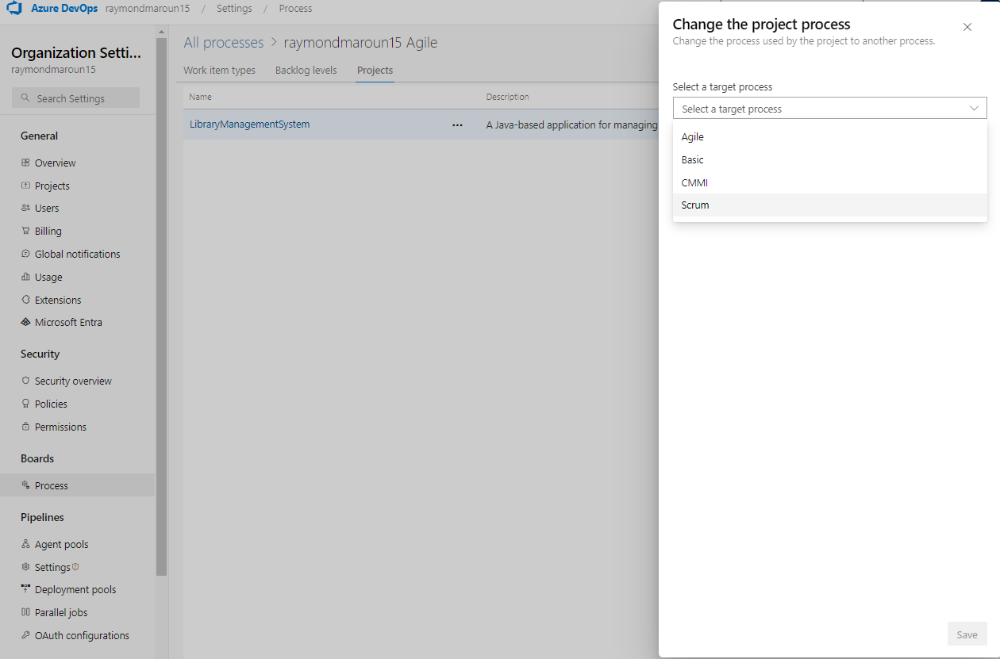
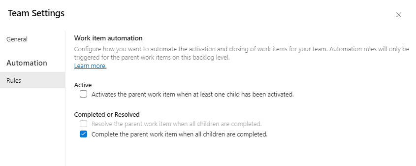
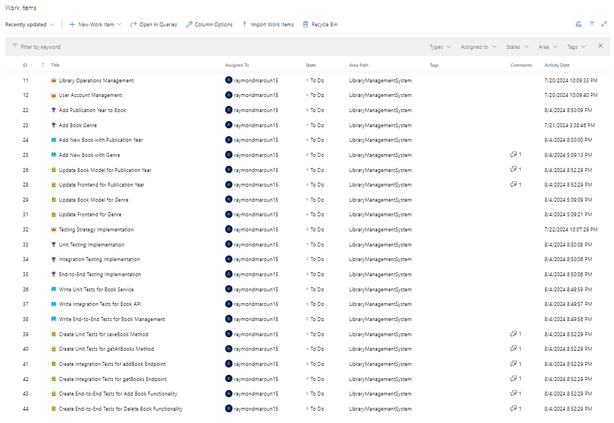

# Live Demo - Setting Up an Agile Project

In this live demo, we will set up an Agile project in Azure DevOps for the **Library Management System**. This Java-based application will manage books, authors, and users, providing a comprehensive API for library operations. The demo will guide you through the setup process, showcasing key Azure DevOps features such as Boards, Repos, and Pipelines. Follow along as we create and configure the project, customize boards, and set up work items.

### 1. Project Setup

#### 1.1. Create Azure DevOps Project

**Log into Azure DevOps**

* Open your web browser and navigate to the Azure DevOps portal: [Azure DevOps](https://dev.azure.com/).
* Enter your credentials and log in to your Azure DevOps account.


Ensure you have the necessary permissions to create projects and invite users.


**Create a New Project**

* Click on the **"New Project"** button or navigate to the **"Projects"** page and select **"Create Project"**.
* **Project Name:** Enter **"LibraryManagementSystem"**.
* **Description:** Provide a description, e.g., **"A Java-based application for managing library operations including books, authors, and users."**
* **Visibility:** Choose the project visibility:
  * **Private:** Only invited members can access the project.
  * **Public:** Anyone on the internet can view the project.
* **Advanced Options:** Expand the advanced options section.
  * **Version Control:** Select **Git**.
  * **Work Item Process:** Select **Agile**.
* Click **"Create"** to create the project.

<figure><figcaption>
Create new Azure DevOps Project
</figcaption></figure>

**Add Users**

* Navigate to **Org Settings** → **Users**.
* Add the email addresses of the users you want to invite, select their access level, project, and Azure DevOps groups.

***

### 2. Set Up Azure Boards

#### 2.1. Enable New Boards Hub

* Navigate to **Preview Features** in your Azure DevOps settings.
* Enable the **New Boards Hub** feature to access the latest board functionalities.


The New Boards Hub provides enhanced features and an improved user interface for managing work items.


#### 2.2. Navigate to Boards

* In the left-hand menu, click on **"Boards"** to expand the menu.
* Select **"Boards"** to navigate to the board view.

#### 2.3. Create a New Kanban Board

**Access the Boards Area**

* Navigate to your Azure DevOps project.
* Click on the **"Boards"** dropdown in the top navigation bar and select **"Boards"** from the list.

**Set Up the Board Columns**

* Click on the **"Settings"** icon (gear icon) on the right side of the board.
* In the settings popup, click on the **"Columns"** tab under the **Board** section.

<figure><figcaption>
Azure Board Settings
</figcaption></figure>

**Customize Columns**

* Configure the columns to reflect the Kanban process. Common column names might include:
  * **To Do:** Work items that need to be started.
  * **In Progress:** Work items that are currently being worked on.
  * **Done:** Completed work items.
* Add, rename, or reorder columns as needed.
* Set column limits (WIP limits) if necessary to control the flow of work.


Successfully setting up the board columns helps visualize the workflow and improves team productivity.


**Save Changes**

* Click **"Save and close"** to apply the changes to your Kanban board.

***

### 3. Create an Inherited Process and Update the Project

#### 3.1. Navigate to Organization Settings

* Go to the Azure DevOps organization settings by clicking on your organization name on the top left and then selecting **"Organization settings"**.

#### 3.2. Create an Inherited Process

* In the **"Process"** section, locate the **Agile** process.
* Right-click on **Agile** and select **"Create inherited process"**.
* Name the new process **"Kanban-\<YourName>" to have a unique process** and click **"Create process"**.


Creating an inherited process allows customization of work item types, states, and workflows to better suit your team's needs.


#### 3.3. Customize the Inherited Process

* Click on the newly created **Kanban** process.
* Under the **"Work Item Types"** tab, select **Epic**, **Feature**, **Task**, and **User Story**.
* For each work item type, configure the states to match the board columns:
  * **To Do**
  * **In Progress**
  * **Done**

<figure><figcaption>
Work Items States
</figcaption></figure>


Keep the state names consistent with the board columns to maintain clarity and simplicity in workflow management.


#### 3.4. Update the Project to Use the New Process

* Go back to "**All processes"** and choose the current process of your project, which "**Agile"** by default.
* Go to the **"Projects"** section.
* Select the project, click on the three dots and choose **"Change process"**.
* Select as the new process you created and click **"Save"**.

<figure><figcaption>
Project Process Settings
</figcaption></figure>


Changing the process will affect all work items in the project. Ensure that the new process is fully configured before making the switch.


***

### 4. Automating Work Item State Changes

#### Enable Automation Rules

* Navigate to **Boards** → **Backlogs**.
* Click on the **"Settings"** icon on the right to open team settings.
* Under the **Automation** section, click on **"Rules"**.
* Enable the rule **"Complete the parent work item when all children are completed."**

<figure><figcaption>
Work Items Automation Settings
</figcaption></figure>


Automating work item state changes can streamline the workflow by reducing manual updates.


***

### 5. Adding Work Items

* In the **Boards** tab, choose the **Work items** view, and then click **"New Work Item"** to create work items.
* For each work item, provide the title and description. After that assign it to yourself and save it.
* Structure the project around the Library Management System theme with Epics, Features, User Stories, and Tasks.

<figure><figcaption>
Work Items
</figcaption></figure>

#### Epics

1. **Title**: "Library Operations Management"
   * **Description**: "Implement core functionalities for managing library operations including book management and author management"
2. **Title**: "User Account Management"
   * **Description**: "Implement functionalities for managing user accounts, including registration, authentication, and profile management."
3. **Title**: "Testing Strategy Implementation"
   * **Description**: "Implement comprehensive testing strategies including unit testing, integration testing, and end-to-end testing for the Library Management System."


Epics provide a high-level view of significant functionalities and help in organizing related features and tasks.


#### Features

1. **Title**: "Add Publication Year to Book"
   * **Description**: "Enhance the book management module to include the publication year for each book."
   * **Link to Epic**: "Library Operations Management"
2. **Title**: "Add Book Genre"
   * **Description**: "Enhance the book management module to include a genre for each book."
   * **Link to Epic**: "Library Operations Management"
3. **Title**: "Unit Testing Implementation"
   * **Description**: "Implement unit tests for backend code using JUnit."
   * **Link to Epic**: "Testing Strategy Implementation"
4. **Title**: "Integration Testing Implementation"
   * **Description**: "Implement integration tests for API endpoints using RestAssured."
   * **Link to Epic**: "Testing Strategy Implementation"
5. **Title**: "End-to-End Testing Implementation"
   * **Description**: "Implement end-to-end tests for the application using Selenium."
   * **Link to Epic**: "Testing Strategy Implementation"

#### User Stories

1. **Title**: "Add New Book with Publication Year"
   * **Description**: "As a librarian, I want to add new books to the library with their publication year so that the library catalog is complete."
   * **Link to Feature**: "Add Publication Year to Book"
2. **Title**: "Add New Book with Genre"
   * **Description**: "As a librarian, I want to add a genre to each book so that users can filter books by genre."
   * **Link to Feature**: "Add Book Genre"
3. **Title**: "Write Unit Tests for Book Service"
   * **Description**: "As a developer, I want to write unit tests for the Book Service to ensure its methods function correctly."
   * **Link to Feature**: "Unit Testing Implementation"
4. **Title**: "Write Integration Tests for Book API"
   * **Description**: "As a developer, I want to write integration tests for the Book API to ensure the endpoints function correctly."
   * **Link to Feature**: "Integration Testing Implementation"
5. **Title**: "Write End-to-End Tests for Book Management"
   * **Description**: "As a tester, I want to write end-to-end tests for the Book Management feature to ensure the UI and backend integration function correctly."
   * **Link to Feature**: "End-to-End Testing Implementation"

#### Tasks

1. **Title**: "Update Book Model for Publication Year"
   * **Description**: "Add the publication year field to the Book model class."
   * **Link to User Story**: "Add New Book with Publication Year"
2. **Title**: "Update Frontend for Publication Year"
   * **Description**: "Modify the frontend templates to include and display the publication year for books."
   * **Link to User Story**: "Add New Book with Publication Year"
3. **Title**: "Update Book Model for Genre"
   * **Description**: "Add the genre field to the Book model class."
   * **Link to User Story**: "Add New Book with Genre"
4. **Title**: "Update Frontend for Genre"
   * **Description**: "Modify the frontend templates to include and display the genre for books."
   * **Link to User Story**: "Add New Book with Genre"
5. **Title**: "Create Unit Tests for saveBook Method"
   * **Description**: "Write unit tests for the saveBook method in Book Service."
   * **Link to User Story**: "Write Unit Tests for Book Service"
6. **Title**: "Create Unit Tests for getAllBooks Method"
   * **Description**: "Write unit tests for the getAllBooks method in Book Service."
   * **Link to User Story**: "Write Unit Tests for Book Service"
7. **Title**: "Create Integration Tests for addBook Endpoint"
   * **Description**: "Write integration tests for the addBook endpoint in Book API."
   * **Link to User Story**: "Write Integration Tests for Book API"
8. **Title**: "Create Integration Tests for getBooks Endpoint"
   * **Description**: "Write integration tests for the getBooks endpoint in Book API."
   * **Link to User Story**: "Write Integration Tests for Book API"
9. **Title**: "Create End-to-End Tests for Add Book Functionality"
   * **Description**: "Write end-to-end tests for the Add Book functionality in the UI."
   * **Link to User Story**: "Write End-to-End Tests for Book Management"
10. **Title**: "Create End-to-End Tests for Delete Book Functionality"
    * **Description**: "Write end-to-end tests for the Delete Book functionality in the UI."
    * **Link to User Story**: "Write End-to-End Tests for Book Management"

***

### Conclusion

This live demo covers the essential steps to set up an Agile project in Azure DevOps for the Library Management System. We've created a new Azure DevOps project, set up boards and work items, customized the process, and structured the project to align with Agile methodologies. This setup will serve as the foundation for managing and tracking the development of the Library Management System throughout the course.
