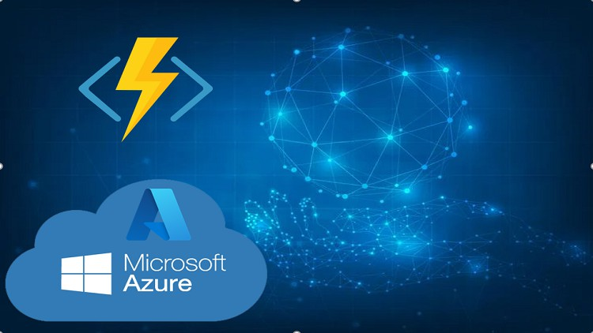
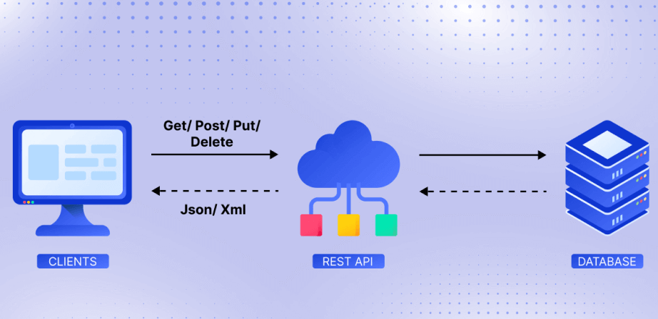
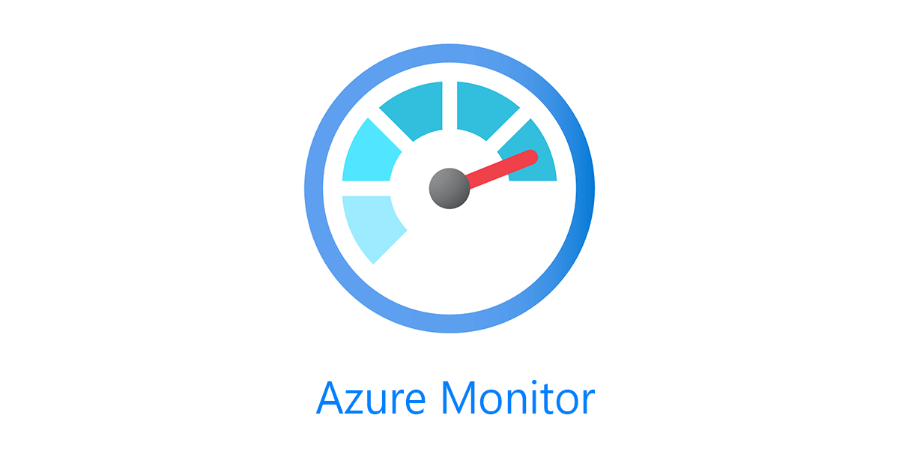

# Gates and Approvals

### **Overview**

In a DevOps environment, ensuring that deployments happen smoothly and safely is crucial. Azure DevOps provides various gates and approval mechanisms to control when and how deployments occur, ensuring that all necessary conditions are met before a deployment proceeds. This page will discuss different types of gates and approvals available in Azure DevOps and how they can be used to enhance the security and reliability of your deployment process.

***

### **Pre-Deployment Approvals**

Pre-deployment approvals are a fundamental control mechanism in Azure DevOps. They require designated approvers to manually approve a deployment before it can proceed. This is particularly useful in environments where compliance and governance are crucial, as it ensures that all changes are reviewed by the appropriate stakeholders before being deployed.

#### **Key Points:**

* **Manual Review:** Approvers can review the changes, associated work items, and test results before granting approval.
* **Multi-Level Approvals:** Azure DevOps allows you to configure multiple approval levels, ensuring that different stakeholders can review changes.
* **Notification System:** Approvers are notified automatically via email or other channels, prompting them to review and approve the deployment.

#### **Example:**

A financial institution might require pre-deployment approvals from both the development lead and the compliance officer before any changes are deployed to the production environment, ensuring that both the technical and regulatory aspects are reviewed.

***

### **Business Hours Gates**

The Business Hours gate ensures that deployments only occur within a predefined time window, such as during standard business hours. This is useful for minimizing disruption by ensuring that deployments happen when support staff are available to address any issues that may arise.

<figure><figcaption>
Business Hours
</figcaption></figure>

#### **Key Points:**

* **Time-Based Control:** Define specific hours and days when deployments can occur, such as weekdays from 9 AM to 5 PM.
* **Minimize Risk:** By restricting deployments to business hours, you reduce the risk of issues going unnoticed and unresolved.
* **Flexibility:** Business Hours gates can be customized to fit the operational hours of your team or organization.

#### **Example:**

A retail company might enforce business hours gates to ensure that deployments to their e-commerce platform only occur during off-peak hours when technical support staff are available to address any issues that arise.

***

### **Branch Control**

Branch Control gates allow deployments based on branches linked to the run. This gate ensures that only changes from specific branches (e.g., `master`, `main`, or `release`) can trigger a deployment, providing an additional layer of control over what gets deployed to production.

<figure><figcaption>
<strong>Branch Control</strong>
</figcaption></figure>

#### **Key Points:**

* **Selective Deployments:** Restrict deployments to only those changes that have been merged into a specific branch.
* **Version Control:** Helps maintain the integrity of the deployment process by ensuring only vetted changes are deployed.
* **Custom Configuration:** You can configure the gate to allow or deny deployments from specific branches according to your needs.

#### **Example:**

A development team working on a microservices architecture might use branch control gates to ensure that only code from the `release` branch, which has passed all integration tests, can be deployed to production.

***

### **Evaluate Artifact (Preview)**

The Evaluate Artifact gate allows you to ensure that the artifacts adhere to custom policies before they are deployed. This is particularly useful for container images, where you might want to enforce specific security or compliance requirements before allowing the deployment to proceed.

#### **Key Points:**

* **Artifact Validation:** Automatically check that artifacts meet certain criteria, such as security scans or compliance checks.
* **Prevent Bad Deployments:** Helps catch potential issues before they are deployed, reducing the risk of security vulnerabilities or non-compliance.
* **Preview Feature:** This is currently a preview feature, which means it might be subject to change in future updates of Azure DevOps.

#### **Example:**

An organization might use the Evaluate Artifact gate to enforce that all container images pass a vulnerability scan before they are deployed to the production environment, ensuring that no insecure containers are used.

***

### **Required Template**

This gate ensures that the pipeline extends one or more YAML templates. It is useful for organizations that standardize their deployment processes using templates, ensuring consistency across different projects and environments.

#### **Key Points:**

* **Template Enforcement:** Ensure that deployments adhere to standardized templates, promoting consistency and reducing errors.
* **Scalability:** Useful in large organizations where multiple teams need to follow the same deployment procedures.
* **Customization:** Templates can be customized to include specific steps, tasks, or checks relevant to your organization’s needs.

#### **Example:**

A large enterprise might enforce a required template gate to ensure that all deployment pipelines include steps for automated testing and security scanning, reducing the risk of missing critical processes.

***

### **Invoke Azure Function**

The Invoke Azure Function gate allows you to call an Azure Function as part of the deployment pipeline. This is useful for executing custom logic, such as additional validations, sending notifications, or interacting with other systems before or after deployment.

<figure><figcaption>
<strong>Azure Function</strong>
</figcaption></figure>

#### **Key Points:**

* **Custom Logic Execution:** Run custom scripts or processes as part of your deployment pipeline.
* **Integration:** Integrate your deployment process with other systems or services using Azure Functions.
* **Flexibility:** This gate offers a high degree of flexibility, allowing you to tailor the deployment process to your specific needs.

#### **Example:**

A company might use the Invoke Azure Function gate to trigger an automated backup process of the database before deploying new changes to the production environment, ensuring data integrity.

***

### **Invoke REST API**

The Invoke REST API gate allows you to call a REST API as part of your deployment pipeline. Similar to the Azure Function gate, this is useful for integrating with other services or running custom checks and balances before proceeding with a deployment.

<figure><figcaption>
REST API
</figcaption></figure>

#### **Key Points:**

* **API Integration:** Call external APIs to perform tasks, such as updating a status dashboard, validating deployment conditions, or triggering external workflows.
* **Automation:** Automate various aspects of the deployment process by interacting with other systems via REST APIs.
* **Custom Checks:** Implement custom gates by validating responses from the API before allowing the deployment to continue.

#### **Example:**

A team might use the Invoke REST API gate to check the status of a critical third-party service via its API before proceeding with a deployment, ensuring that the service is available and functioning correctly.

***

### **Query Azure Monitor Alerts**

This gate allows you to observe the configured Azure Monitor rules for active alerts before proceeding with the deployment. It ensures that deployments are not initiated if there are ongoing issues or alerts that might indicate a problem in the environment.

<figure><figcaption>
Azure Monitor
</figcaption></figure>

#### **Key Points:**

* **Monitoring Integration:** Integrate Azure Monitor alerts into your deployment process to catch issues before they impact production.
* **Preemptive Action:** Prevent deployments if there are active alerts, reducing the risk of exacerbating existing issues.
* **Automated Checks:** Automate the monitoring of your environment as part of the deployment pipeline, ensuring that deployments only occur when the environment is healthy.

#### **Example:**

An IT operations team might configure a Query Azure Monitor Alerts gate to prevent deployments if there are active alerts related to high CPU usage on the production servers, avoiding further strain on the environment.

***

### **Post-Check Approvals**

Post-Check Approvals are similar to pre-deployment approvals, but they occur after certain conditions or checks have been met during the deployment process. This can include validating that all tests have passed, all gates have been cleared, and any other conditions have been satisfied.

#### **Key Points:**

* **Conditional Approvals:** Approvers can grant approval only after verifying that specific post-deployment checks have been met.
* **Multiple Levels:** Just like pre-deployment approvals, you can configure multiple levels of post-check approvals.
* **Automated Notifications:** Approvers are notified to review the deployment once all other checks are complete.

#### **Example:**

A DevOps team might configure post-check approvals to ensure that all security scans have passed and that the application has been deployed successfully to a staging environment before final approval is granted for production deployment.

***

### **Exclusive Lock**

The Exclusive Lock gate ensures that access to a resource is limited to only a single stage at a time. This is useful in scenarios where you want to prevent concurrent deployments to the same environment, reducing the risk of conflicts or inconsistent states.

#### **Key Points:**

* **Resource Locking:** Prevent multiple deployments from occurring simultaneously in the same environment.
* **Consistency:** Ensure that deployments occur in a controlled manner without overlap or interference.
* **Conflict Avoidance:** Helps avoid issues that can arise from concurrent modifications to the same resources.

#### **Example:**

A cloud services provider might use the Exclusive Lock gate to ensure that only one deployment can occur at a time in a shared production environment, preventing conflicts that could arise from multiple simultaneous deployments.

***

### **Security Scans**

The Security Scans gate ensures that your deployment only proceeds after successful security scans have been completed. This can include scans for vulnerabilities in code, dependencies, or container images. Security Scans are a critical component of ensuring that only secure and compliant artifacts are deployed to production.

<figure><figcaption>
Security Scans
</figcaption></figure>

#### **Key Points:**

* **Automated Security Validation:** Integrate security scans directly into your deployment pipeline to automatically check for vulnerabilities.
* **Compliance:** Ensure that deployments meet your organization's security and compliance requirements by enforcing security scans.
* **Actionable Insights:** Receive detailed reports on any vulnerabilities or issues found during the scan, enabling you to address them before proceeding with the deployment.

#### **Example:**

A software development team might configure a Security Scans gate to ensure that all code and dependencies pass a vulnerability scan before the application is deployed to production, preventing known vulnerabilities from being introduced.

***

### **External Service Checks**

The External Service Checks gate allows you to validate the availability or status of external services before proceeding with a deployment. This ensures that critical external dependencies are functioning correctly, reducing the risk of deployment failures or service disruptions.

#### **Key Points:**

* **Dependency Validation:** Ensure that all external services your application depends on are available and functioning before deployment.
* **Reduce Downtime:** Prevent deployments if critical external services are down or experiencing issues, reducing the risk of deploying an application that relies on them.
* **Customizable Checks:** Configure checks to validate the specific external services relevant to your application, ensuring a tailored and effective deployment process.

#### **Example:**

An online payment processor might use External Service Checks to ensure that payment gateways are operational before deploying updates to their payment processing application, avoiding potential disruptions to their service.

***

### **Conclusion**

Azure DevOps offers a robust set of gates and approvals that help enforce control, consistency, and security within your deployment pipelines. By leveraging these tools, you can ensure that deployments are carried out smoothly, with all necessary checks and balances in place. Whether you’re looking to implement business hour restrictions, enforce branch policies, or integrate custom logic via REST APIs or Azure Functions, Azure DevOps has the flexibility to meet your needs. Properly configuring these gates and approvals is essential for maintaining a reliable and secure DevOps process, aligning with best practices, and meeting organizational compliance requirements.
