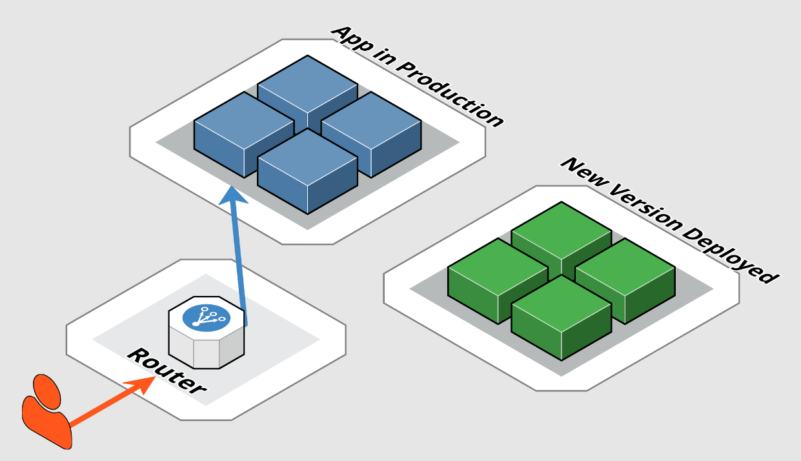
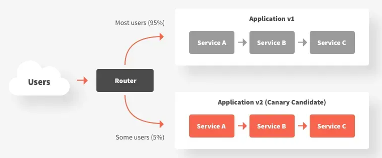
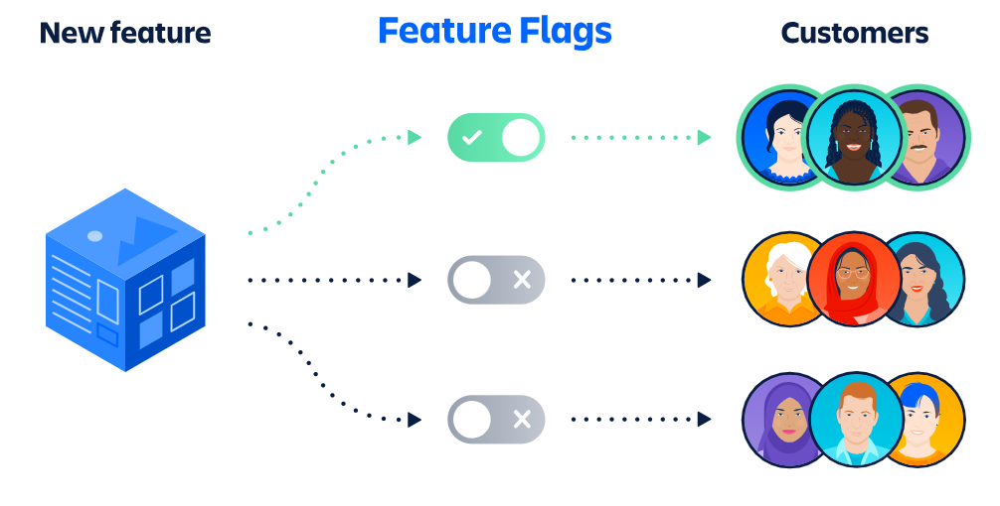
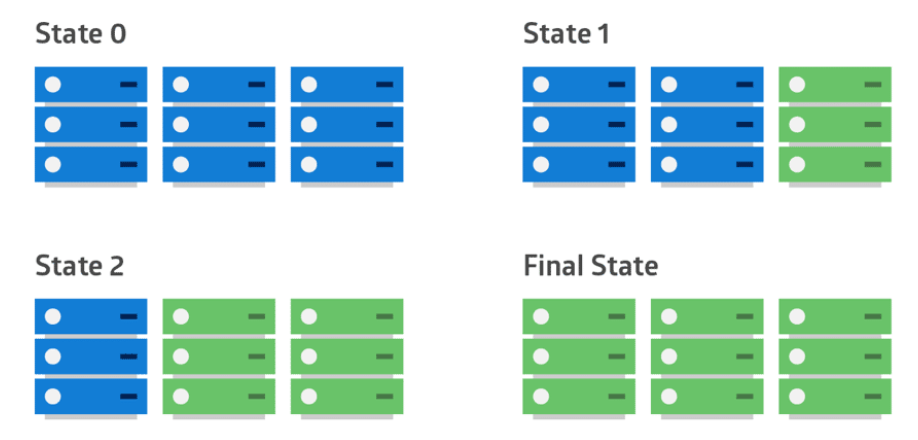
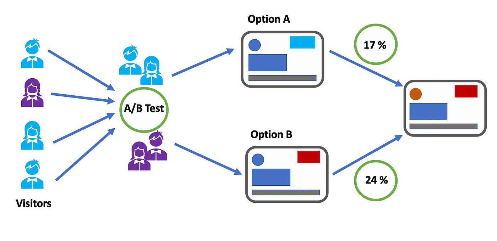

# Release Strategies and Deployment Patterns

### **Overview**

In modern software development, ensuring that new features and updates are deployed safely and efficiently is crucial. Release strategies and deployment patterns provide the framework for deploying software changes while minimizing risk, ensuring high availability, and providing a seamless experience for users. This page will explore various release strategies and deployment patterns, discussing their advantages, disadvantages, and best practices for implementation.

***

### **Blue-Green Deployments**

#### **What is Blue-Green Deployment?**

Blue-Green Deployment is a strategy that involves running two identical production environments, called Blue and Green. At any given time, only one environment (let's say Blue) is live and serving production traffic, while the other (Green) is idle. When a new version of the application is ready for deployment, it is deployed to the idle environment (Green). Once tested and verified, traffic is switched from the live environment (Blue) to the new environment (Green), making it live. The old environment (Blue) remains as a fallback option in case any issues arise.

<figure><figcaption>
<strong>Blue-Green Deployment</strong>
</figcaption></figure>

#### **Advantages:**

* **Minimized Downtime:** Traffic is switched seamlessly between environments, reducing or eliminating downtime.
* **Easy Rollback:** If issues are detected in the new environment, traffic can be quickly switched back to the old environment.
* **Testing in Production-like Environment:** The new version is tested in an environment identical to production, ensuring reliability.

#### **Disadvantages:**

* **Cost:** Maintaining two identical environments can be expensive, especially for large-scale applications.
* **Complexity:** Managing two environments and ensuring they remain in sync can add complexity to the deployment process.

#### **Best Practices:**

1. **Automate Environment Management:** Use Infrastructure as Code (IaC) to automate the creation and management of Blue and Green environments.
2. **Monitor Both Environments:** Ensure that both environments are actively monitored, even if only one is serving traffic.
3. **Plan for Rollback:** Have a clear rollback plan in place in case issues arise after switching traffic.

#### **Example:**

A financial services company might use Blue-Green Deployment to ensure that their trading platform remains available during deployments. By switching traffic between environments, they can deploy new features without interrupting service to their users.

***

### **Canary Releases**

#### **What is a Canary Release?**

A Canary Release is a deployment strategy where a new version of an application is gradually rolled out to a small subset of users before being made available to the entire user base. This strategy allows teams to monitor the impact of the new version in a controlled manner and to roll back quickly if issues are detected. If the canary deployment is successful, the new version is gradually rolled out to more users until it is fully deployed.

<figure><figcaption>
<strong>Canary Release</strong>
</figcaption></figure>

#### **Advantages:**

* **Reduced Risk:** By gradually rolling out the new version, any issues can be detected early and resolved before they affect the entire user base.
* **User Feedback:** Early adopters can provide feedback on the new version, allowing teams to make improvements before a full release.
* **Continuous Deployment:** Canary releases support a continuous deployment approach, where new features are regularly pushed to production.

#### **Disadvantages:**

* **Complex Rollout Process:** Managing different versions of the application for different user groups can be complex.
* **Potential for Inconsistent User Experience:** Users in the same region or network might experience different versions of the application, leading to potential confusion.

#### **Best Practices:**

1. **Use Feature Flags:** Implement feature flags to control which users receive the new version, making it easier to manage canary releases.
2. **Monitor Metrics Closely:** Monitor key metrics, such as performance and error rates, to detect any issues early in the canary release.
3. **Automate Rollback:** Ensure that rollback procedures are automated to quickly revert to the previous version if needed.

#### **Example:**

A social media platform might use a canary release to test a new messaging feature with a small group of users before rolling it out to the entire user base. If the feature causes performance issues, the team can roll back the deployment without affecting all users.

***

### **Feature Flags**

#### What are Feature Flags?

Feature Flags (also known as feature toggles) are a powerful technique that allows developers to enable or disable features in an application dynamically, without the need to deploy new code. This decouples the deployment of code from the release of features, giving teams the flexibility to control the visibility and availability of features in production environments. Feature flags are particularly useful in scenarios where you want to test new features with a subset of users, perform A/B testing, or deploy code changes incrementally.

<figure><figcaption>
Feature Flag
</figcaption></figure>

#### **How Feature Flags Work:**

* **Conditional Logic:** Feature flags are implemented using conditional statements within the codebase that check whether a feature is enabled or disabled. Depending on the flag’s state, the application will either execute the new feature code or fall back to the existing functionality.
* **Configuration:** The state of each feature flag (on or off) is typically managed through a configuration file, database, or a centralized feature flag management system. This allows for easy updates without altering the codebase.
* **Controlled Rollouts:** By toggling feature flags, teams can selectively release features to specific users or environments. This enables controlled rollouts where a new feature is initially enabled for a small group, allowing for testing and feedback before a full-scale release.

#### **Advantages:**

* **Controlled Releases:** Feature flags enable a gradual rollout of new features, allowing teams to test and gather feedback before a complete launch. This reduces the risk of introducing bugs or performance issues to the entire user base.
* **Decoupled Deployment and Release:** With feature flags, code can be deployed continuously without immediately releasing new features. This allows for more flexible release schedules, as features can be toggled on when the team is ready.
* **A/B Testing:** Feature flags are instrumental in A/B testing, where different groups of users are exposed to different versions of a feature. This helps in evaluating which version performs better in terms of user engagement, conversions, or other metrics.

#### **Disadvantages:**

* **Technical Debt:** Managing a large number of feature flags can introduce technical debt if they are not properly cleaned up after the feature is fully deployed. Over time, the codebase can become cluttered with outdated flags that complicate the development process.
* **Complexity:** Implementing and managing feature flags requires additional code and configuration, adding complexity to the development lifecycle. Developers need to carefully manage these flags to avoid introducing bugs or inconsistencies.

#### **Best Practices:**

*   **Keep Feature Flags Temporary:**

    * Feature flags should be treated as temporary switches. Once a feature is fully rolled out and stable, the corresponding flag should be removed to prevent unnecessary complexity and technical debt.

    **Example:** If a new feature is successfully launched to all users, the feature flag and associated conditional logic should be removed from the codebase during the next development cycle.
*   **Use a Centralized Feature Flag Management System:**

    * Managing feature flags across multiple environments and applications can become challenging. A centralized management system allows for consistent control, monitoring, and auditing of feature flags.

    **Example:** Tools like LaunchDarkly or FeatureFlag.io offer centralized dashboards where teams can manage flags, track their usage, and ensure consistent behavior across different environments.
*   **Monitor Feature Usage:**

    * It’s essential to track how features controlled by flags are used and their impact on performance and user experience. Monitoring helps in making informed decisions about whether to fully deploy, roll back, or adjust the feature.

    **Example:** An e-commerce site might track user interactions with a new checkout process enabled by a feature flag. If users encounter issues or the process leads to cart abandonment, the team can quickly disable the feature while working on improvements.

**Example:**

Consider an e-commerce platform that wants to introduce a new checkout process. Instead of releasing the feature to all users at once, the team uses a feature flag to control its availability. Initially, the feature is enabled for 10% of users. The team monitors key metrics such as completion rates and user feedback. If the new process performs well, the feature is gradually rolled out to more users until it’s available to everyone. If issues are detected, the feature can be quickly disabled, minimizing the impact on the user experience.

***

### **Rolling Deployments**

#### **What is Rolling Deployment?**

Rolling Deployment is a deployment strategy that involves updating an application incrementally, replacing instances of the old version with the new version one at a time or in small batches. Unlike strategies where the entire application is deployed simultaneously, rolling deployments allow for a more controlled and gradual release process. This approach ensures that while some instances of the application are being updated, others remain available to handle user traffic, minimizing downtime and reducing the risk of widespread issues.

<figure><figcaption>
<strong>Rolling Deployments</strong>
</figcaption></figure>

**How Rolling Deployment Works:**

1. **Incremental Updates:** The application is deployed to a subset of instances, such as one or two servers, while the rest continue to run the old version.
2. **Health Checks:** Each updated instance is monitored for any issues or performance degradation. If the new version passes the health checks, the deployment proceeds to the next set of instances.
3. **Gradual Rollout:** The process continues until all instances have been updated to the new version, ensuring that at least some portion of the application is always available to serve users.

#### **Advantages:**

* **Minimized Downtime:** By only updating a portion of the instances at a time, the application remains available throughout the deployment process. This minimizes disruption to users and ensures that the application continues to operate smoothly.
* **Gradual Rollout:** Rolling deployments allow teams to catch potential issues early in the deployment process. If a problem is detected in the early stages, it can be addressed before the deployment is fully completed, reducing the impact on users.
* **Improved Fault Isolation:** In the event of an issue, only a small subset of users is affected initially. This makes it easier to isolate and resolve problems without affecting the entire user base.

#### **Disadvantages:**

* **Inconsistent Environment:** During the deployment process, different instances may be running different versions of the application. This can lead to inconsistent behavior, especially if there are significant differences between versions.
* **Complex Rollback:** Rolling back a partially deployed application can be challenging. If issues are detected partway through the deployment, it may be necessary to coordinate the rollback across multiple instances, adding complexity to the process.
* **Increased Resource Usage:** Maintaining multiple versions of the application during the deployment process can require additional resources, such as increased server capacity, to handle both versions simultaneously.

#### **Best Practices:**

*   **Automate the Deployment Process:**

    * Automation is key to ensuring a smooth and consistent rollout. Use deployment automation tools to manage the process, handle configurations, and monitor the deployment. Automation reduces the risk of human error and ensures that each instance is updated consistently.

    **Example:** Tools like Kubernetes or AWS CodeDeploy can automate rolling deployments, managing the process of updating instances incrementally and monitoring their health.
*   **Monitor Traffic and Performance:**

    * Continuously monitor application performance and user traffic during the rollout. This allows you to detect and address issues quickly, ensuring that the new version is performing as expected.

    **Example:** Implement monitoring tools like Prometheus or New Relic to track key performance metrics during the deployment. Set up alerts to notify the team if any anomalies are detected.
*   **Plan for Rollback:**

    * Have a clear rollback plan in place before starting the deployment. In case of issues, the ability to revert to the previous version quickly is critical to minimizing impact. Ensure that the rollback process is as automated as the deployment process.

    **Example:** If the new version introduces a bug that affects user experience, the rollback plan should be triggered immediately to restore the previous version across all instances.

#### **Example:**

Consider a Software as a Service (SaaS) provider that operates across multiple data centers globally. The provider wants to update their application with a new feature. Instead of deploying the new version to all data centers simultaneously, they use a rolling deployment strategy.

* **Phase 1:** The new version is deployed to a single data center. The team monitors this deployment closely for any issues.
* **Phase 2:** If the deployment is successful, the team proceeds to deploy the new version to additional data centers in stages, one at a time.
* **Phase 3:** Once all data centers are running the new version, the deployment is complete. If any issues had been detected in an earlier phase, the team would have rolled back the affected data center to the previous version while investigating the problem.

By using rolling deployment, the SaaS provider minimizes the risk of downtime and ensures that their application remains available to users even during the update process.

***

### **A/B Testing**

#### **What is A/B Testing?**

A/B Testing, also known as split testing, is a strategy used to compare two or more versions of a feature or interface to determine which performs better. This testing approach involves showing different versions of a feature to separate groups of users simultaneously and analyzing their behavior and feedback to identify which version delivers the best results. A/B testing is a powerful tool for optimizing various aspects of an application, such as user interfaces, features, and content, based on real-world user data.

<figure><figcaption>
<strong>A/B Testing</strong>
</figcaption></figure>

#### **How A/B Testing Works:**

1. **Version Creation:** Two or more versions of a feature, design, or content are created. Each version differs in a specific aspect, such as layout, text, color, or functionality.
2. **User Segmentation:** The user base is divided into distinct groups, with each group exposed to a different version of the feature. For example, Group A sees Version A, while Group B sees Version B.
3. **Data Collection:** User interactions with each version are monitored and recorded. This can include metrics such as click-through rates, conversion rates, time spent on the page, or any other relevant performance indicators.
4. **Analysis:** The performance of each version is compared to determine which one achieves the desired outcome more effectively. Statistical analysis is often used to ensure the results are significant.
5. **Decision-Making:** Based on the analysis, the most successful version is selected for full rollout, ensuring that the application is optimized for the best user experience.

#### **Advantages:**

* **Data-Driven Decisions:** A/B testing allows teams to make informed decisions based on real user data, rather than assumptions or hypotheses. This leads to more effective features and designs that align with user preferences.
* **Risk Mitigation:** By testing multiple versions before full deployment, teams can identify the most successful option and reduce the risk of releasing a feature that underperforms or causes user dissatisfaction.
* **Flexibility:** A/B testing is versatile and can be applied to a wide range of features, from visual elements like UI design and layout to functional aspects like backend logic and performance optimizations.

#### **Disadvantages:**

* **Complex Setup:** Setting up a fair and meaningful A/B test requires careful planning. Teams must ensure that the versions being tested differ in a controlled way and that the user groups are comparable to avoid skewed results.
* **Potential for Inconsistent Experience:** Users may encounter different versions of the application during the test, which could lead to confusion or frustration, especially if the versions differ significantly in terms of functionality or design.
* **Time-Consuming:** A/B tests can take time to set up, run, and analyze. Additionally, achieving statistically significant results may require a large user base and extended testing periods.

#### **Best Practices:**

*   **Define Clear Objectives:**

    * Before starting an A/B test, clearly define what you want to achieve. Set specific, measurable goals that will help you determine which version is more successful.

    **Example:** If the goal is to increase user engagement, define metrics such as click-through rate or time spent on a page that will be used to measure success.
*   **Use Statistical Analysis:**

    * Ensure that the results of the A/B test are statistically significant before making decisions. This involves using statistical methods to determine whether the observed differences between versions are meaningful or if they occurred by chance.

    **Example:** Use tools like Google Optimize, Optimizely, or custom statistical calculations to determine if the difference in user behavior between versions A and B is statistically significant.
*   **Monitor User Experience:**

    * Pay close attention to how users react to each version. Collect qualitative feedback through surveys or user interviews to complement quantitative data. Be prepared to make adjustments based on user feedback.

    **Example:** If users report confusion or frustration with one version during the test, consider refining the design or feature before proceeding with a full rollout.

#### **Example:**

An online news platform wants to increase reader engagement by optimizing the headlines of its articles. To determine the most effective headline format, the platform conducts an A/B test:

* **Version A:** Headlines use a straightforward, factual style.
* **Version B:** Headlines are crafted with a more sensational, attention-grabbing approach.

The user base is split into two groups, with each group seeing one version of the headlines. The platform tracks metrics such as click-through rates and time spent on articles. After analyzing the results, the team finds that Version B leads to a 20% higher click-through rate. Based on this data, the platform decides to adopt the sensational headline style for all users, improving overall engagement.

By implementing A/B testing, the news platform can optimize its content strategy, ensuring that it resonates with readers and drives more traffic to its articles.

***

### **Best Practices for Release Strategies**

1. **Plan for Rollbacks:**
   * Always have a rollback plan in place for any deployment. Whether you're using Blue-Green deployments, Canary releases, or any other strategy, the ability to quickly revert to a previous version is crucial for minimizing downtime and mitigating issues.
   * **Example:** Implement automated scripts that can quickly switch traffic back to the previous environment in the case of Blue-Green deployments.
2. **Automate Everything:**
   * Use automation tools to manage your deployment process. Automation reduces human error, ensures consistency across environments, and allows for more frequent, reliable deployments.
   * **Example:** Tools like Jenkins, GitHub Actions, or Azure DevOps can automate the deployment pipeline, including tests, environment setup, and monitoring.
3. **Monitor Deployments:**
   * Implement comprehensive monitoring to track the health and performance of your application during and after deployment. This includes monitoring response times, error rates, and user feedback.
   * **Example:** Use monitoring tools like Prometheus, Grafana, or New Relic to set up alerts for key performance indicators during a deployment.
4. **Use Staging Environments:**
   * Always test new releases in a staging environment that closely mirrors production before deploying them to live users. This helps catch issues that might not be apparent in development or QA environments.
   * **Example:** Run a full suite of integration and end-to-end tests in the staging environment before moving to production.
5. **Gradual Rollouts:**
   * Prefer gradual rollouts over big-bang deployments. Strategies like Canary releases and Rolling deployments allow you to deploy new features to a small subset of users first, making it easier to catch and fix issues without affecting all users.
   * **Example:** Deploy a new feature to 10% of users, monitor the results, and then gradually increase the percentage as confidence grows.
6. **Maintain Documentation:**
   * Keep detailed documentation of your release strategies, deployment processes, and rollback plans. This ensures that everyone on the team understands the procedures and can follow them consistently.
   * **Example:** Create a wiki or use tools like Confluence to document your deployment workflows, rollback procedures, and key contacts.

***

### **Conclusion**

Effective release strategies and deployment patterns are essential for delivering software updates that are safe, reliable, and efficient. By choosing the right strategy—whether it’s Blue-Green deployment, Canary releases, or Feature Flags—you can minimize risk and ensure a smooth user experience. Each strategy has its strengths and trade-offs, and understanding these will help you tailor your deployment process to your specific needs. By following best practices, including thorough planning, automation, and monitoring, you can build a robust deployment pipeline that supports continuous delivery and improves your software’s resilience and performance.
