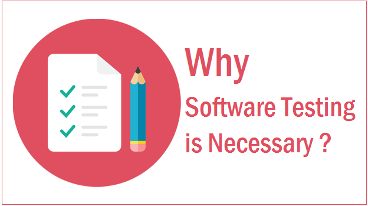
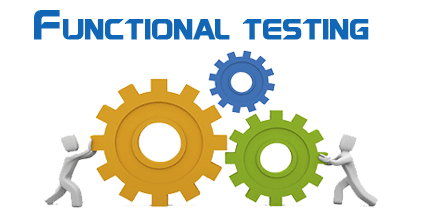
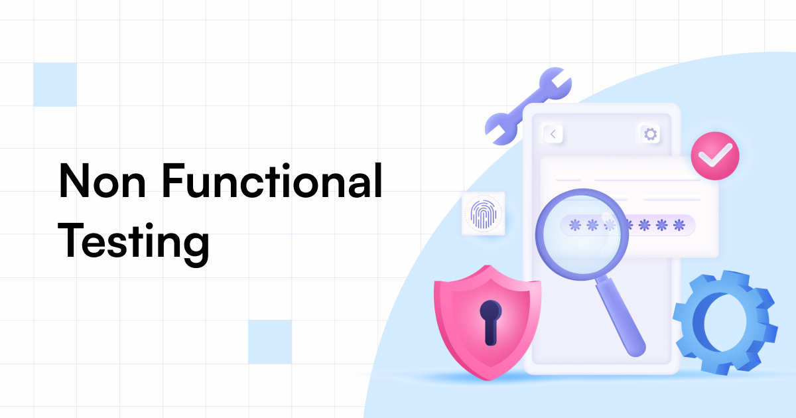
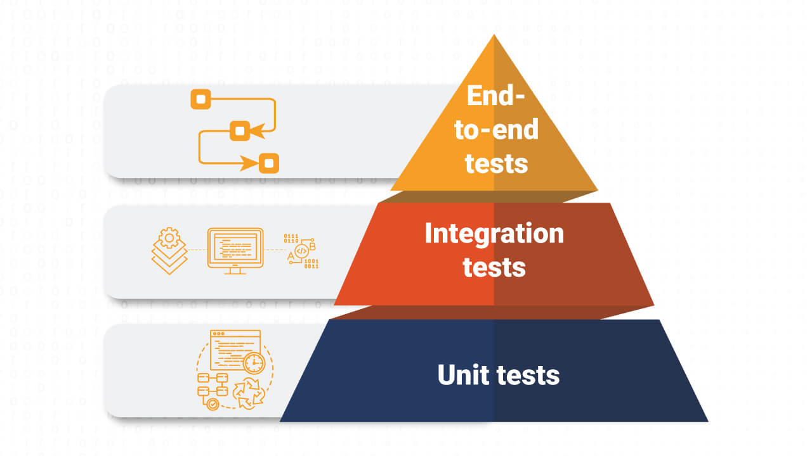

# Importance of Testing and Types

Testing is a crucial aspect of software development that ensures the quality, reliability, and performance of software applications. It involves evaluating a system or its components to verify that it meets specified requirements and functions correctly under various conditions. This page provides an overview of the importance of testing in software development and introduces various testing types.

***

### **Why Testing is Important**

<figure><figcaption>
Why Software Tesing
</figcaption></figure>

1. **Quality Assurance:** Testing helps identify defects and issues in the software, ensuring that it meets the expected quality standards before release.
2. **Risk Mitigation:** By catching bugs early in the development process, testing reduces the risk of software failures in production.
3. **Cost Efficiency:** Identifying and fixing issues during the development phase is more cost-effective than addressing them after deployment.
4. **User Satisfaction:** Well-tested software is more likely to meet user expectations, resulting in higher customer satisfaction and trust.


Testing helps ensure that the final product is stable, reliable, and free of critical bugs that could impact user experience.


***

### **Overview of Testing Types**

Testing can be broadly categorized into several types, each serving a specific purpose in the software development lifecycle. Below are the main categories with brief explanations and examples:

### **Functional Testing**

<figure><figcaption></figcaption></figure>

Functional testing focuses on verifying that the software functions as expected. It involves testing the system's features and functionalities by providing appropriate input and comparing the output with the expected results.

**Unit Testing**

Unit testing involves testing individual components or units of code in isolation to ensure they work as intended.

**Example: Price Calculation**

* **Objective**: Ensure the function correctly calculates the total price of items in a shopping cart.
* **Scope**: Test the function in isolation.
* **Steps**:
  1. Call the price calculation function with a list of item prices and discounts.
  2. Verify the returned total is correct, including discounts and taxes.

**Integration Testing**

Integration testing checks the interaction between integrated components to ensure they work together correctly.

**Example: Payment Gateway Integration**

* **Objective**: Verify that the payment gateway integrates correctly with the checkout process.
* **Scope**: Test the interaction between the shopping cart, payment processing, and confirmation systems.
* **Steps**:
  1. Add items to the cart and proceed to checkout.
  2. Enter payment details and submit the payment.
  3. Verify that the payment is processed and a confirmation is received.

**System Testing**

System tests are a type of software testing that validate the complete and integrated software system to ensure it meets its specified requirements. These tests focus on verifying that individual features or functionalities of the system work correctly within the context of the entire application. System tests typically target specific components or modules and their interactions within the integrated system.

**Example: User Registration Process**

* **Objective**: Ensure the entire user registration workflow functions correctly.
* **Scope**: Test the complete system as a whole.
* **Steps**:
  1. Navigate to the registration page.
  2. Enter valid user details (e.g., username, password, email).
  3. Submit the registration form.
  4. Verify the system displays a confirmation message.
  5. Check the database to ensure the new user record is created.

**Acceptance Testing**

Acceptance testing verifies whether the software meets the business requirements and is ready for delivery.

**Example: User Profile Update Feature**

* **Objective**: Verify that the new user profile update feature meets business requirements.
* **Scope**: Test the feature based on user stories and use cases.
* **Steps**:
  1. Navigate to the user profile page.
  2. Update profile details (e.g., name, address).
  3. Submit the changes.
  4. Verify the system updates the information and displays a success message.

**End-to-End (E2E) Testing**

End-to-end (E2E) tests are a type of software testing that validate the entire application flow from start to finish. These tests simulate real user scenarios and interactions to ensure that the software works as expected in a production-like environment. E2E tests cover the complete user journey, verifying that all components and systems work together seamlessly to deliver the desired outcomes.

**Example: Online Purchase Process**

* **Objective**: Validate the complete online purchase workflow, including interactions between multiple systems.
* **Scope**: Test the entire purchase flow, from browsing products to order confirmation, mimicking real user behavior and interactions with external systems (e.g., payment gateways, email services).
* **Steps**:
  1. Navigate to the homepage.
  2. Search for a product and add it to the cart.
  3. Proceed to checkout.
  4. Enter shipping and payment information.
  5. Submit the order.
  6. Verify the system processes the payment (interaction with external payment gateway).
  7. Confirm the order details are correct and the order status is updated in the database.
  8. Check that the user receives an order confirmation email (interaction with email service).

***

### **Non-Functional Testing**

<figure><figcaption></figcaption></figure>

Non-functional testing evaluates aspects of the software that do not relate to specific functionalities. It assesses the system's performance, usability, reliability, and other quality attributes.

**Performance Testing**

Performance testing assesses the system's speed, responsiveness, and stability under various conditions.

**Example: Website Load Testing**

* **Objective**: Assess the website's response time and stability under heavy load.
* **Scope**: Simulate thousands of simultaneous users to identify potential bottlenecks.
* **Steps**:
  1. Use a load testing tool to simulate 10,000 users accessing the website.
  2. Measure the response time for various actions (e.g., searching for products, adding items to the cart).
  3. Verify the system remains stable and responsive under load.

**Security Testing**

Security testing identifies vulnerabilities and ensures the software is secure against threats.

**Example: SQL Injection Testing**

* **Objective**: Identify vulnerabilities in the login form.
* **Scope**: Test the login form for SQL injection vulnerabilities.
* **Steps**:
  1. Attempt to log in with a SQL injection payload.
  2. Verify the system rejects the input and does not expose any data or vulnerabilities.

**Usability Testing**

Usability testing evaluates the user interface and user experience to ensure the software is easy to use.

**Example: Mobile App Navigation**

* **Objective**: Evaluate the intuitiveness of the mobile app's navigation.
* **Scope**: Test the user interface and user experience.
* **Steps**:
  1. Ask users to perform common tasks (e.g., searching for products, completing a purchase).
  2. Gather feedback on the ease of navigation and overall user experience.
  3. Identify areas for improvement based on user feedback.

**Compatibility Testing**

Compatibility testing ensures the software works as expected across different devices, browsers, and operating systems.

**Example: Cross-Browser Testing**

* **Objective**: Ensure the web application works across different browsers and operating systems.
* **Scope**: Test the application on various browsers and OS combinations.
* **Steps**:
  1. Open the web application on Chrome, Firefox, Safari, and Edge browsers.
  2. Verify that all pages display correctly and functionality is consistent.
  3. Test on different operating systems (Windows, macOS, Linux) to ensure compatibility.

***

### **Maintenance Testing**

<figure><figcaption></figcaption></figure>

Maintenance testing is performed after the software has been deployed to ensure it continues to function correctly after updates, bug fixes, or other modifications.

**Regression Testing**

Regression testing re-tests previously tested functionalities to ensure that changes have not introduced new defects.

**Example: Login Functionality**

* **Objective**: Ensure recent changes have not introduced new defects.
* **Scope**: Re-test previously tested functionalities after implementing a new feature.
* **Steps**:
  1. Perform a full test of the login functionality.
  2. Verify that logging in works as expected and no new issues have been introduced.

**Smoke Testing**

Smoke testing is a preliminary test to check whether the basic functionalities of the software are working after a new build or update.

**Example: Post-Update Basic Functionality Check**

* **Objective**: Check whether the basic functionalities are working after a new build or update.
* **Scope**: Conduct a preliminary test of critical features.
* **Steps**:
  1. Verify that the main dashboard loads correctly.
  2. Check that navigation elements are functional.
  3. Ensure critical features like login and product search work without errors.

**Sanity Testing**

Sanity testing is a quick check to ensure that a particular function or bug fix works as expected after changes.

**Example: Bug Fix Verification**

* **Objective**: Ensure a specific bug fix works as expected after changes.
* **Scope**: Perform a quick check of the affected functionality.
* **Steps**:
  1. Verify that the specific bug (e.g., incorrect data display in user profiles) is fixed.
  2. Ensure the affected functionality is working as intended.


Different types of testing address different aspects of the software, ensuring a comprehensive evaluation of its functionality, performance, and user experience.


***

### **The Testing Pyramid**

The Testing Pyramid is a framework that guides the distribution of different types of tests in a software project to achieve a balance between speed and coverage. The pyramid emphasizes having a larger number of low-level unit tests at the bottom, fewer integration tests in the middle, and the fewest end-to-end (E2E) tests at the top.

<figure><figcaption>
Testing Pyramid
</figcaption></figure>

1. **Unit Tests (Base of the Pyramid):**
   * **Description:** Unit tests focus on individual components or functions in isolation.
   * **Benefits:** Fast execution, easy to write and maintain, provides immediate feedback on code changes.
   * **Example:** Testing a function that calculates the total price of items in a shopping cart.
2. **Integration Tests (Middle of the Pyramid):**
   * **Description:** Integration tests focus on the interactions between different components or systems.
   * **Benefits:** Ensures that integrated parts work together correctly, covers more complex scenarios than unit tests.
   * **Example:** Verifying the interaction between the shopping cart and the payment gateway.
3. **End-to-End Tests (Top of the Pyramid):**
   * **Description:** E2E tests validate complete user workflows and interactions across the entire application, including external systems.
   * **Benefits:** Provides the highest level of confidence that the application works correctly from a user perspective, though these tests are slower and more brittle.
   * **Example:** Testing the entire process of an online purchase, from browsing products to receiving an order confirmation email.

By following the Testing Pyramid, development teams can ensure a comprehensive testing strategy that balances speed, coverage, and maintenance effort.


The Testing Pyramid helps prioritize and balance different types of tests, ensuring fast and reliable feedback while covering critical user flows comprehensively.


***

### **Conclusion**

Testing is an essential practice in software development, playing a critical role in ensuring the quality and reliability of applications. By understanding and implementing various testing types, development teams can catch defects early, reduce risks, and deliver high-quality software products. As we delve deeper into specific testing types in subsequent pages, we'll explore the tools, techniques, and best practices that make testing an integral part of the development process.
