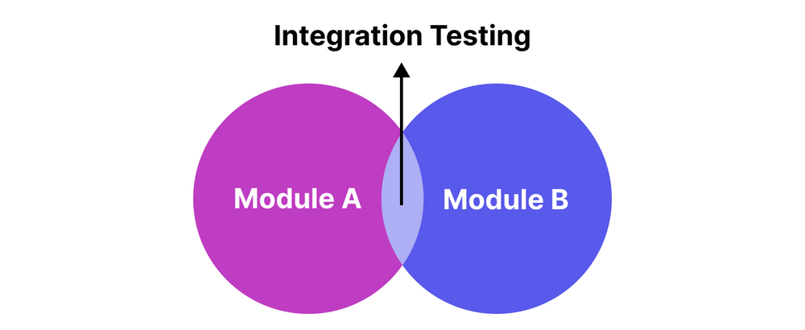

# Integration Testing

Integration testing focuses on verifying the interactions and data flow between different components of a system. It ensures that various modules work together as expected and helps identify issues that may arise from their integration. This page provides an overview of integration testing, its purpose, key concepts, and its importance in ensuring the smooth functioning of a software system.

***

### **What is Integration Testing?**

<figure><figcaption><p>Integration Testing</p></figcaption></figure>

Integration testing involves testing the interfaces and interactions between integrated components or systems. Unlike unit testing, which isolates individual units of code, integration testing combines multiple components and tests them as a group to ensure they work together seamlessly.

* **Objective:** To detect defects that occur when integrating components, such as data format mismatches, incorrect API usage, and more.
* **Scope:** It covers the communication paths and data exchange between modules, ensuring that integrated parts of the application function together correctly.

***

### **Purpose and Importance of Integration Testing**

1. **Detect Integration Issues:** It helps identify problems that occur when integrating different modules, such as incorrect data flow, communication errors, and interface mismatches.
2. **Verify Component Interactions:** Ensures that components interact as intended, correctly passing data and responding to API calls.
3. **Improves System Reliability:** By validating the interaction between components, integration testing helps improve the overall reliability and stability of the system.
4. **Facilitates Early Bug Detection:** Catching integration issues early in the development process can prevent more significant problems down the line, reducing the cost and effort of fixes.


Integration testing is crucial for ensuring that the combined components of a system function together as expected, preventing issues in the production environment.


***

### **Key Concepts in Integration Testing**

1. **Integration Scenarios:** These are the specific use cases and interactions tested during integration testing. They typically involve the integration of two or more components or systems.
2. **Stubs:** Sometimes, when some parts of the system are not ready yet, we use stubs to fill in those gaps.
   *   **Stubs:** Act like temporary replacements for missing pieces that a component needs to interact with. Think of them as "stand-in" components that give fixed responses.

       ```java
       // Example of a stub in Java

       /**
        * Stub implementation of the PaymentService interface.
        * This class provides a fixed response for testing purposes.
        */
       public class PaymentServiceStub implements PaymentService {
           /**
            * Processes a payment by returning a fixed response.
            *
            * @param amount the amount to process
            * @return a fixed response indicating the payment was processed successfully
            */
           @Override
           public String processPayment(double amount) {
               return "Payment processed successfully"; // Fixed response
           }
       }

       // Usage in an integration test

       import org.junit.jupiter.api.BeforeEach;
       import org.junit.jupiter.api.Test;
       import org.junit.runner.RunWith;
       import org.springframework.boot.test.context.SpringBootTest;
       import org.springframework.test.context.junit4.SpringRunner;

       import static org.junit.jupiter.api.Assertions.assertEquals;

       /**
        * Integration test for the OrderService using a PaymentService stub.
        */
       @RunWith(SpringRunner.class)
       @SpringBootTest
       public class OrderServiceIntegrationTest {
           private OrderService orderService;
           private PaymentServiceStub paymentServiceStub;

           /**
            * Sets up the test environment before each test.
            * Initializes the PaymentServiceStub and OrderService.
            */
           @BeforeEach
           void setUp() {
               paymentServiceStub = new PaymentServiceStub();
               orderService = new OrderService(paymentServiceStub);
           }

           /**
            * Test case for processing an order.
            * It verifies that the order processing returns the expected result.
            */
           @Test
           void testOrderProcessing() {
               // Process an order with a specific amount
               String result = orderService.processOrder(100.0);
               // Assert that the result is as expected
               assertEquals("Order completed: Payment processed successfully", result);
           }
       }
       ```
3. **Test Environment:** Integration tests often require a test environment that closely resembles the production environment, including databases, servers, and third-party services.
4. **Data Validation:** Integration tests often involve checking that data is correctly passed between components, including verifying data formats, values, and types.

***

### **Best Practices for Integration Testing**

1. **Incremental Integration:** Integrate and test components incrementally rather than all at once. This approach helps in identifying the source of issues more easily.
2. **Realistic Test Data:** Use realistic data that resembles what will be used in the production environment to ensure that the tests are meaningful and reliable.
3. **Automate Tests:** Automate integration tests to run them frequently, especially during the continuous integration and deployment (CI/CD) process.
4. **Focus on Interfaces:** Pay special attention to the interfaces and interactions between components, as these are common sources of issues.
5. **Isolation:** Isolate the components under test as much as possible to ensure that tests are accurate and repeatable.

***

### What is RestAssured?

RestAssured is a popular Java library used for testing RESTful web services. It simplifies the process of writing tests for API endpoints by providing a domain-specific language (DSL) that allows developers to create readable and maintainable test scripts. RestAssured integrates well with existing Java testing frameworks like JUnit and TestNG, making it a powerful tool for verifying the functionality and correctness of APIs.

**Key Features of RestAssured:**

1. **Fluent API:** RestAssured's DSL allows for a fluent and human-readable syntax, making test scripts easy to write and understand.
2. **Support for Various HTTP Methods:** It supports all HTTP methods, including GET, POST, PUT, DELETE, PATCH, and more.
3. **Assertion Capabilities:** RestAssured provides a wide range of built-in assertions to verify response status codes, headers, and body content.
4. **JSON and XML Support:** It can handle both JSON and XML responses, making it versatile for different types of APIs.
5. **Integration with Test Frameworks:** RestAssured integrates seamlessly with JUnit, TestNG, and other popular Java testing frameworks.

***

### **Example Concepts in Integration Testing**

**1. Testing Database Interactions:** Integration tests often involve testing the interactions between the application and the database to ensure data is being stored and retrieved correctly.

```java
// Example of testing database interactions in an integration test using RestAssured

import io.restassured.RestAssured;
import io.restassured.http.ContentType;
import org.junit.jupiter.api.BeforeEach;
import org.junit.jupiter.api.Test;
import org.junit.jupiter.api.extension.ExtendWith;
import org.springframework.beans.factory.annotation.Autowired;
import org.springframework.boot.test.context.SpringBootTest;
import org.springframework.boot.test.web.server.LocalServerPort;
import org.springframework.test.context.junit.jupiter.SpringExtension;

import java.util.List;

import static org.junit.jupiter.api.Assertions.assertEquals;

/**
 * Integration test for the BookController to verify database interactions using RestAssured.
 */
@ExtendWith(SpringExtension.class)
@SpringBootTest(webEnvironment = SpringBootTest.WebEnvironment.RANDOM_PORT)
public class BookControllerIntegrationTest {

    @LocalServerPort
    private int port;

    @Autowired
    private BookRepository bookRepository;

    /**
     * Sets up the test environment before each test.
     * Clears the book repository to ensure a clean state.
     */
    @BeforeEach
    void setUp() {
        bookRepository.deleteAll();
    }

    /**
     * Test case for adding a book.
     * It verifies that a book is successfully added to the database.
     */
    @Test
    public void testAddBook() {
        // Perform a POST request to add a new book
        RestAssured.given()
                .port(port) // Set the port for RestAssured
                .contentType(ContentType.JSON) // Set the content type to JSON
                .body("{\"title\": \"Spring in Action\", \"author\": \"Craig Walls\"}") // Set the request body
                .when()
                .post("/books") // Send a POST request to /books
                .then()
                .statusCode(201); // Expect a 201 Created status

        // Retrieve all books from the repository
        List<Book> books = bookRepository.findAll();
        // Assert that there is one book in the repository
        assertEquals(1, books.size());
        // Assert that the title of the book is "Spring in Action"
        assertEquals("Spring in Action", books.get(0).getTitle());
        // Assert that the author of the book is "Craig Walls"
        assertEquals("Craig Walls", books.get(0).getAuthor());
    }
}
```

**2. Verifying API Interactions:** Integration tests can verify that different parts of the application communicate correctly via APIs, ensuring that requests and responses are properly handled.

```java
// Example of verifying API interactions in an integration test using RestAssured

import io.restassured.RestAssured;
import io.restassured.http.ContentType;
import io.restassured.response.Response;
import org.junit.jupiter.api.Test;
import org.junit.jupiter.api.extension.ExtendWith;
import org.springframework.boot.test.context.SpringBootTest;
import org.springframework.boot.test.web.server.LocalServerPort;
import org.springframework.test.context.junit.jupiter.SpringExtension;

import static org.hamcrest.Matchers.equalTo;

/**
 * Integration test for the BookController to verify API interactions using RestAssured.
 */
@ExtendWith(SpringExtension.class)
@SpringBootTest(webEnvironment = SpringBootTest.WebEnvironment.RANDOM_PORT)
public class BookControllerIntegrationTest {

    @LocalServerPort
    private int port;

    /**
     * Test case for retrieving a book by its ID.
     * It verifies that a book can be successfully retrieved after being added.
     */
    @Test
    public void testGetBookById() {
        // Add a book first
        Response response = RestAssured.given()
                .port(port) // Set the port for RestAssured
                .contentType(ContentType.JSON) // Set the content type to JSON
                .body("{\"title\": \"Spring in Action\", \"author\": \"Craig Walls\"}") // Set the request body
                .when()
                .post("/books") // Send a POST request to /books
                .then()
                .statusCode(201) // Expect a 201 Created status
                .extract()
                .response();

        // Extract the book ID from the response
        String bookId = response.jsonPath().getString("id");

        // Retrieve the book by its ID
        RestAssured.given()
                .port(port) // Set the port for RestAssured
                .when()
                .get("/books/" + bookId) // Send a GET request to /books/{id}
                .then()
                .statusCode(200) // Expect a 200 OK status
                .body("title", equalTo("Spring in Action")) // Verify the title
                .body("author", equalTo("Craig Walls")); // Verify the author
    }
}
```

**3. Handling Complex Scenarios:** Integration tests may need to handle complex scenarios, such as transactions that span multiple components or services. For instance, a test might simulate adding a book, updating its details, and then verifying that all changes are reflected correctly in the system.

```java
// Example of handling a complex scenario in an integration test using RestAssured

import io.restassured.RestAssured;
import io.restassured.http.ContentType;
import io.restassured.response.Response;
import org.junit.jupiter.api.BeforeEach;
import org.junit.jupiter.api.Test;
import org.junit.jupiter.api.extension.ExtendWith;
import org.springframework.beans.factory.annotation.Autowired;
import org.springframework.boot.test.context.SpringBootTest;
import org.springframework.boot.test.web.server.LocalServerPort;
import org.springframework.test.context.junit.jupiter.SpringExtension;

import static org.junit.jupiter.api.Assertions.assertEquals;
import static org.junit.jupiter.api.Assertions.assertNotNull;

/**
 * Integration test for the BookController to handle complex scenarios using RestAssured.
 */
@ExtendWith(SpringExtension.class)
@SpringBootTest(webEnvironment = SpringBootTest.WebEnvironment.RANDOM_PORT)
public class BookControllerIntegrationTest {

    @LocalServerPort
    private int port;

    @Autowired
    private BookRepository bookRepository;

    /**
     * Sets up the test environment before each test.
     * Clears the book repository to ensure a clean state.
     */
    @BeforeEach
    void setUp() {
        bookRepository.deleteAll();
    }

    /**
     * Test case for adding and updating a book.
     * It verifies that a book can be successfully added and then updated.
     */
    @Test
    public void testAddAndUpdateBook() {
        // Add a new book
        Response response = RestAssured.given()
                .port(port) // Set the port for RestAssured
                .contentType(ContentType.JSON) // Set the content type to JSON
                .body("{\"title\": \"Spring in Action\", \"author\": \"Craig Walls\"}") // Set the request body
                .when()
                .post("/books") // Send a POST request to /books
                .then()
                .statusCode(201) // Expect a 201 Created status
                .extract()
                .response();

        // Extract the book ID from the response
        String bookId = response.jsonPath().getString("id");

        // Update the book details
        RestAssured.given()
                .port(port) // Set the port for RestAssured
                .contentType(ContentType.JSON) // Set the content type to JSON
                .body("{\"title\": \"Spring Boot in Action\", \"author\": \"Craig Walls\"}") // Set the request body
                .when()
                .put("/books/" + bookId) // Send a PUT request to /books/{id}
                .then()
                .statusCode(200); // Expect a 200 OK status

        // Verify the update
        Book updatedBook = bookRepository.findById(Long.valueOf(bookId)).orElse(null);
        assertNotNull(updatedBook); // Assert that the updated book is not null
        assertEquals("Spring Boot in Action", updatedBook.getTitle()); // Verify the updated title
        assertEquals("Craig Walls", updatedBook.getAuthor()); // Verify the author
    }
}
```

***

### **Conclusion**

Integration testing is a critical aspect of software testing that ensures different components or systems work together as intended. By focusing on the interactions between integrated parts, it helps detect issues that may not surface during unit testing. Following best practices and understanding key concepts can help teams conduct effective integration testing, leading to a more stable and reliable software system.
