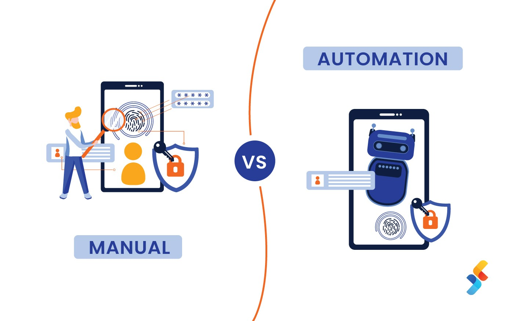

# Test Automation Tools and Technologies

Test automation is an integral part of modern software development, enabling efficient and reliable testing of applications. Automation tools and frameworks streamline the testing process, making it possible to execute tests quickly and consistently. This page provides an introduction to popular test automation tools and technologies, focusing on Selenium and RestAssured, which are widely used for E2E and integration testing, respectively.

***

### **What is Test Automation?**

<figure><figcaption><p>Test Automation</p></figcaption></figure>

Test automation involves using specialized tools and scripts to automate the execution of tests. It helps in performing repetitive and complex testing tasks that would be time-consuming and error-prone if done manually.

* **Benefits:**
  * **Efficiency:** Automates repetitive tests, saving time and effort.
  * **Consistency:** Ensures tests are executed in the same manner every time, reducing human errors.
  * **Scalability:** Allows running a large number of tests simultaneously across different environments.
  * **Early Detection:** Identifies bugs early in the development process, facilitating quick fixes.

***

### **Manual vs. Automated Testing**

<figure><figcaption><p>Manual vs Automation Tests</p></figcaption></figure>

#### **Manual Testing:** Involves human testers executing test cases without the help of tools or scripts. It is essential for:

* **Exploratory Testing:** Where testers explore the application to identify defects.
* **Usability Testing:** Evaluating the user interface and experience.
* **Ad-hoc Testing:** Testing without formal test cases.

#### **Automated Testing:** Uses scripts and tools to perform tests automatically. It is ideal for:

* **Regression Testing:** Ensuring that new changes do not break existing functionality.
* **Load Testing:** Simulating multiple users to test performance.
* **Continuous Testing:** Integrating tests into the CI/CD pipeline for ongoing validation.

#### **Benefits of Automated Testing Over Manual Testing:**

* **Speed:** Automated tests can run much faster than manual tests.
* **Repeatability:** Tests can be repeated consistently without variation.
* **Coverage:** Automated tests can cover more scenarios in less time.
* **Cost-Effective:** Reduces the long-term cost of testing, especially for large projects.

***

### **Key Automation Tools and Frameworks**

#### **Selenium**

Selenium is a widely-used open-source tool for automating web browsers. It supports multiple programming languages, including Java, C#, and Python, and can be used to automate browser actions such as clicking, typing, and navigating.

**Key Features:**

* **Cross-Browser Support:** Works with various browsers like Chrome, Firefox, Safari, and Edge.
* **Multi-Language Support:** Supports multiple programming languages, making it versatile for different development teams.
* **Integration:** Can be integrated with other tools like TestNG, JUnit, and Azure DevOps for CI/CD pipelines.

**Use Cases:**

* **E2E Testing:** Automating user flows and interactions in web applications.
* **Regression Testing:** Verifying that new changes do not break existing functionality.

**Example:**

```java
import org.openqa.selenium.WebDriver;
import org.openqa.selenium.chrome.ChromeDriver;

public class SeleniumExample {
    public static void main(String[] args) {
        // Set the system property for the ChromeDriver executable
        // This specifies the path to the ChromeDriver executable
        System.setProperty("webdriver.chrome.driver", "/path/to/chromedriver");

        // Initialize a new instance of the Chrome browser
        WebDriver driver = new ChromeDriver();

        // Navigate to a webpage
        // This opens the specified URL in the Chrome browser
        driver.get("https://www.example.com");

        // Perform actions on the webpage
        // Example: Click on a button, fill a form, etc.
        // Additional code to interact with the web elements on the page would go here

        // Close the browser
        // This closes the Chrome browser and ends the WebDriver session
        driver.quit();
    }
}
```

***

#### **RestAssured**

RestAssured is a powerful library for testing RESTful APIs. It simplifies the process of sending HTTP requests and validating responses, making it an ideal choice for API testing.

**Key Features:**

* **Fluent Interface:** Provides a clean and readable syntax for writing tests.
* **JSON and XML Support:** Easily parse and validate JSON and XML responses.
* **Integration:** Can be integrated with testing frameworks like JUnit and TestNG.

**Use Cases:**

* **API Testing:** Validating the functionality, performance, and security of RESTful APIs.
* **Integration Testing:** Ensuring that different components of the application interact correctly.

**Example:**

```java
import io.restassured.RestAssured;
import io.restassured.response.Response;

public class RestAssuredExample {
    public static void main(String[] args) {
        // Set the base URL of the API
        RestAssured.baseURI = "https://api.example.com";

        // Sending a GET request to the API endpoint "/users"
        Response response = RestAssured.get("/users");

        // Validating that the response status code is 200 (OK)
        response.then().statusCode(200);

        // Printing the response body to the console
        System.out.println(response.getBody().asString());
    }
}
```

***

#### **JUnit and TestNG**

JUnit and TestNG are popular testing frameworks for Java applications. They provide annotations, assertions, and test runners that facilitate the organization and execution of tests.

**Key Features:**

* **Annotations:** Simplify the definition of test methods, setup, and teardown.
* **Assertions:** Provide methods to check expected vs. actual outcomes.
* **Test Runners:** Manage test execution and report generation.

**Use Cases:**

* **Unit Testing:** Testing individual components or units of code.
* **Integration Testing:** Testing interactions between components.

***

### **Integrating Automation Tools in CI/CD Pipelines**

Automated tests can be integrated into Continuous Integration and Continuous Deployment (CI/CD) pipelines to ensure that code changes are tested and validated automatically. Using Azure DevOps for CI/CD integration provides several benefits:

**Benefits:**

* **Continuous Feedback:** Automated E2E tests in the CI/CD pipeline provide instant feedback on the state of the application after each change, helping to catch issues early.
* **Reduced Manual Effort:** Automating E2E tests reduces the need for manual testing, saving time and effort for the development and QA teams.
* **Improved Code Quality:** Continuous testing helps maintain high code quality by ensuring that all changes are tested against real-world scenarios.
* **Faster Release Cycles:** Automated testing enables faster and more reliable release cycles by ensuring that each deployment is thoroughly tested.
* **Consistent Test Environment:** Running tests in a CI/CD pipeline ensures that they are executed in a consistent environment, reducing the risk of environment-specific issues.

**Azure DevOps** integrates seamlessly with various testing tools like Selenium and RestAssured, allowing you to automate your testing processes and integrate them into your CI/CD pipelines. This ensures that your code is continuously tested and validated, leading to faster and more reliable software releases.

***

### **Conclusion**

Test automation tools and technologies play a crucial role in modern software development, providing efficiency, reliability, and scalability in testing processes. Selenium and RestAssured are powerful tools for E2E and API testing, respectively, offering comprehensive features for validating web applications and APIs. By integrating these tools into CI/CD pipelines using Azure DevOps, teams can ensure continuous testing and quality assurance, leading to faster and more reliable software releases.
